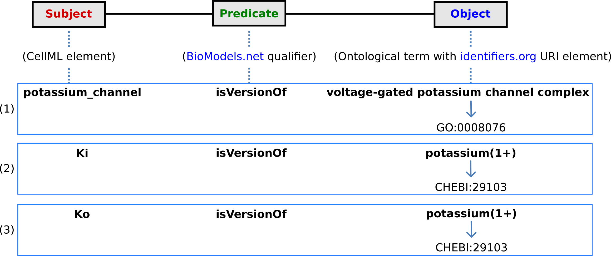

.. include:: resources/roles.txt

================
Model annotation
================

One of the most powerful features of CellML is its ability to import
models. This means that complex models can be built up by combining
previously defined models. There is a potential problem with this
process, however, since the imported models (often developed by
completely different modellers) may represent the same biological or
biophysical entity with different expressions. The potassium channel
model in :ref:`ocr_tut_intro_cellml_comp_conn`, for example, represents the intracellular
concentration of potassium as ‘Ki’ (see the *CellML Text* code :ref:`Potassium_ion_channel.cellml <ocr_tut_k_ion_ch_ctc>`) but another model involving the intracellular potassium
concentration may use a different expression.

The solution to this dilemma is to annotate the CellML variables with
names from controlled vocabularies that have been agreed upon by the
relevant scientific community. In this case we may simply want to
annotate Ki as ‘\ *the concentration of potassium in the cytosol*\ ’.
This expression, however, refers to three distinct entities:
*concentration*, *potassium* and *cytosol*. We might also want to
specify that we are referring to the cytosol of a neuron … and that the
neuron comes from a particular part of a giant squid (the experimental
animal used by Hodgkin and Huxley). Annotations can clearly get very
complicated!

What comes to our rescue here is that most scientific communities have
developed controlled vocabularies together with the relationships
between the terms of that vocabulary – called **ontologies**.
Furthermore relationships can always be expressed in the form
:red:`subject`-:green:`predicate`-:blue:`object`. E.g. :red:`Ki`
:green:`is-the-concentration-of` :blue:`potassium` is one relationship and
:red:`potassium` :green:`in-the` :blue:`cytosol` is another. Each object can become
the subject of another expression. We could continue, for example, with
:red:`cytosol` :green:`of-the` :blue:`neuron`, :red:`neuron` :green:`of-the` :blue:`squid` and so
on. The terms :green:`s-the-concentration-of`, :green:`in-the` and :green:`of-the` are
the predicates and these semantically rich expressions too have to come
from controlled vocabularies. Each of these
:red:`subject`-:green:`predicate`-:blue:`object` expressions is called an RDF **triple**
and the World Wide Web consortium [*]_ has established a framework
called the *Resource Description Framework* (RDF [*]_) to support
these.

CellML models therefore contain two parts, one dealing with **syntax**
(the MathML definition of the models together with the structure of
components, connections, groups, units, etc) as discussed in previous
sections, and one dealing with **semantics** (the meanings of the
terms used in the models) discussed in this section [*]_. This latter
is also referred to as *metadata* – i.e. data about data.

In the CellML metadata specification [*]_ the first RDF *subject* of a
triple is a CellML element (e.g. a variable such as ‘Ki’), the RDF
*predicate* is chosen from the Biomodels Biological Qualifiers [*]_
list, and the RDF *object* is a URI (the string of characters used to
identify the name of a resource [*]_). Establishing these RDF links to
biological and biophysical meaning is the goal of annotation.

Note the different types of subject/object used in the RDF triples: *the
concentration* is a biophysical entity, *potassium* is a chemical
entity, *the cytosol* is an anatomical entity. In fact, to cover all the
terminology used in the models, CellML uses five separate ontologies:

 -  ChEBI (Chemical Entities of Biological Interest) `www.ebi.ac.uk/chebi <http://www.ebi.ac.uk/chebi>`_
 -  GO (Gene Ontology) `www.geneontology.org <http://www.geneontology.org>`_
 -  FMA (Foundation Model of Anatomy) `fma.biostr.washington.edu/projects/fm/ <http://sig.biostr.washington.edu/projects/fm/>`_
 -  Cell type ontology `code.google.com/p/cell-ontology <https://code.google.com/p/cell-ontology>`_
 -  OPB `sbp.bhi.washington.edu/projects/the-ontology-of-physics-for-biology-opb <http://sbp.bhi.washington.edu/projects/the-ontology-of-physics-for-biology-opb>`_

These ontologies are available through OpenCOR’s annotation facilities
as explained below.

   
   Clicking on *CellML Annotation* lists the CellML components with their variables ready for annotation.

If we now go back to the potassium ion channel CellML model and, under
*Editing*, click on *CellML* *Annotation*, the various elements of the
model (Units, Components, Variables, Groups and Connections) are
displayed (see :numref:`ocr_tut_ocr_anno_view`). If you right click on any of them a popup
menu will appear, which you can use to expand/collapse all the child
nodes, as well as remove the metadata associated with the current CellML
element or the whole CellML file. Expanding *Components* lists all the
components and their variables. To annotate the potassium channel
component, select it and specify a *Qualifier* from the list displayed::

  bio:encodes,         bio:isPropertyOf
  bio:hasPart,         bio:isVersionOf
  bio:hasProperty,     bio:occursIn
  bio:hasVersion,      bio:hasTaxon
  bio:is,              model:is
  bio:isDescribedBy,   model:isDerivedFrom
  bio:isEncodedBy,     model:isDescribedBy
  bio:isHomologTo,     model:isInstanceOf
  bio:isPartOf,        model:hasInstance

If you do not know which qualifier to use, click on the
|image_variable_node| button to get some information about the current qualifier
(you must be connected to the internet) and go through the list of
qualifiers until you find the one that best suits your needs. Here, we
will say that you want to use bio:isVersionOf. :numref:`ocr_tut_ocr_qualifiers` shows the
information displayed about this qualifier.

   
   The qualifiers are displayed from the top right menu.
   Clicking on the most appropriate one (bio:isVersionOf) gives more
   information about this qualifier in the bottom panel.

Now you need to retrieve some possible ontological terms to describe the
*potassium\_channel* component. For this you must enter a search term,
which in our case is ‘potassium channel’ (note that regular expressions
are supported [*]_). This returns 24 possible ontological terms as
shown in :numref:`ocr_tut_ocr_ont_terms_pot`. The *voltage-gated potassium channel complex* is the
most appropriate. Clicking on the GO identifier link shown provides more
information about this term (see :numref:`ocr_tut_ocr_qual_res_info`).

   
   The ontological terms listed when ‘potassium channel’ is entered into the search box next to *Term*.

   
   The qualifier, resource & ID information in the middle
   panel appears when you click on the |image_add| button next to the
   selected term in Fig.32. GO identifier details are listed when either of
   the :red:`arrowed` links are clicked.

Now, assuming that you are happy with your choice
of ontological term, you can associate it with the *potassium_channel*
component by clicking on its corresponding |image_add| button which then displays
the qualifier, resource and ID information in the middle panel as shown
in :numref:`ocr_tut_ocr_ont_terms_pot`. If you make a mistake, this can be removed by clicking on
the |image_sub| button.

The first level annotation of the *potassium\_channel* component has now
been achieved. The content of the three terms in the RDF triple are
shown in :numref:`ocr_tut_pot_ch_anno_diag`, along with the annotation for the variables *Ki* and
*Ko*.

   
   The RDF triple used in CellML metadata to link a CellML
   element (component or variable) with an ontological term from one of the
   five ontologies accessed via
   `identifiers.org <http://www.identifiers.org/>`_, using a predicate
   qualifier from `BioModels.net <http://biomodels.net/qualifiers/>`_.
   The three examples of annotated CellML model elements shown are for (1)
   the *potassium\_channel* component (this points to a GO identifier), (2)
   the variable *Ki*, and (3) the variable *Ko*. These two variables are
   defined within the *potassium_channel* component of the model and point
   to CHEBI identifiers. A further annotation is needed to identify the
   cellular location of those variables (since one is intracellular and one
   is extracellular).

.. code-block:: cell

   def comp {id_000000001} potassium_channel as
      var V: millivolt {pub: in, priv: out};
      var t: millisec {pub: in, priv: out};
      var n: dimensionless {priv: in};
      var i_K: microA_per_cm2 {pub: out};
      var g_K: milliS_per_cm2 {init: 36};
      var {id_000000002} Ki: mM {init: 90};
      var {id_000000003} Ko: mM {init: 3};
      var RTF: millivolt {init: 25};
      var E_K: millivolt;
      var K_conductance: milliS_per_cm2 {pub: out};

      E_K = RTF*ln(Ko/Ki);
      K_conductance = g_K*pow(n, 4{dimensionless});
      i_K = K_conductance*(V-E_K);
   enddef;

When saved (the *CellML Annotation* tag will appear un-grayed), the
result of these annotations is to add metadata to the CellML file. If
you switch to the *CellML Text* view you will see that the elements that
have been annotated appear with ID numbers, as shown above.
These point to the corresponding metadata contained in the CellML file
for this model and are displayed under the qualifier-resource-Id
headings in the annotation window when you click on the element in the
editing window.

Note that the three annotations added above are all biological
annotations. Many of the other components and variables in the CellML
potassium channel model deal with biophysical entities and these require
the use of the OPB ontology (yet to be implemented in OpenCOR). The use
of composite annotations is also being developed [*]_, such as
“:red:`Ki` :green:`is-the` :red:`concentration` :green:`of` :red:`potassium` :green:`in-the`
:red:`cytosol` :green:`of-the` :red:`neuron` :green:`of-the` :red:`giant-squid`”, where *concentration*,
*potassium*, *cytosol*, *neuron* and *giant-squid* are defined by the
ontologies OPB, ChEBI, GO, FMA and a species ontology, respectively.

---------------------------

.. rubric:: Footnotes

.. [*] Referred to as W3C – see `www.w3.org <http://www.w3.org>`_

.. [*] `www.w3.org/RDF <http://www.w3.org/RDF>`_

.. [*] For details on the annotation plugin see http://opencor.ws/user/plugins/editing/CellMLAnnotationView.html

.. [*] See http://www.cellml.org/specifications/metadata/ and http://www.cellml.org/specifications/metadata/mcdraft

.. [*] http://co.mbine.org/standards/qualifiers

.. [*] http://en.wikipedia.org/wiki/Uniform_resource_identifier

.. [*] http://en.wikipedia.org/wiki/Regular_expression

.. [*] This is a project being carried out at the University of Washington, Seattle, using an annotation tool called SEMGEN (...).

.. |image_add| image:: _static/images/sim_panel_btn_6.png
   :height: 12pt
   
.. |image_sub| image:: _static/images/sim_panel_btn_7.png
   :height: 12pt
   
   
