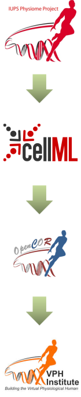

======================================
Background to the VPH-Physiome project
======================================

To be of benefit to applications in healthcare, organ and whole organism
physiology needs to be understood at both a systems level and in terms
of subcellular function and tissue properties. Understanding a
re-entrant arrhythmia in the heart, for example, depends on knowledge of
not only numerous cellular ionic current mechanisms and signal
transduction pathways, but also larger scale myocardial tissue structure
and the spatial variation in protein expression. As reductionist
biomedical science succeeds in elucidating ever more detail at the
molecular level, it is increasingly difficult for physiologists to
relate integrated whole organ function to underlying biophysically
detailed mechanisms that exploit this molecular knowledge. Multi-scale
computational modelling is used by engineers and physicists to design
and analyse mechanical, electrical and chemical engineering systems.
Similar approaches could benefit the understanding of physiological
systems. To address these challenges and to take advantage of
bioengineering approaches to modelling anatomy and physiology, the
International Union of Physiological Sciences (IUPS) formed the Physiome
Project in 1997 as an international collaboration to provide a
computational framework for understanding human physiology [#]_.

Primary Goals
=============

One of the primary goals of the Physiome Project :cite:`4` has been to promote
the development of standards for the exchange of information between
models. The first of these standards, dealing with time varying but
spatially lumped processes, is CellML :cite:`5`. The second (dealing with
spatially and time varying processes) is FieldML :cite:`6,7` [#]_. A further
goal of the Physiome Project has been the development of open source
tools for creating and visualizing standards-based models and running
model simulations. OpenCOR is the latest in a series of software
projects aimed at providing a modelling environment for CellML models.
Similar tools exist for FieldML models.

Following the publication of the STEP [#]_ (*Strategy for a European
Physiome*) Roadmap in 2006, the European Commission in 2007 initiated
the Virtual Physiological Human (VPH) project :cite:`8`. A related US
initiative by the Interagency Modeling and Analysis Group (IMAG) began
in 2003 [#]_. These projects and similar initiatives are now coordinated
and are collectively referred to here as the ‘VPH-Physiome’
project [#]_. The VPH-Institute [#]_ was formed in 2012 as a virtual
organisation to providing strategic leadership, initially in Europe but
now globally, for the VPH-Physiome Project.

---------------------------

.. rubric:: Footnotes

.. [#]
   `www.iups.org <endnotes.xml>`__. The IUPS President, Denis Noble from
   Oxford University, and Jim Bassingthwaighte from the University of
   Washington in Seattle have been two of the driving forces behind the
   Physiome Project. Peter Hunter from the University of Auckland was
   appointed Chair of the newly created Physiome Commission of the IUPS
   in 2000. The IUPS Physiome Committee, formed in 2008, was co-chaired
   by Peter Hunter and Sasha Popel (JHU) and is now chaired by Andrew
   McCulloch from UCSD. The UK Wellcome Trust provided initial support
   for the Physiome Project through the Heart Physiome grant awarded in
   2004 to David Paterson, Denis Noble and Peter Hunter.

.. [#]
   CellML began as a joint public-private initiative in 1998 with
   funding by the US company Physiome Sciences (CEO Jeremy Levin),
   before being launched under IUPS as a fully open source project in
   1999.

.. [#]
   The STEP report, led by Marco Viceconte (University of Sheffield,
   UK), is available at
   `www.europhysiome.org/roadmap <media/image2.png>`__.

.. [#]
   This coordinates various US Governmental funding agencies involved in
   multi-scale bioengineering modeling research including NIH, NSF,
   NASA, the Dept of Energy (DoE), the Dept of Defense (DoD), the US
   Dept of Agriculture and the Dept of Veteran Affairs. See
   `www.nibib.nih.gov/Research/MultiScaleModeling/IMAG <media/image3.jpeg>`__.
   Grace Peng of NHBIB leads the IMAG group.

.. [#]
   Other significant contributions to the VPH-Physiome project have come
   from Yoshi Kurachi in Japan
   (`www.physiome.jp <media/image4.tiff>`__), Stig Omholt in Norway
   (`www.ntnu <media/image5.png>`__) and Chae-Hun Leem in Korea
   (`www.physiome.or.kr <media/image6.jpeg>`__).

.. [#]
   `www.vph-institute.org <media/image7.png>`__. Formed in 2012, the
   inaugural Director was Marco Viceconti. The current Director is
   Adriano Henney. The inaugural and current President of the
   VPH-Institute is Denis Noble.
