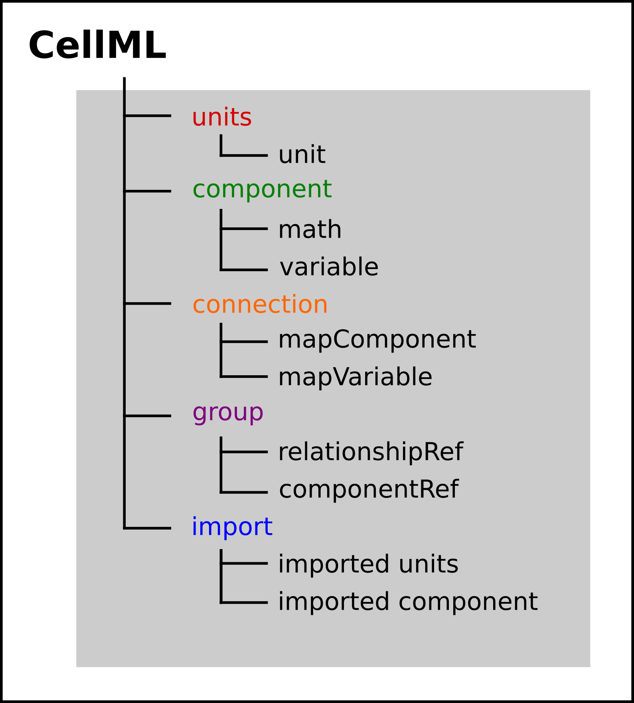

.. include:: resources/roles.txt

.. _ocr_tut_intro_cellml_comp_conn:

===============================================================================
A model of the potassium channel: Introducing CellML components and connections
===============================================================================

We now deal specifically with the application of the previous model to
the Hodgkin and Huxley (HH) potassium channel. Following the convention
introduced by Hodgkin and Huxley, the gating variable for the potassium
channel is :math:`n` and the number of gates in series is
:math:`\gamma = 4`, therefore

:math:`i_{K} = \bar{i_K}n^{4} = n^{4}\bar{g}_{K}\left( V - E_{K} \right)`

where :math:`\bar{g}_{K} = \ 36 \text{mS.cm}^{-2}`,
and with intra- and extra-cellular concentrations
:math:`\left\lbrack K^{+} \right\rbrack_{i} = 90\text{mM}` and
:math:`\left\lbrack K^{+} \right\rbrack_{o} = 3\text{mM}`, respectively, the
Nernst potential for the potassium channel (:math:`z = 1` since one +ve charge on
:math:`K^{+}`) is

:math:`E_{k} = \frac{\text{RT}}{\text{zF}}\ ln\frac{\left\lbrack K^{+} \right\rbrack_{o}}{\left\lbrack K^{+} \right\rbrack_{i}} = 25\ ln\frac{3}{90} = - 85\text{mV}`.

As noted above, this is called the *equilibrium potential* since it is
the potential across the cell membrane when the channel is open but no
current is flowing because the electrostatic driving force from the
potential (voltage) difference between internal and external ion charges
is exactly matched by the entropic driving force from the ion
concentration difference. :math:`n^{4}\bar{g}_{K}` is
the channel conductance.

.. figure:: _static/images/volt_deps_of_gate_consts.png
   :name: ocr_tut_volt_deps_gates
   :alt: Voltage dependencies of gate constants
   :align: right
   :figwidth: 8cm

   Voltage dependence of rate constants :math:`\alpha_n` and :math:`\beta_n\ (\text{ms}^{-1})`, time constant
   :math:`\tau_n\ (\text{ms})` and relative conductance :math:`\frac{g_{SS}}{\bar{g}_Y}`.

The gating kinetics are described (as before) by

:math:`\frac{\text{dn}}{\text{dt}} = \alpha_{n}\left( 1 - n \right) - \beta_{n}\text{.n}`

with time constant :math:`\tau_{n} = \frac{1}{\alpha_{n} + \beta_{n}}`
(see :ref:`A simple first order ODE <ocr_tut_out_first_ode>`).

The main difference from the gating model in our previous example is
that Hodgkin and Huxley found it necessary to make the rate constants
functions of the membrane potential :math:`V` (see :numref:`ocr_tut_volt_deps_gates`) as
follows\ [#]_:

:math:`\alpha_{n} = \frac{- 0.01\left( V + 65 \right)}{e^{\frac{- \left( V + 65 \right)}{10}} - 1}`;
:math:`\beta_{n} = 0.125e^{\frac{- \left( V + 75 \right)}{80}}` .

Note that under steady state conditions when
:math:`t \rightarrow \infty` and

:math:`\frac{\text{dn}}{\text{dt}} \rightarrow 0`,
:math:`\left. \ n \right|_{t = \infty} = n_{\infty} = \frac{\alpha_{n}}{\alpha_{n} + \beta_{n}}`.

   The steady-state current-voltage relation for the potassium channel.

The voltage dependence of the steady state channel conductance is then

:math:`g_{\text{SS}} = \left( \frac{\alpha_{n}}{\alpha_{n} + \beta_{n}} \right)^{4}.\bar{g}_{Y}`.

(see :numref:`ocr_tut_volt_deps_gates`). The steady state current-voltage relation for the
channel is illustrated in :numref:`ocr_tut_ss_cur_volt`.

These equations are captured with OpenCOR *CellML Text* view (together
with the previous unit definitions) below. But first we need
to explain some further CellML concepts.

   Key entities in a CellML model.

We introduced CellML :red:`units` above. We now need to introduce three
more CellML constructs: :green:`components`, :orange:`connections` (mappings
between components) and :purple:`groups`. For completeness we also show one
other construct in :numref:`ocr_tut_cellml_comp_legend`, :blue:`imports`, that will be used later in :ref:`ocr_tut_intro_cellml_imports`.

Defining components serves two purposes: it preserves a modular
structure for CellML models, and allows these component modules to be
imported into other models, as we will illustrate later :cite:`2`. For the
potassium channel model we define components representing (i) the
environment, (ii) the potassium channel conductivity, and (iii) the
dynamics of the n-gate.

Since certain variables (t, V and n) are shared between components, we
need to also define the component maps as indicated in the *CellML Text*
view below.

The *CellML Text* code for the potassium ion channel model is as
follows\ [#]_:

:download:`Potassium_ion_channel.cellml <resources/potassium_ion_channel.cellml>`

.. code-block:: cell
   :name: ocr_tut_k_ion_ch_ctc
   :linenos:

   def model potassium_ion_channel as
      def unit millisec as
         unit second {pref: milli};
      enddef;
      def unit per_millisec as
         unit second {pref: milli, expo: -1};
      enddef;
      def unit millivolt as
         unit volt {pref: milli};
      enddef;
      def unit per_millivolt as
         unit millivolt {expo: -1};
      enddef;
      def unit per_millivolt_millisec as
         unit per_millivolt;
         unit per_millisec;
      enddef;
      def unit microA_per_cm2 as
         unit ampere {pref: micro};
         unit metre {pref: centi, expo: -2};
      enddef;
      def unit milliS_per_cm2 as
         unit siemens {pref: milli};
         unit metre {pref: centi, expo: -2};
      enddef;
      def unit mM as
         unit mole {pref: milli};
      enddef;
      def comp environment as
         var V: millivolt { pub: out};
         var t: millisec {pub: out};
         V = sel
         case (t > 5 {millisec}) and (t < 15 {millisec}):
            -85.0 {millivolt};
         otherwise:
            0.0 {millivolt};
         endsel;
      enddef;
      def group as encapsulation for
         comp potassium_channel incl
            comp potassium_channel_n_gate;
         endcomp;
      enddef;
      def comp potassium_channel as
         var V: millivolt {pub: in , priv: out};
         var t: millisec {pub: in, priv: out};
         var n: dimensionless {priv: in};
         var i_K: microA_per_cm2 {pub: out};
         var g_K: milliS_per_cm2 {init: 36};
         var Ko: mM {init: 3};
         var Ki: mM {init: 90};
         var RTF: millivolt {init: 25};
         var E_K: millivolt;
         var K_conductance: milliS_per_cm2 {pub: out};
         E_K=RTF*ln(Ko/Ki);
         K_conductance = g_K*pow(n, 4{dimensionless});
         i_K = K_conductance(V-E_K);
      enddef;
      def comp potassium_channel_n_gate as
         var V: millivolt {pub: in};
         var t: millisec {pub: in};
         var n: dimensionless {init: 0.325, pub: out};
         var alpha_n: per_millisec;
         var beta_n: per_millisec;
         alpha_n = 0.01{per_millivolt_millisec}*(V+10{millivolt})
            /(exp((V+10{millivolt})/10{millivolt})-1{dimensionless});
         beta_n = 0.125{per_millisec}*exp(V/80{millivolt});
         ode(n, t) = alpha_n*(1{dimensionless}-n)-beta_n*n;
      enddef;
      def map between environment and potassium_channel for
         vars V and V;
         vars t and t;
      enddef;
      def map between potassium_channel and
        potassium_channel_n_gate for
         vars V and V;
         vars t and t;
         vars n and n;
      enddef;
   enddef;

|  **Lines 2-28:** Define :red:`units`.
|  **Lines 29-38:** Define :green:`component` 'environment'.
|  **Lines 32-37:** Define **voltage step**.
|  **Lines 39-43:** Define :purple:`encapsulation` of 'n_gate'.
|  **Lines 44-58:** Define :green:`component` 'potassium_channel'.
|  **Lines 59-69:** Define :green:`component` 'potassium_channel_n_gate'.
|  **Lines 70-79:** Define :orange:`mappings` between :green:`components` for variables that are shared between these components.

Note that several other features have been added:

-  the event control *select case* which indicates that the voltage is
   specified to jump from 0 mV to -85 mV at t = 5 ms then back to 0 mV at
   t = 15 ms. This is only used here in order to test the K channel model;
   when the potassium_channel component is later imported into a neuron
   model, **the environment component is not imported**.

-  the use of :purple:`encapsulation` to embed the
   **potassium_channel_n_gate** inside the **potassium_channel**.
   This avoids the need to establish mappings from **environment** to
   **potassium_channel_n_gate** since the gate component is entirely
   within the channel component.

-  the use of :math:`\left\{ pub:in \right\}` and
   :math:`\left\{ pub:out \right\}` to indicate which variables are
   either supplied as inputs to a component or produced as outputs from
   a component\ [#]_. Any variables not labelled as *in* or *out* are
   local variables or parameters defined and used only within that
   component. Public (and private) interfaces are discussed in more
   detail in the next section.

We now use OpenCOR, with *Ending point* 40 and *Point interval* 0.1, to
solve the equations for the potassium channel under a voltage step
condition in which the membrane voltage is clamped initially at 0mV and
then stepped down to -85mV for 10ms before being returned to 0mV. At
0mV, the steady state value of the n gate is
:math:`n_{\infty} = \frac{\alpha_{n}}{\alpha_{n} + \beta_{n}} =` 0.324
and, at -85mV, :math:`n_{\infty} = \ `\ 0.945.

The voltage traces are shown at the top of Figure 21. The n-gate
response, shown next, is to open further from its partially open value
of :math:`n =`\ 0.324 at 0mV and then plateau at an almost fully open
state of :math:`n =`\ 0.945 at the Nernst potential -85mV before closing
again as the voltage is stepped back to 0mV. Note that the gate opening
behaviour (set by the voltage dependence of the :math:`\alpha_{n}`
opening rate constant) is faster than the closing behaviour (set by the
voltage dependence of the :math:`\beta_{n}` closing rate constant). The
channel conductance (:math:`= n^{4}\bar{g}_K`) is
shown next – note the initial s-shaped conductance increase caused by
the :math:`n^{4}` (four gates in series) effect on conductance. Finally
the channel current :math:`i_{K} =` conductance x
:math:`\left( V - E_{K} \right)` is shown at the bottom. Because the
voltage is clamped at the Nernst potential (-85mV) during the period
when the gate is opening, there is no current flow, but when the voltage
is stepped back to 0mV, the open gates begin to close and the
conductance declines but now there is a voltage gradient to drive an
outward (positive) current flow through the partially open channel –
albeit brief since the channel is closing.

   Kinetics of the potassium channel gates for a voltage
   step from 0mV to -85mV (`OpenCOR link <opencor://openFile/https://models.physiomeproject.org/workspace/25d/rawfile/66e44ef897fca3e513c077adfff0380acbdc9bf2/potassium_ion_channel.sedml>`_). The voltage clamp step is shown at the top, then
   the n gate first order response, then the channel conductance, then the
   channel current. Notice how the conductance is slightly slower to turn
   on (due to the four gates in series) but fast to inactivate. Current
   only flows when there is a non-zero conductance and a non-zero voltage
   gradient. This is called the ‘tail current’.

Note that the *CellML Text* code above includes the Nernst equation with
its dependence on the concentrations
:math:`\left\lbrack K^{+} \right\rbrack_{i}`\ = 90mM and
:math:`\left\lbrack K^{+} \right\rbrack_{o}`\ = 3mM. Try raising the
external potassium concentration to
:math:`\left\lbrack K^{+} \right\rbrack_{o}`\ = 10mM – you will then see
the Nernst potential increase from -85mV to -55mV and a negative
(inward) current flowing during the period when the membrane voltage is
clamped to -85mV. The cell is now in a ‘hyperpolarised’ state because
the potential is less than the equilibrium potential.

Note that you can change a model parameter such as
:math:`\left\lbrack K^{+} \right\rbrack_{o}` either by changing the
value in the left hand *Parameters* window (which leaves the file
unchanged) or by editing the *CellML Text* code (which does change the
file when you save from *CellML Text* view – which you have to do to see
the effect of that change.

This potassium channel model will be used later, along with a sodium
channel model and a leakage channel model, to form the Hodgkin-Huxley
neuron model, where the membrane ion channel current flows are coupled
to the equations governing current flow along the axon to generate an
action potential.

---------------------------

.. rubric:: Footnotes

.. [#] The original expression in the HH paper used :math:`\alpha_n\ =\ \frac{0.01(v+10)}{e^{\frac{(v+10)}{10}}-1}` and :math:`\beta_n\ =\ 0.125e^{\frac{v}{80}}`, where :math:`v` is defined relative to the resting potential (:math:`-75\text{mV}`) with +ve corresponding to +ve *inward* current and :math:`v\ =\ -(V+75)`.

.. [#] From here on we use a coloured background to identify code blocks that relate to a particular CellML construct: :red:`units`, :green:`components`, :orange:`mappings` and :purple:`encapsulation groups` and later :blue:`imports`.

.. [#] Note that a later version of CellML will remove the terms in and out since it is now thought that the direction of information flow should not be constrained.
