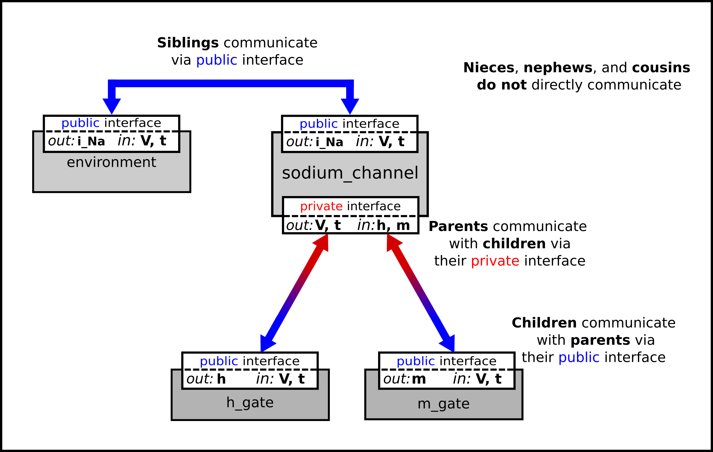

.. _ocr_tut_intro_cellml_encaps_inter:

==============================================================================
A model of the sodium channel: Introducing CellML encapsulation and interfaces
==============================================================================

The HH sodium channel has two types of gate, an :math:`m` gate (of which
there are 3) that is initially closed (:math:`m = 0`) before activating
and inactivating back to the closed state, and an :math:`h` gate that is
initially open (:math:`h = 1`) before activating and inactivating back
to the open state. The short period when both types of gate are open
allows a brief window current to pass through the channel. Therefore,

.. math::

   i_{\text{Na}} = \bar{i}_{\text{Na}}m^{3}h = m^{3}\text{h.}\bar{g}_{\text{Na}}\left( V - E_{\text{Na}} \right)

where :math:`\bar{g}_{\text{Na}} = \ `\ 120
mS.cm\ :sup:`-2`, and with
:math:`\left\lbrack \text{Na}^{+} \right\rbrack_{i}`\ = 30mM and
:math:`\left\lbrack \text{Na}^{+} \right\rbrack_{o}`\ = 140mM, the
Nernst potential for the sodium channel (z=1) is

.. math::

   E_{\text{Na}} = \frac{\text{RT}}{\text{zF}}ln\frac{\left\lbrack \text{Na}^{+} \right\rbrack_{o}}{\left\lbrack \text{Na}^{+} \right\rbrack_{i}} = 25\ ln\frac{140}{30} = 35\text{mV}.

The gating kinetics are described by

.. math::

   \frac{\text{dm}}{\text{dt}} = \alpha_{m}\left( 1 - m \right) - \beta_{m}\text{.m};
   \frac{\text{dh}}{\text{dt}} = \alpha_{h}\left( 1 - h \right) - \beta_{h}\text{.h}

where the voltage dependence of these four rate constants is determined
experimentally to be\ [#]_

.. math::

   \alpha_{m} = \frac{- 0.1\left( V + 50 \right)}{e^{\frac{- \left( V + 50 \right)}{10}} - 1};
   \beta_{m} = 4e^{\frac{- \left( V + 75 \right)}{18}};
   \alpha_{h} = 0.07e^{\frac{- \left( V + 75 \right)}{20}};
   \beta_{h} = \frac{1}{e^{\frac{- \left( V + 45 \right)}{10}} + 1}.

Before we construct a CellML model of the sodium channel, we first
introduce some further CellML concepts that help deal with the
complexity of biological models: first the use of *encapsulation groups*
and *public* and *private interfaces* to control the visibility of
information in modular CellML components. To understand encapsulation,
it is useful to use the terms ‘parent’, ‘child’ and ‘sibling’.

.. code-block:: cell

   def group as encapsulation for 
      comp sodium_channel incl
         comp sodium_channel_m_gate;
         comp sodium_channel_h_gate; 
      endcomp;
   enddef;

We define the CellML components **sodium_channel_m_gate** and
**sodium_channel_h_gate** below. Each of these components has its own
equations (voltage-dependent gates and first order gate kinetics) but
they are both parts of one protein – the sodium channel – and it is
useful to group them into one **sodium_channel** component as shown above:

We can then talk about the sodium channel as the parent of two children:
the m gate and the h gate, which are therefore siblings. A *private
interface* allows a parent to talk to its children and a *public
interface* allows siblings to talk among themselves and to their parents
(see :numref:`ocr_tut_int_bet_comp`).

   
   Children talk to each other as siblings, and to their
   parents, via *public interfaces*. But the outside world can only talk
   to children through their parents via a *private interface*. Note that
   the siblings **m_gate** and **h_gate** could talk via a *public
   interface* but only if a mapping is established between them (not needed
   here).

The OpenCOR *CellML Text* for the HH sodium ion channel is given below.

:download:`Sodium_ion_channel.cellml <resources/sodium_ion_channel.cellml>`

.. code-block:: cell
   :name: ocr_tut_na_ion_ch_ctc

   def model sodium_ion_channel as
      def unit millisec as
         unit second {pref: milli};
      enddef;
      def unit per_millisec as
         unit second {pref: milli, expo: -1};
      enddef;
      def unit millivolt as
         unit volt {pref: milli};
      enddef;
      def unit per_millivolt as
         unit millivolt {expo: -1};
      enddef;
      def unit per_millivolt_millisec as
         unit per_millivolt;
         unit per_millisec;
      enddef;
      def unit microA_per_cm2 as
         unit ampere {pref: micro};
         unit metre {pref: centi, expo: -2};
      enddef;
      def unit milliS_per_cm2 as
         unit siemens {pref: milli};
         unit metre {pref: centi, expo: -2};
      enddef;
      def unit mM as
         unit mole {pref: milli};
      enddef;
      def comp environment as
         var V: millivolt {pub: out};
         var t: millisec {pub: out};
         V = sel
         case (t > 5 {millisec}) and (t < 15 {millisec}):
            -20.0 {millivolt};
         otherwise:
            -85.0 {millivolt}; 
         endsel;
      enddef;
      def group as encapsulation for
         comp sodium_channel incl
            comp sodium_channel_m_gate;
            comp sodium_channel_h_gate;
         endcomp;
      enddef;
      def comp sodium_channel as
         var V: millivolt {pub: in, priv: out};
         var t: millisec {pub: in, priv: out };
         var m: dimensionless {priv: in};
         var h: dimensionless {priv: in};
         var g_Na: milliS_per_cm2 {init: 120};
         var i_Na: microA_per_cm2 {pub: out};
         var Nao: mM {init: 140};
         var Nai: mM {init: 30};
         var RTF: millivolt {init: 25};
         var E_Na: millivolt;
         var Na_conductance: milliS_per_cm2 {pub: out};
   
         E_Na=RTF*ln(Nao/Nai);
         Na_conductance = g_Na*pow(m, 3{dimensionless})*h);
         i_Na= Na_conductance*(V-E_Na);
      enddef;
         def comp sodium_channel_m_gate a s
         var V: millivolt {pub: in};
         var t: millisec {pub: in};
         var alpha_m: per_millisec;
         var beta_m: per_millisec;
         var m: dimensionless {init: 0.05, pub: out};
         alpha_m = 0.1{per_millivolt_millisec}*(V+25{millivolt})
            /(exp((V+25{millivolt})/10{millivolt})-1{dimensionless});
         beta_m = 4{per_millisec}*exp(V/18{millivolt});
         ode(m, t) = alpha_m*(1{dimensionless}-m)-beta_m*m;
      enddef;
      def comp sodium_channel_h_gate as
         var V: millivolt {pub: in};
         var t: millisec {pub: in};
         var alpha_h: per_millisec;
         var beta_h: per_millisec;
         var h: dimensionless {init: 0.6, pub: out};
         alpha_h = 0.07{per_millisec}*exp(V/20{millivolt});
         beta_h = 1{per_millisec}/(exp((V+30{millivolt})/10{millivolt})+1{dimensionless});
         ode(h, t) = alpha_h*(1{dimensionless}-h)-beta_h*h;
      enddef;
      def map between environment and sodium_channel for
         vars V and V;
         vars t and t;
      enddef;
      def map between sodium_channel and sodium_channel_m_gate for
         vars V and V;
         vars t and t;
         vars m and m;
      enddef;
      def map between sodium_channel and sodium_channel_h_gate for
         vars V and V;
         vars t and t;
         vars h and h;
      enddef;
   enddef;
   
The results of the OpenCOR computation, with *Ending point* 40 and
*Point interval* 0.1, are shown in :numref:`ocr_tut_kin_na_ch_vs` with plots :math:`V\left( t \right)`, :math:`m\left( t \right)`,
:math:`h\left( t \right)`, :math:`g_{\text{Na}}\left( t \right)` and
:math:`i_{\text{Na}}(t)` for voltage steps from (a) -85mV to -20mV, (b) -85mV to 0mV and (c) -85mV to 20mV. There are several
things to note:

i.   The kinetics of the m-gate are much faster than the h-gate.

ii.  The opening behaviour is faster as the voltage is stepped to higher
     values since :math:`\tau = \frac{1}{\alpha_{n} + \beta_{n}}`
     reduces with increasing V (see :numref:`ocr_tut_volt_deps_gates`).

iii. The sodium channel conductance rises (*activates*) and then falls
     (*inactivates*) under a positive voltage step from rest since the
     three m-gates turn on but the h-gate turns off and the conductance
     is a product of these. Compare this with the potassium channel
     conductance shown in :numref:`ocr_tut_kin_pot_ch` which is only reduced back to zero
     by stepping the voltage back to its resting value – i.e.
     *deactivating* it.

iv.  The only time current :math:`i_{\text{Na}}` flows through the
     sodium channel is during the brief period when the m-gate is
     rapidly opening and the much slower h-gate is beginning to close. A
     small current flows during the reverse voltage step but this is at
     a time when the h-gate is now firmly off so the magnitude is very
     small.

v.   The large sodium current :math:`i_{\text{Na}}` is an inward current
     and hence negative.

Note that the bottom trace does not quite line up at t=0 because the
values shown on the axes are computed automatically and hence can take
more or less space depending on their magnitude.

.. figure:: _static/images/kinetics_na_ch_votages.png
   :name: ocr_tut_kin_na_ch_vs
   :alt: Interfaces between CellML components
   :align: center
   
   Kinetics of the sodium channel gates for voltage steps to (a) -20mV, (b) 0mV (`OpenCOR link <opencor://openFile/https://models.physiomeproject.org/workspace/25d/rawfile/31aa609fc5a976bb65b2803a4bc24776d4ef612b/sodium_ion_channel.sedml>`_), and (c) 20mV.

---------------------------

.. rubric:: Footnotes

.. [#] The HH paper used :math:`\alpha_m\ =\ \frac{0.1(v+25)}{e^{\frac{(v+25)}{10}}-1}`; :math:`\beta_m\ =\ 4e^{\frac{v}{18}}`; :math:`\alpha_h\ =\ 0.07e^{\frac{v}{20}}`; :math:`\beta_h\ =\ \frac{1}{e^{\frac{(v+30)}{10}}+1}`;.

