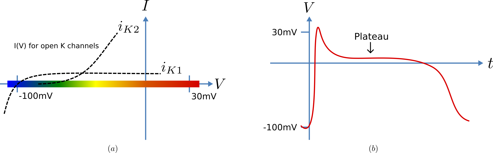
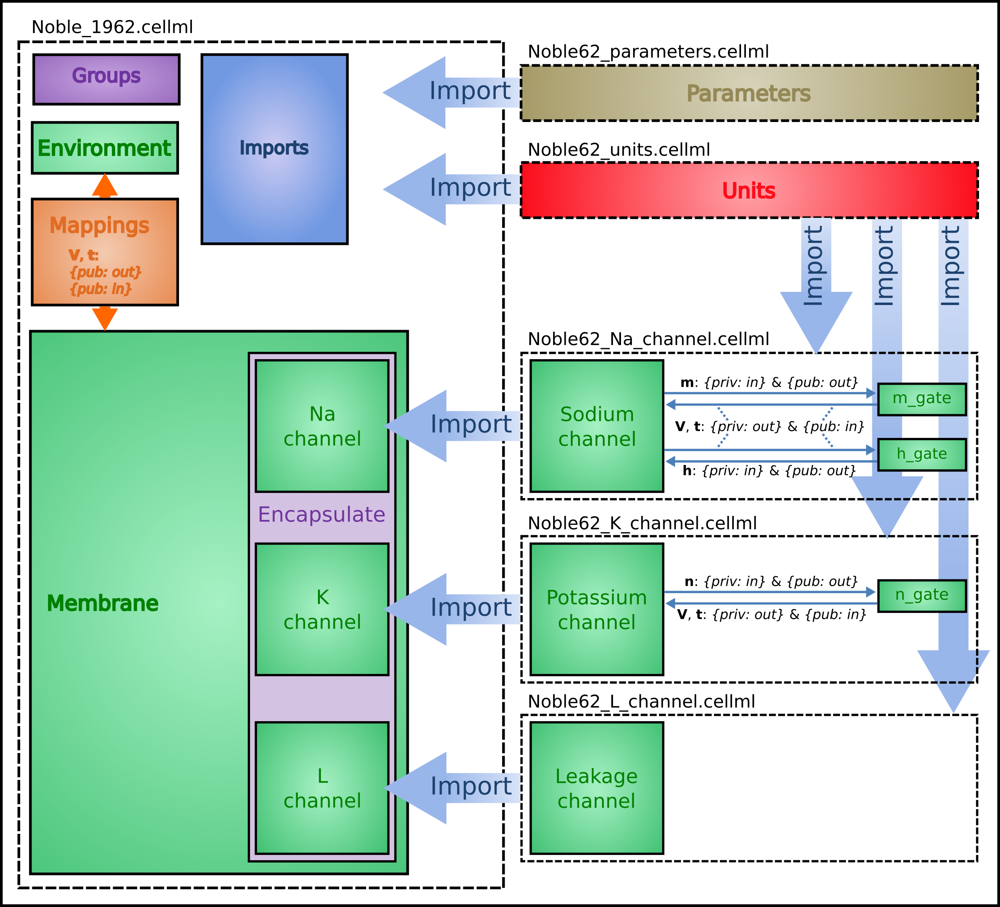
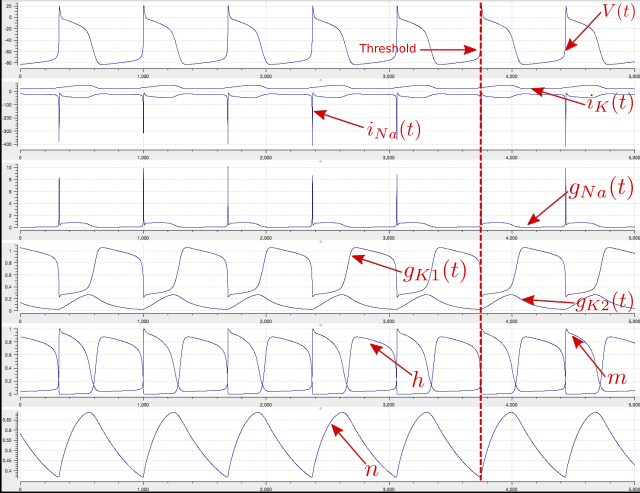

.. include:: resources/roles.txt

.. _ocr_tut_intro_cellml_import_unit_params:

=======================================================================
A model of the cardiac action potential: Importing units and parameters
=======================================================================

We now examine the Noble 1962 model :cite:`12` that applied the Hodgkin-Huxley
approach to cardiac cells and thereby initiated the development of a
long line of cardiac cell models that, in their human cell formulation,
are now used clinically and are the most sophisticated models of any
cell type. It was the incorporation of these models into whole heart
bioengineering models that initiated the Physiome Project. We also
illustrate the use of imported units and imported parameter sets.

Cardiac cells have similar gradients of potassium and sodium ions that
operate in a similar way to neurons (as do all electrically active
cells). There is one major difference, however, in the potassium channel
that holds the cells in their resting state at -85mV (HH neuron) or
-100mV (cardiac Purkinje cells). This difference is illustrated in
:numref:`Fig. %s(a)<ocr_tut_cur_volt_relations>`. When the membrane potential is raised above the equilibrium
potential for potassium, the cardiac channel conductance shown by the
dashed line drops to nearly zero – i.e. it is an *inward rectifier*
since it rectifies (‘cuts off’) the outward current that otherwise would
have flowed through the channel at that potential. This is an
evolutionary adaptation of the potassium channel to avoid loss of
potassium ions out of the cell during the long plateau phase of the
cardiac action potential (:numref:`Fig. %s(b)<ocr_tut_cur_volt_relations>`) needed to give the heart time to
contract. This evolutionary change saves the additional energy that
would otherwise be needed to pump potassium ions back into the cell, but
this Faustian “pact with the devil” is also the reason the heart is so
susceptible to conduction failure (more on this later). To explain his
data on Purkinje cells Noble :cite:`12` postulated the existence of two inward
rectifier potassium channels, one with a conductance :math:`g_{K1}` that
showed voltage dependence but no significant time dependence and another
with conductance :math:`g_{K2}` that showed less severe rectification
with time dependent gating similar to the HH four-gated potassium
channel.

   Current-voltage relations (a) around the equilibrium
   potentials for the potassium and sodium channels in cardiac cells. The
   sodium channel is similar to the one in neurons but the two potassium
   channels have an inward rectifying property that stops leakage of
   potassium ions out of the cell when the membrane potential (illustrated
   in (b)) is high during the plateau phase of the cardiac action potential.

To model the cardiac action potential in Purkinje fibres (a cardiac cell
specialised for rapid conduction from the atrio-ventricular node to the
apical ventricular myocardial tissue), Noble :cite:`12` proposed two potassium
channels (one of these being the inwardly rectifying potassium channel
described above and the other called the delayed potassium channel), one
sodium channel (very similar to the HH neuronal sodium channel) and one
leakage channel (also similar to the HH one).

The equations for these are as follows: (as for the HH model, time is in
ms, voltages are in mV, concentrations are in mM, conductances are in
mS, currents are in µA and capacitance is in µF).

**Inward rectifying** :math:`\mathbf{i}_{\mathbf{K}\mathbf{1}}`
**potassium channel** (voltage dependent only)

.. math::

   i_{K1} &=\ g_{K1}\left( V - E_{K} \right),\text{ with }
   E_{K} = \frac{\text{RT}}{\text{zF}}ln\frac{\left\lbrack K^{+} \right\rbrack_{o}}{\left\lbrack K^{+} \right\rbrack_{i}} = 25ln\frac{2.5}{140} = - 100\text{mV}. \\
   g_{K1} &=\ 1.2e^{\frac{- \left( V + 90 \right)}{50}} + 0.015e^{\frac{\left( V + 90 \right)}{60}}

**Inward rectifying** :math:`\mathbf{i}_{\mathbf{K}\mathbf{2}}`
**potassium channel** (voltage and time dependent)\ [#]_

.. math::

   i_{K2} &=\ g_{K2}\left( V - E_{K} \right) \\
   g_{K2} &=\ 1.2n^{4} \\
   \frac{\text{dn}}{\text{dt}} &=\ \alpha_{n}\left( 1 - n \right) - \beta_{n}\text{.n},
   \text{ where } \alpha_{n} = \frac{- 0.0001\left( V + 50 \right)}{e^{\frac{- \left( V + 50 \right)}{10}} - 1} \text{ and } \beta_{n} = 0.002e^{\frac{- \left( V + 90 \right)}{80}}.

Note that the rate constants here reflect a much slower onset of the
time dependent change in conductance than in the HH potassium channel.

**Sodium channel**

.. math::

   i_{\text{Na}} &=\ \left( g_{\text{Na}} + 140 \right)\left( V - E_{\text{Na}} \right), \text{ with } E_{\text{Na}} = \frac{\text{RT}}{\text{zF}}ln\frac{\left\lbrack \text{Na}^{+} \right\rbrack_{o}}{\left\lbrack \text{Na}^{+} \right\rbrack_{i}} = 25ln\frac{140}{30} = 35\text{mV}. \\
   g_{\text{Na}} &=\ m^{3}\text{h.}g_{Na\_ max} \text{ where } g_{Na\_ max} = 400\text{mS}. \\
   \frac{\text{dm}}{\text{dt}} &=\ \alpha_{m}\left( 1 - m \right) - \beta_{m}\text{.m}, \text{ where } \alpha_{m} = \frac{- 0.1\left( V + 48 \right)}{e^{\frac{- \left( V + 48 \right)}{15}} - 1} \text{ and } \beta_{m} = \frac{0.12\left( V + 8 \right)}{e^{\frac{\left( V + 8 \right)}{5}} - 1} \\
   \frac{\text{dh}}{\text{dt}} &=\ \alpha_{h}\left( 1 - h \right) - \beta_{h}\text{.h},
   \text{ where } \alpha_{h} = 0.17e^{\frac{- \left( V + 90 \right)}{20}}\text{ and } \beta_{h} = \frac{1}{1 + e^{\frac{- \left( V + 42 \right)}{10}}}

**Leakage channel**

.. math::

   i_{\text{leak}} = g_{L}\left( V - E_{L} \right), \text{ with }
   E_{L} = - 60mV \text{ and } g_{L} = 0.075\text{mS}.

**Membrane equation**\ [#]_

.. math::

   \frac{\text{dV}}{\text{dt}} = - \left( i_{\text{Na}} + i_{K1} + i_{K2} + i_{\text{leak}} \right)/C_{m}\text{ where } C_{m} = 12\mu\text{F}.

:numref:`ocr_tut_ove_str_noble62` shows the structure of the model, including separate files for
units, parameters, and the three ion channels (the two potassium
channels are lumped together). We include the Nernst equations
dependence on potassium and sodium ion concentrations in order to
demonstrate the use of parameter values, defined in a separate
parameters file, that are read in at the top (whole cell model) level
and passed down to the individual ion channel models.

   Overall structure of the Noble62 CellML model showing the
   encapsulation hierarchy (:purple:`purple`), the CellML model imports
   (:blue:`blue`) and the other key parts (:red:`units`, :green:`components` &
   :orange:`mappings`) of the top level CellML model. Note that the overall
   structure of the Noble62 model differs from that of the earlier HH model
   in that all units are defined in a units file and imported where needed
   (shown by the import arrows). Also the ion concentration parameters are
   defined in a parameters file and imported into the top level file but
   passed down to the modules that use them via the mappings.

The CellML Text code for all six files is shown on the following two
pages. The arrows indicate the imports (appropriately colour coded for
:red:`units`, :green:`components`, and :olive:`parameters`).

Graphical outputs from solution of the Noble 1962 model with OpenCOR for
5000ms are shown in :numref:`ocr_tut_ove_str_noble62`.  Interpretation of the model outputs is given in the :numref:`ocr_tut_ove_str_noble62` legend.
The Noble62 model was developed further by Noble and others to include
additional sodium and potassium channels, calcium channels (needed for
excitation-contraction coupling), chloride channels and various ion
exchange mechanisms (Na/Ca, Na/H), co-transporters (Na/Cl, K/Cl) and
energy (ATP)-dependent pumps (Na/K, Ca) needed to model the observed
beat by beat changes in intracellular ion concentrations. These are
discussed further in Section 15.

.. note::

   The downloadable links below are links to the raw text file that may be used for copying and pasting into OpenCOR.  For the underlying CellML file that is suitable for opening with OpenCOR from disk obtain the xml file.

Raw text: :download:`Noble_1962.txt <resources/Noble_1962.txt>`, XML file: `Noble_1962.cellml <https://models.physiomeproject.org/workspace/25d/rawfile/aec9dd2760d3512135605017226531ac1d4d0d0f/Noble_1962.cellml>`_.

.. code-block:: cell

   def model Noble_1962 as
      def import using "Noble62_Na_channel.xml" for
         comp Na_channel using comp sodium_channel;
      enddef;
      def import using "Noble62_K_channel.xml" for
         comp K_channel using comp potassium_channel;
      enddef;
      def import using "Noble62_L_channel.xml" for
         comp L_channel using comp leakage_channel;
      enddef;
      def import using "Noble62_units.xml" for
         unit mV using unit mV;
         unit ms using unit ms;
         unit nanoF using unit nanoF;
         unit nanoA using unit nanoA;
      enddef;
      def import using "Noble62_parameters.xml" for
         comp parameters using comp parameters;
      enddef;
      def map between parameters and membrane for
         vars Ki and Ki;
         vars Ko and Ko;
         vars Nai and Nai;
         vars Nao and Nao;
      enddef;
      def comp environment as
         var t: ms {init: 0, pub: out};
      enddef;
      def group as encapsulation for
         comp membrane incl
            comp Na_channel;
            comp K_channel;
            comp L_channel;
         endcomp;
      enddef;
      def comp membrane as
         var V: mV {init: -85, pub: out, priv: out};
         var t: ms {pub: in, priv: out};
         var Cm: nanoF {init: 12000};
         var Ki: mM {pub: in, priv: out};
         var Ko: mM {pub: in, priv: out};
         var Nai: mM {pub: in, priv: out};
         var Nao: mM {pub: in, priv: out};
         var i_Na: nanoA {pub: out, priv: in};
         var i_K: nanoA {pub: out, priv: in};
         var i_L: nanoA {pub: out, priv: in};
         ode(V, t) = -(i_Na+i_K+i_L)/Cm;
      enddef;
      def map between environment and membrane for
         vars t and t;
      enddef;
      def map between membrane and Na_channel for
         vars V and V;
         vars t and t;
         vars Nai and Nai;
         vars Nao and Nao;
         vars i_Na and i_Na;
      enddef;
      def map between membrane and K_channel for
         vars V and V;
         vars t and t;
         vars Ki and Ki;
         vars Ko and Ko;
         vars i_K and i_K;
      enddef;
      def map between membrane and L_channel for
         vars V and V;
         vars i_L and i_L;
      enddef;
   enddef;

Raw text: :download:`Noble62_units.txt <resources/Noble62_units.txt>`, XML file `Noble62_units.cellml <https://models.physiomeproject.org/workspace/25d/rawfile/aec9dd2760d3512135605017226531ac1d4d0d0f/Noble62_units.cellml>`_.

.. code-block:: cell

   def model Noble62_units as
      def unit ms as
         unit second {pref: milli};
      enddef;
      def unit per_ms as
         unit second {pref: milli, expo: -1};
      enddef;
      def unit mV as
         unit volt {pref: milli};
      enddef;
      def unit mM as
         unit mole {pref: milli};
      enddef;
      def unit per_mV as
         unit volt {pref: milli, expo: -1};
      enddef;
      def unit per_mV_ms as
         unit mV {expo: -1};
         unit ms {expo: -1};
      enddef;
      def unit microS as
         unit siemens {pref: micro};
      enddef;
      def unit nanoF as
         unit farad {pref: nano};
      enddef;
      def unit nanoA as
         unit ampere {pref: nano};
      enddef;
   enddef;

Raw text: :download:`Noble62_parameters.txt <resources/Noble62_parameters.txt>`, XML file `Noble62_parameters.cellml <https://models.physiomeproject.org/workspace/25d/rawfile/aec9dd2760d3512135605017226531ac1d4d0d0f/Noble62_parameters.cellml>`_.

.. code-block:: cell

   def model Noble62_parameters as
      def import using "Noble62_units.xml" for
         unit mM using unit mM;
      enddef;
      def comp parameters as
         var Ki: mM {init: 140, pub: out};
         var Ko: mM {init: 2.5, pub: out};
         var Nai: mM {init: 30, pub: out};
         var Nao: mM {init: 140, pub: out};
      enddef;
   enddef;

Raw text: :download:`Noble62_Na_channel.txt <resources/Noble62_Na_channel.txt>`, XML file `Noble62_Na_channel.cellml <https://models.physiomeproject.org/workspace/25d/rawfile/aec9dd2760d3512135605017226531ac1d4d0d0f/Noble62_Na_channel.cellml>`_.

.. code-block:: cell

   def model sodium_ion_channel as
      def import using "Noble62_units.xml" for
         unit mV using unit mV;
         unit ms using unit ms;
         unit mM using unit mM;
         unit per_ms using unit per_ms;
         unit per_mV using unit per_mV;
         unit per_mV_ms using unit per_mV_ms;
         unit microS using unit microS;
         unit nanoA using unit nanoA;
      enddef;
      def group as encapsulation for
         comp sodium_channel incl
         comp sodium_channel_m_gate;
         comp sodium_channel_h_gate;
      endcomp;
      enddef;
      def comp sodium_channel as
         var V: mV {pub: in, priv: out};
         var t: ms {pub: in, priv: out};
         var g_Na_max: microS {init: 400000};
         var g_Na: microS;
         var E_Na: mV;
         var m: dimensionless {priv: in};
         var h: dimensionless {priv: in};
         var Nai: mM {pub: in};
         var Nao: mM {pub: in};
         var RTF: mV {init: 25};
         var i_Na: nanoA {pub: out};
         E_Na = RTF*ln(Nao/Nai);
         g_Na = pow(m, 3{dimensionless})*h*g_Na_max;
         i_Na = (g_Na+140{microS})*(V-E_Na);
      enddef;
      def comp sodium_channel_m_gate as
         var V: mV {pub: in};
         var t: ms {pub: in};
         var m: dimensionless {init: 0.01, pub: out};
         var alpha_m: per_ms;
         var beta_m: per_ms;
         alpha_m = -0.10{per_mV_ms}*(V+48{mV})
           /(exp(-(V+48{mV})/15{mV})-1{dimensionless});
         beta_m = 0.12{per_mV_ms}*(V+8{mV})
           /(exp((V+8{mV})/5{mV})-1{dimensionless});
         ode(m, t)=alpha_m*(1{dimensionless}-m)-beta_m*m;
      enddef;
      def comp sodium_channel_h_gate as
         var V: mV {pub: in};
         var t: ms {pub: in};
         var h: dimensionless {init: 0.8, pub: out};
         var alpha_h: per_ms;
         var beta_h: per_ms;
         alpha_h = 0.17{per_ms}*exp(-(V+90{mV})/20{mV});
         beta_h = 1.00{per_ms}
           /(1{dimensionless}+exp(-(V+42{mV})/10{mV}));
         ode(h, t) = alpha_h*(1{dimensionless}-h)-beta_h*h;
      enddef;
      def map between sodium_channel
        and sodium_channel_m_gate for
         vars V and V;
         vars t and t;
         vars m and m;
      enddef;
      def map between sodium_channel
        and sodium_channel_h_gate for
         vars V and V;
         vars t and t;
         vars h and h;
      enddef;
   enddef;

Raw text: :download:`Noble62_K_channel.txt <resources/Noble62_K_channel.txt>`, XML file `Noble62_K_channel.cellml <https://models.physiomeproject.org/workspace/25d/rawfile/aec9dd2760d3512135605017226531ac1d4d0d0f/Noble62_K_channel.cellml>`_.

.. code-block:: cell

   def model potassium_ion_channel as
      def import using "Noble62_units.xml" for
         unit mV using unit mV;
         unit ms using unit ms;
         unit mM using unit mM;
         unit per_ms using unit per_ms;
         unit per_mV using unit per_mV;
         unit per_mV_ms using unit per_mV_ms;
         unit microS using unit microS;
         unit nanoA using unit nanoA;
      enddef;
      def group as encapsulation for
         comp potassium_channel incl
            comp potassium_channel_n_gate;
         endcomp;
      enddef;
      def comp potassium_channel as
         var V: mV {pub: in, priv: out};
         var t: ms {pub: in, priv: out};
         var n: dimensionless {priv: in};
         var Ki: mM {pub: in};
         var Ko: mM {pub: in};
         var RTF: mV {init: 25};
         var E_K: mV;
         var g_K1: microS;
         var g_K2: microS;
         var i_K: nanoA {pub: out};
         E_K = RTF*ln(Ko/Ki);
         g_K1 = 1200{microS}*exp(-(V+90{mV})/50{mV})
           +15{microS}*exp((V+90{mV})/60{mV});
         g_K2 = 1200{microS}*pow(n, 4{dimensionless});
         i_K = (g_K1+g_K2)*(V-E_K);
      enddef;
      def comp potassium_channel_n_gate as
         var V: mV {pub: in};
         var t: ms {pub: in};
         var n: dimensionless {init: 0.01, pub: out};
         var alpha_n: per_ms;
         var beta_n: per_ms;
         alpha_n = -0.0001{per_mV_ms}*(V+50{mV})
           /(exp(-(V+50{mV})/10{mV})-1{dimensionless});
         beta_n = 0.0020{per_ms}*exp(-(V+90{mV})/80{mV});
         ode(n,t)= alpha_n*(1{dimensionless}-n)-beta_n*n;
      enddef;
      def map between environment
        and potassium_channel for
         vars V and V;
         vars t and t;
      enddef;
      def map between potassium_channel and
        potassium_channel_n_gate for
         vars V and V;
         vars t and t;
         vars n and n;
      enddef;
   enddef;

Raw text: :download:`Noble62_L_channel.txt <resources/Noble62_L_channel.txt>`, XML file `Noble62_L_channel.cellml <https://models.physiomeproject.org/workspace/25d/rawfile/aec9dd2760d3512135605017226531ac1d4d0d0f/Noble62_L_channel.cellml>`_.

.. code-block:: cell

   def model leakage_ion_channel as
      def import using "Noble62_units.xml" for
         unit mV using unit mV;
         unit ms using unit ms;
         unit microS using unit microS;
         unit nanoA using unit nanoA;
      enddef;
      def comp leakage_channel as
         var V: mV {pub: in};
         var g_L: microS {init: 75};
         var E_L: mV {init: -60};
         var i_L: nanoA {pub: out};
         i_L = g_L*(V-E_L);
      enddef;
   enddef;

   Output from the Noble62 model (`OpenCOR link <opencor://openFile/https://models.physiomeproject.org/workspace/25d/rawfile/e3ef4cf57b9be0b9f5ccb72e98dac46f2381add5/Noble_1962.sedml>`_). Top panel is
   :math:`V\left( t \right)`, the cardiac action potential. The next
   panel has the two membrane ion channel currents
   :math:`i_{\text{Na}}\left( t \right)` and
   :math:`i_{K}\left( t \right)`. Note that
   :math:`i_{\text{Na}}\left( t \right)` has a very brief downward (i.e.
   inward current) spike that is triggered when the membrane voltage
   reaches about -70mV. This is caused by the huge increase in sodium
   channel conductance :math:`g_{\text{Na}}\left( t \right)` shown in the
   panel below associated with the simultaneous opening of the *m*-gate
   and closing of the *h*-gate (5\ :sup:`th` panel down). The resting state
   of about
   -80mV in the top panel is set by the potassium equilibrium (Nernst)
   potential via the open potassium channels. As can be seen from the
   4\ :sup:`th` and bottom panels, it is the closing of the
   time-dependent potassium *n*-gate and the corresponding decline of
   potassium conductance that, with a small background leakage current
   :math:`i_{L}\left( t \right)`, leads to the membrane potential rising
   from -80mV to the threshold for activation of the sodium channel (note
   the dotted red line showing the point when *n(t)* reaches a minimum).
   Later cardiac cell models include additional ion channels that
   directly affect the heart rate by controlling this rise.

We have now covered all existing features of CellML and OpenCOR. But,
most importantly, you have learned 'best practice' for building CellML
models, including encapsulation of sub-components and a modular approach
in which units, parameters and model components are defined in separate
files that are imported into a composite model.

---------------------------

.. rubric:: Footnotes

.. [#] The second inwardly rectifying channel model was later replaced with two currents and , so that modern cardiac cell models do not include but they do include the inward rectifier (see later section).

.. [#] The Purkinje fibre membrane capacitance is 12 times higher than that found for squid axon. The use of :math:`\mu`\ F ensures unit consistency with ms, mV and  A since F is equivalent to :math:`\text{C.V}^{-1}` or :math:`\text{s.A.V}^{-1}` and therefore  A/ F or  A/(:math:`\text{ms. A. mV}^{-1}`) on the RHS matches mV/ms on the LHS).
