===========================================================
Tutorial on CellML, OpenCOR & the Physiome Model Repository
===========================================================

.. warning::
   This version of the tutorial is undergoing translation from the original source to reStructuredText. Many aspects of formatting and presentation are currently lacking, although being worked on. The original tutorial is available here: :download:`OpenCOR-Tutorial-v17.pdf <images/OpenCOR-Tutorial-v17.pdf>`.

This tutorial shows you how to install and run the OpenCOR [1]_ software
[1], to author and edit CellML models [2]_ [2] and to use the Physiome
Model Repository (PMR) [3]_ [3]. We start by giving a brief background
on the VPH-Physiome project. We then create a simple model, save it as a
CellML file and run model simulations. We next try opening existing
CellML models, both from a local directory and from the Physiome Model
Repository. The various features of CellML [4]_ and OpenCOR are then
explained in the context of increasingly complex biological models. A
simple linear first order ODE model and a nonlinear third order model
are introduced. Ion channel gating models are used to introduce the way
that CellML handles units, components, encapsulation groups and
connections. More complex potassium and sodium ion channel models are
then developed and subsequently imported into the Hodgkin-Huxley 1952
squid axon neural model using the CellML model import facility. The
Noble 1962 model of a cardiac cell action potential is used to
illustrate importing of units and parameters. The tutorial finishes with
sections on model annotation and the facilities available on the CellML
website and the Physiome Model Repository to support model development,
including the links to bioinformatic databases. There is a strong
emphasis in the tutorial on establishing ‘best practice’ in the creation
of CellML models and using the PMR resources, particularly in relation
to modular approaches (model hierarchies) and model annotation.

.. note::

   This tutorial relies on readers having some background in
   algebra and calculus, but tries to explain all mathematical concepts
   beyond this, along with the physical principles, as they are needed for
   the development of CellML models. [5]_

.. contents::

Background to the VPH-Physiome project
======================================

To be of benefit to applications in healthcare, organ and whole organism
physiology needs to be understood at both a systems level and in terms
of subcellular function and tissue properties. Understanding a
re-entrant arrhythmia in the heart, for example, depends on knowledge of
not only numerous cellular ionic current mechanisms and signal
transduction pathways, but also larger scale myocardial tissue structure
and the spatial variation in protein expression. As reductionist
biomedical science succeeds in elucidating ever more detail at the
molecular level, it is increasingly difficult for physiologists to
relate integrated whole organ function to underlying biophysically
detailed mechanisms that exploit this molecular knowledge. Multi-scale
computational modelling is used by engineers and physicists to design
and analyse mechanical, electrical and chemical engineering systems.
Similar approaches could benefit the understanding of physiological
systems. To address these challenges and to take advantage of
bioengineering approaches to modelling anatomy and physiology, the
International Union of Physiological Sciences (IUPS) formed the Physiome
Project in 1997 as an international collaboration to provide a
computational framework for understanding human physiology [6]_.

One of the primary goals of the Physiome Project [4] has been to promote
the development of standards for the exchange of information between
models. The first of these standards, dealing with time varying but
spatially lumped processes, is CellML [5]. The second (dealing with
spatially and time varying processes) is FieldML [6,7] [7]_. A further
goal of the Physiome Project has been the development of open source
tools for creating and visualizing standards-based models and running
model simulations. OpenCOR is the latest in a series of software
projects aimed at providing a modelling environment for CellML models.
Similar tools exist for FieldML models.

Following the publication of the STEP [8]_ (*Strategy for a European
Physiome*) Roadmap in 2006, the European Commission in 2007 initiated
the Virtual Physiological Human (VPH) project [8]. A related US
initiative by the Interagency Modeling and Analysis Group (IMAG) began
in 2003 [9]_. These projects and similar initiatives are now coordinated
and are collectively referred to here as the ‘VPH-Physiome’
project [10]_. The VPH-Institute [11]_ was formed in 2012 as a virtual
organisation to providing strategic leadership, initially in Europe but
now globally, for the VPH-Physiome Project.

Install and launch OpenCOR
==========================

Download OpenCOR from `www.opencor.ws <http://www.opencor.ws>`__.
Versions are available for Windows, Mac and Linux. Note that the
annotation section of this tutorial relies on the OpenCOR snapshot
2015-06-09 (or later). Create a shortcut to the executable (found in the
bin directory) on your desktop and click on this to launch OpenCOR. A
window will appear that looks like Figure 1(a).

|image0| |image1|

(a) (b)

**Figure 1**. (a) Default positioning of dockable windows. (b) An
alternative configuration achieved by dragging and dropping the dockable
windows.

The central area is used to interact with files. By default, no files
are open, hence the OpenCOR logo is shown instead. To the sides, there
are dockable windows, which provide additional features. Those windows
can be dragged and dropped to the top or bottom of the central area as
shown in Figure 1(b) or they can be individually undocked or closed. All
closed panels can be re-displayed by enabling them in the *View* menu,
or by using the *Tools* menu *Reset All* option. Clicking on
‘CTRL’ [12]_ & ‘spacebar’ on the Windows version, removes (for less
clutter) or restores these two side panels.

Any of the subpanels (*Physiome Model Repository*, *File Browser*, and
*File Organiser*) can be closed with the top right delete button, and
then restored from the *View* .. *Windows*.. menu. Files can be dragged
and dropped into the File Organiser to create a local directory
structure for your files.

|image2|\ OpenCOR has a plugin architecture and can be used with or
without a range of modules. These can be viewed under the *Tools* menu.
By default they are all included, as shown in Figure 2. Information
about developing plugins for OpenCOR is also available [13]_.

Create and run a simple CellML model: editing and simulation
============================================================

In this example we create a simple CellML model and run it. The model is
the Van der Pol oscillator [14]_ defined by the second order equation

.. math:: \frac{d^{2}x}{dt^{2}} - \mu\left( 1 - x^{2} \right)\frac{\text{dx}}{\text{dt}} + x = 0

with initial conditions
:math:`x = - 2;\ \frac{\text{dx}}{\text{dt}} = 0`. The parameter
:math:`\mu` controls the magnitude of the damping term. To create a
CellML model we convert this to two first order equations [15]_ by
defining the velocity :math:`\frac{\text{dx}}{\text{dt}}` as a new
variable :math:`y`:

:math:`\frac{\text{dx}}{\text{dt}} = y`

:math:`\frac{\text{dy}}{\text{dt}} = \mu\left( 1 - x^{2} \right)y - x`

The initial conditions are now :math:`x = - 2;y = 0`.

With the central pane in *Editing* mode (e.g. *CellML Text* view), under
the *File* menu and *New*, click on *CellML 1.1 File* then type in the
following lines of code after deleting the three lines that indicate
where the code should go:

    **def** model van\_der\_pol\_model as

    **def** comp main as

    var t: dimensionless *{init: 0}*;

    var x: dimensionless *{init: -2}*;

    var y: dimensionless *{init: 0}*;

    var mu: dimensionless *{init: 1}*;

    // These are the ODEs

    ode(x,t)=y;

    ode(y,t)=mu\*(1{dimensionless}-sqr(x))\*y-x;

    **enddef**;

    **enddef**;

Things to note [16]_ are: (i) the closing semicolon at the end of each
line (apart from the first two *def* statements that are opening a
CellML construct); (ii) the need to indicate dimensions for each
variable and constant (all dimensionless in this example – but more on
dimensions later); (iii) the use of *ode(x,t)* to indicate a first
order [17]_ ODE in *x* and *t*, (iv) the use of the squaring function
*sqr(x)* for :math:`x^{2}`, and (v) the use of ‘//’ to indicate a
comment.

A partial list of mathematical functions available for OpenCOR is:

+----------------------------+----------+----------------------------+----------+----------------------------+----------+--------------------------------+----------+--------------------------------+----------+----------------------------+----------+
| .. math:: x^{2}            | sqr(x)   | .. math:: \sqrt{x}         | sqrt(x)  | .. math:: \ln x            | ln(x)    | .. math:: \operatorname{}x     | log(x)   | .. math:: e^{x}                | exp(x)   | .. math:: x^{a}            | pow(x,a) |
+============================+==========+============================+==========+============================+==========+================================+==========+================================+==========+============================+==========+
| .. math:: \sin x           | sin(x)   | .. math:: \cos x           | cos(x)   | .. math:: \tan x           | tan(x)   | .. math:: \csc x               | csc(x)   | .. math:: \sec x               | sec(x)   | .. math:: \cot x           | cot(x)   |
+----------------------------+----------+----------------------------+----------+----------------------------+----------+--------------------------------+----------+--------------------------------+----------+----------------------------+----------+
| .. math:: \operatorname{}x | asin(x)  | .. math:: \operatorname{}x | acos(x)  | .. math:: \operatorname{}x | atan(x)  | .. math:: \operatorname{}x     | acsc(x)  | .. math:: \operatorname{}x     | asec(x)  | .. math:: \operatorname{}x | acot(x)  |
+----------------------------+----------+----------------------------+----------+----------------------------+----------+--------------------------------+----------+--------------------------------+----------+----------------------------+----------+
| .. math:: \sinh x          | sinh(x)  | .. math:: \cosh x          | cosh(x)  | .. math:: \tanh x          | tanh(x)  | .. math:: \operatorname{csch}x | csch(x)  | .. math:: \operatorname{sech}x | sech(x)  | .. math:: \coth x          | coth(x)  |
+----------------------------+----------+----------------------------+----------+----------------------------+----------+--------------------------------+----------+--------------------------------+----------+----------------------------+----------+
| .. math:: \operatorname{}x | asinh(x) | .. math:: \operatorname{}x | acosh(x) | .. math:: \operatorname{}x | atanh(x) | .. math:: \operatorname{}x     | acsch(x) | .. math:: \operatorname{}x     | asech(x) | .. math:: \operatorname{}x | acoth(x) |
+----------------------------+----------+----------------------------+----------+----------------------------+----------+--------------------------------+----------+--------------------------------+----------+----------------------------+----------+

**Table 1**. The list of mathematical functions available for coding in
OpenCOR.

Positioning the cursor over either of the ODEs renders the maths in
standard form above the code as shown in Figure 3(a).

Note that CellML is a declarative language [18]_ (unlike say C, Fortran
or Matlab, which are procedural languages) and therefore the order of
statements does not affect the solution. For example, the order of the
ODEs could equally well be

The significance of this will become apparent later when we import
several CellML models to create a composite model.

|image3| |image4|

(a) (b)

**Figure 3**. (a) Positioning the cursor over an equation and clicking
(shown by the highlighted line) renders the maths. (b) Once the model
has been successfully saved, the *CellML Text* view tab becomes white
rather than grey. The right hand tabs provide different views of the
CellML code.

Now save the code to a local folder using *Save* under the *File* menu
(or ‘CTRL-S’) and choosing *.cellml* as the file format [19]_. With the
CellML model saved various views, accessed via the tabs on the right
hand edge of the window, become available. One is the *CellML Text* view
(the view used to enter the code above); another is the *Raw CellML*
view that displays the way the model is stored and is intentionally
verbose to ensure that the meaning is always unambiguous (note that
positioning the cursor over part of the code shows the maths in this
view also); and another is the *Raw* view. Notice that ‘CTRL-T’ in the
*Raw CellML* view performs validation tests on the CellML model. The
*CellML Text* view provides a much more convenient format for entering
and editing the CellML model.

With the equations and initial conditions defined, we are ready to run
the model. To do this, click on the *Simulation* tab on the left hand
edge of the window. You will see three main areas - at the left hand
side of the window are the *Simulation*, *Solvers*, *Graphs* and
*Parameters* panels, which are explained below. At the right hand side
is the graphical output window, and running along the bottom of the
window is a status area, where status messages are displayed.

***Simulation panel***

This area is used to set up the simulation settings.

-  Starting point - the value of the variable of integration (often
       time) at which the simulation will begin. Leave this at 0.

-  Ending point - the point at which the simulation will end. Set to
   100.

-  Point interval - the interval between data points on the variable of
   integration. Set to 0.1.

Just above the *Simulation panel* are controls for running the
simulation. These are:

*Run* (|image5|), *Pause* (|image6|), *Reset parameters* (|image7|),
*Clear simulation data* (|image8|), *Interval delay* (|image9|),
*Add*\ (|image10|)\ */Subtract*\ (|image11|) *graphical output windows*
and *Output solution to a CSV file* (|image12|).

For this model, we suggest that you create three graphical output
windows using the **+** button.

***Solvers panel ***

This area is used to configure the solver that will run the simulation.

-  Name - this is used to set the solver algorithm. It will be set by
   default to be the most appropriate solver for the equations you are
   solving. OpenCOR allows you to change this to another solver
   appropriate to the type of equations you are solving if you choose
   to. For example, CVODE for ODE (ordinary differential equation)
   problems, IDA for DAE (differential algebraic equation) problems,
   KINSOL for NLA (non-linear algebraic) problems [20]_.

-  Other parameters for the chosen solver – e.g. *Maximum step*,
   *Maximum number of steps*, and *Tolerance* settings for CVODE and
   IDA. For more information on the solver parameters, please refer to
   the documentation for the particular solver.

Note: these can all be left at their default values for our simple demo
problem [21]_.

***Graphs panel***

This shows what parameters are being plotted once these have been
defined in the *Parameters panel*. These can be selected/deselected by
clicking in the box next to a parameter.

***Parameters panel***

This panel lists all the model parameters, and allows you to select one
or more to plot against the variable of integration or another parameter
in the graphical output windows. OpenCOR supports graphing of any
parameter against any other. All variables from the model are listed
here, arranged by the components in which they appear, and in
alphabetical order. Parameters are displayed with their variable name,
their value, and their units. The icons alongside them have the
following meanings:

Editable constant Editable state variable

Computed constant Rate variable

Variable of integration Algebraic quantity

Right clicking on a parameter provides the options for displaying that
parameter in the currently selected graphical output window. With the
cursor highlighting the top graphical output window (a blue line appears
next to it), select *x* then *Plot Against Variable of Integration* – in
this case *t* - in order to plot *x(t)*. Now move the cursor to the
second graphical output window and select *y* then *t* to plot *y(t)*.
Finally select the bottom graphical output window, select *y* and select
*Plot Against* then *Main* then *x* to plot *y(x)*.

Now click on the *Run* control. You will see a progress bar running
along the bottom of the status window. Status messages about the
successful simulation, including the time taken, are displayed in the
bottom panel. This can be hidden by dragging down on the bar just above
the panel. Figure 4 shows the results. Use the *interval delay* wheel to
slow down the plotting if you want to watch the solution evolve. You can
also pause the simulation at any time by clicking on the *Run* control
and if you change a parameter during the pause, the simulation will
continue (when you click the *Run* control button again) with the new
parameter.

Note that the values shown for the various parameters are the values
they have at the end of the solution run. To restore these to their
initial values, use the *Reset parameters* (|image13|) button. To clear
the graphical output traces, click on the *Clear simulation data*
(|image14|) button.

The top two graphical output panels are showing the time-dependent
solution of the *x* and *y* variables. The bottom panel shows how *y*
varies as a function of *x*. This is called the solution in state space
and it is often useful to analyse the state space solution to capture
the key characteristics of the equations being solved.

| **Figure 4**. Graphical output from OpenCOR. The top window is *x(t)*,
  the middle is *y(t)* and the bottom is *y(x)*.
| The *Graphs* panel shows that *y(x)* is being plotted on the graph
  output window highlighted by the LH blue line.
| The window at the very bottom provides runtime information on the type
  of equation being solved and the simulation time (2ms in this case).
  The computed variables shown in the left hand panel are at the values
  they have at the end of the simulation.

To obtain numerical values for all variables (i.e. *x(t)* and *y(t)*),
click on the *CSV file* button (|image15|). You will be asked to enter a
filename and type (use .csv). Opening this file (e.g. with Microsoft
Excel) provides access to the numerical values. Other output types (e.g.
BiosignalML) will be available in future versions of OpenCOR.

You can move the graphical output traces around with ‘left click and
drag’ and you can change the horizontal or vertical scale with ‘right
click and drag’. Holding the SHIIFT key down while clicking on a
graphical output panel allows you to interrogate the solution at any
point. Right clicking on a panel provides zoom facilities.

The various plugins used by OpenCOR can be viewed under the Tools menu.
A French language version of OpenCOR is also available under the *Tools*
menu. An option under the *File* menu allows a file to be locked (also
‘CTRL-L’). To indicate that the file is locked, the background colour
switches to **pink** in the *CellML Text* and *Raw CellML* views and a
lock symbol appears on the filename tab. Note that OpenCOR text is case
sensitive.

Open an existing CellML file from a local directory or the Physiome Model Repository
====================================================================================

Go to the *File* menu and select *Open...*. Browse to the folder that
contains your existing models and select one. Note that this brings up a
new tabbed window and you can have any number of CellML models open at
the same time in order to quickly move between them. A model can be
removed from this list by clicking on |image16| next to the CellML model
name.

You can also access models from the left hand panel in Figure 1(a). If
this panel is not currently visible, use ‘CTRL-spacebar’ to make it
reappear. Models can then be accessed from any one of the three
subdivisions of this panel – *File Browser*, *Physiome Model Repository*
or *File Organiser*. For a file under *File Browser* or *File
Organiser*, either double-click it or ‘drag&drop’ it over the central
workspace to open that model. Clicking on a model in the *Physiome Model
Repository* (PMR) (e.g. Chen, Popel, 2007) opens a new browser window
with that model (PMR is covered in more detail in Section 13). You can
either load this model directly into OpenCOR or create an identical copy
(clone) of the model in your local directory. Note that PMR contains
*workspaces* and *exposures*. Workspaces are online environments for the
collaborative development of models (e.g. by geographically dispersed
groups) and can have password protected access. Exposures are workspaces
that are exposed for public view and mostly contain models from
peer-reviewed journal publications. There are about 600 exposures based
on journal papers and covering many areas of cell processes and other
ODE/algebraic models, but these are currently being supplemented with
reusable protein-based models – see discussion in a Section 13.

To load a model directly into OpenCOR, click on the right-most of the
two buttons in Figure 5 - this lists the CellML models in that exposure
- and then click on the model you want. Clicking on the left hand button
copies the PMR workspace to a local directory that you specify. This is
useful if you want to use that model as a template for a new one you are
creating.

|image17|

**Figure 5**. The Physiome Model Repository (PMR) window listing all PMR
models. These can be opened from within OpenCOR using the two buttons to
the right of a model, as explained below.

A simple first order ODE
========================

The simplest example of a first order ODE is

:math:`\frac{\text{dy}}{\text{dt}} = - ay + b`

with the solution

:math:`y\left( t \right) = \frac{b}{a} + \left( y\left( 0 \right) - \frac{b}{a} \right).e^{- at}`,

where :math:`y\left( 0 \right)` or :math:`y_{0}`, the value of
:math:`y\left( t \right)` at :math:`t = 0`, is the *initial condition*.
The final steady state solution as :math:`t \rightarrow \infty` is
:math:`y\left( \left. \ t \right|_{\infty} \right) = y_{\infty} = \frac{b}{a}`
(see Figure 6). Note that :math:`t = \tau = \frac{1}{a}` is called the
*time constant* of the exponential decay, and that

:math:`y\left( \tau \right) = \frac{b}{a} + \left( y\left( 0 \right) - \frac{b}{a} \right).e^{- 1}`.

At :math:`t = \tau` , :math:`y\left( t \right)` has therefore fallen to
:math:`\frac{1}{e}` (or about 37%) of the difference between the initial
(:math:`y\left( 0 \right)`) and final steady state (
:math:`y\left( \infty \right)`) values. [22]_

Choosing parameters :math:`a = \tau = 1;b = 2` and
:math:`y\left( 0 \right) = 5`, the *CellML Text* for this model is

    def model first\_order\_model as

    def comp main as

    var t: dimensionless *{init: 0}*;

    var y: dimensionless *{init: 5}*;

    var a: dimensionless *{init: 1}*;

    var b: dimensionless *{init: 2}*;

    ode(y,t)=-a\*y+b;

    enddef;

    enddef;

The solution by OpenCOR is shown in Figure 7(a) for these parameters (a
decaying exponential) and in Figure 7(b) for parameters
:math:`a = 1;b = 5` and :math:`y\left( 0 \right) = 2` (an inverted
decaying exponential). Note the simulation panel with *Ending
point*\ =10, *Point interval*\ =0.1. Try putting :math:`a = - 1`.

(a) (b)

**Figure 7**. OpenCOR output :math:`y\left( t \right)` for the simple
ODE model with parameters (a) :math:`a = 1;b = 2` and
:math:`y\left( 0 \right) = 5`, and (b) :math:`a = 1;b = 5` and
:math:`y\left( 0 \right) = 2`. The **red** **arrow** indicates the point
at which the trace reaches the time constant :math:`\tau`
(:math:`e^{- 1}` or ≈37% of the difference between the initial and final
solution values). The black arrows indicate the initial and final
(steady state) solutions. Note that the parameters on the left have been
reset to their initial values for this figure – normally they would be
at their final solution values.

These two solutions have the same exponential time constant
(:math:`\tau = \frac{1}{a} = 1`) but different initial and final (steady
state) values.

The exponential decay curve shown on the left in Figure 7 is a common
feature of many models and in the case of radioactive decay (for
example) is a statement that the ***rate of decay***
(:math:`- \frac{\text{dy}}{\text{dt}}`) is proportional to the
***current amount of substance*** (:math:`y`). This is illustrated on
the NZ$100 note (should you be lucky enough to possess one), shown in
Figure 8.

**Figure 8.** The **exponential curve** representing the naturally
occurring radioactive decay explained by the New Zealand Noble laureate
Sir Ernest Rutherford - best known for ‘splitting the atom’. This may be
the only bank note depicting the mathematical solution of a first order
ODE.

The Lorenz attractor
====================

An example of a third order ODE system (i.e. three 1\ :sup:`st` order
equations) is the *Lorenz equations*\  [23]_.

This system has three equations:

:math:`\frac{\text{dx}}{\text{dt}} = \sigma\left( y - x \right)`

:math:`\frac{\text{dy}}{\text{dt}} = x\left( \rho - z \right) - y`

:math:`\frac{\text{dz}}{\text{dt}} = xy - \beta z`

where :math:`\sigma,\ \rho` and :math:`\beta` are parameters.

| The *CellML Text* code entered for
| these equations is shown in Figure 9
| with parameters

:math:`\sigma = 10`, :math:`\rho = 28`, :math:`\beta = 8/3` = 2.66667

and initial conditions

:math:`x\left( 0 \right) = y\left( 0 \right) = z\left( 0 \right) =`\ 1.

Solutions for :math:`x\left( t \right)`, :math:`y\left( x \right)` and
:math:`z\left( x \right)`, corresponding to the time integration
parameters shown on the LHS, are shown in Figure 10. Note that this
system exhibits ‘chaotic dynamics’ with small changes in the initial
conditions leading to quite different solution paths.

This example illustrates the value of OpenCOR’s ability to plot
variables as they are computed. Use the *Simulation Delay* wheel to slow
down the plotting by a factor of about 5-10,000 – in order to follow the
solution as it spirals in ever widening trajectories around the left
hand wing of the attractor before coming close to the origin that then
sends it off to the right hand wing of the attractor.

**Figure 10**. Solutions of the Lorenz equations. Note that the
parameters on the left have been reset to their initial values for this
figure – normally they would be at their final solution values.

Solutions to the Lorenz equations are organised by the 2D ‘Lorenz
manifold’. This surface has a very beautiful shape and has become an art
form – even rendered in crochet! [24]_ (See Figure 11).

**Exercise for the reader**

Another example of intriguing and unpredictable behaviour from a simple
deterministic ODE system is the ‘blue sky catastrophe’ model [9] defined
by the following equations:

:math:`\frac{\text{dx}}{\text{dt}} = y`

:math:`\frac{\text{dy}}{\text{dt}} = x - x^{3} - 0.25y + A\sin t`

with parameter :math:`A = 0.2645` and initial conditions
:math:`x\left( 0 \right) = 0.9`, :math:`y\left( 0 \right) = 0.4`. Run to
:math:`t = 500` with :math:`\Delta t = 0.01` and plot
:math:`x\left( t \right)` and :math:`y\left( x \right)`. Also try with
:math:`A = 0.265` to see how sensitive the solution is to small changes
in parameter values.

A model of ion channel gating and current: Introducing CellML units
===================================================================

A good example of a model based on a first order equation is the one
used by Hodgkin and Huxley [10] to describe the gating behaviour of an
ion channel (see also next three sections). Before we describe the
gating behaviour of an ion channel, however, we need to explain the
concepts of the ‘Nernst potential’ and channel conductance.

An ion channel is a protein or protein complex embedded in the bilipid
membrane surrounding a cell and containing a pore through which an ion
:math:`Y^{+}` (or :math:`Y^{-}`) can pass when the channel is open. If
the concentration of this ion is
:math:`\left\lbrack Y^{+} \right\rbrack_{o}` outside the cell and
:math:`\left\lbrack Y^{+} \right\rbrack_{i}` inside the cell, the force
driving an ion through the pore is calculated from the change in
*entropy*.

Entropy :math:`S` (J.K:sup:`-1`) is a measure of the number of
microstates available to a system, as defined by Boltzmann’s equation
:math:`S = k_{B}\text{lnW}`, where :math:`W` is the number of ways of
arranging a given distribution of microstates of a system and
:math:`k_{B}` is Boltzmann’s constant [25]_. The driving force for ion
movement is the dispersal of energy into a more probable distribution
(see Figure 12; cf the second law of thermodynamics [26]_).

The energy change :math:`\Delta q` associated with this change of
entropy :math:`\Delta S` at temperature :math:`T` is
:math:`\Delta q = T\Delta S` (J).

For a given volume of fluid the number of microstates :math:`W`
available to a solute (and hence the entropy of the solute) at a high
concentration is less than that for a low concentration [27]_. The
energy difference driving ion movement from a high ion concentration
:math:`\left\lbrack Y^{+} \right\rbrack_{i}` (lower entropy) to a lower
ion concentration :math:`\left\lbrack Y^{+} \right\rbrack_{o}` (higher
entropy) is therefore

:math:`\Delta q = T\Delta S = k_{B}T\left( \ln{\left\lbrack Y^{+} \right\rbrack_{o} - \ln\left\lbrack Y^{+} \right\rbrack_{i}} \right) = k_{B}T\ln\frac{\left\lbrack Y^{+} \right\rbrack_{o}}{\left\lbrack Y^{+} \right\rbrack_{i}}`
(J.ion:sup:`-1`) or

:math:`\Delta Q = RT\ln\frac{\left\lbrack Y^{+} \right\rbrack_{o}}{\left\lbrack Y^{+} \right\rbrack_{i}}`
(J.mol:sup:`-1`).

| :math:`R = k_{B}N_{A}` ≈ 1.34x10\ :sup:`-23` (J.K:sup:`-1`) x
  6.02x10\ :sup:`23` (mol:sup:`-1`) ≈ 8.4 (J.mol:sup:`-1`\ K\ :sup:`-1`)
  is the ‘universal gas constant’ [28]_.
| At 25°C (298K), :math:`\text{RT}` ≈ 2.5 kJ.mol\ :sup:`-1`.

| Every positively charged ion that crosses the membrane raises the
  potential difference and produces an electrostatic driving force that
  opposes the entropic force (see Figure 13). To move an electron of
  charge *e* (≈1.6x10:sup:`-19`\ C) through a voltage change of
| :math:`\Delta\phi` (V) requires energy :math:`e\Delta\phi` (J) and
  therefore the energy needed to move an ion :math:`Y^{+}` of valence
  *z=1* (the number of charges per ion) through a voltage change of
  :math:`\Delta\phi` is :math:`\text{ze}\Delta\phi`
  *(*\ J.ion\ :sup:`-1`) or
| :math:`\text{ze}N_{A}\Delta\phi` (J.mol:sup:`-1`). Using Faraday’s
  constant :math:`F = eN_{A}`, where
| :math:`F` ≈0.96x10\ :sup:`5` C.mol\ :sup:`-1`, the change in energy
  density at the macroscopic scale is :math:`\text{zF}\Delta\phi`
  (J.mol:sup:`-1`).

No further movement of ions takes place when the force for entropy
driven ion movement exactly equals the opposing electrostatic driving
force associated with charge movement:

:math:`\text{zF}\Delta\phi = \text{RT}\ln\frac{\left\lbrack Y^{+} \right\rbrack_{o}}{\left\lbrack Y^{+} \right\rbrack_{i}}`
(J.mol:sup:`-1`) or
:math:`\Delta\phi = E_{Y} = \frac{\text{RT}}{\text{zF}}\ln\frac{\left\lbrack Y^{+} \right\rbrack_{o}}{\left\lbrack Y^{+} \right\rbrack_{i}}`
(J.C:sup:`-1` or V)

where :math:`E_{Y}` is the ‘equilibrium’ or ‘Nernst’ potential for
:math:`Y^{+}`. At 25°C (298K),
:math:`\frac{\text{RT}}{F} = \frac{2.5x10^{3}\ }{0.96x10^{5}}`
(J.C:sup:`-1`) ≈ 25mV.

For an open channel the electrochemical current flow is driven by the
open channel conductance :math:`{\overset{\overline{}}{g}}_{Y}` times
the difference between the transmembrane voltage :math:`V` and the
Nernst potential for that ion:

:math:`{\overset{\overline{}}{i}}_{Y}\mathbf{=}{\overset{\overline{}}{g}}_{Y}\left( V - E_{Y} \right)`.

This defines a linear current-voltage relation (‘Ohms law’) as shown in
Figure 14. The gates to be discussed below modify this open channel
conductance.

To describe the time dependent transition between the closed and open
states of the channel, Hodgkin and Huxley introduced the idea of channel
gates that control the passage of ions through a membrane ion channel.
If the fraction of gates that are open is *y*, the fraction of gates
that are closed is *1-y*, and a first order ODE can be used to describe
the transition between the two states (see Fig.15):

:math:`\frac{\text{dy}}{\text{dt}} = \alpha_{y}\left( 1 - y \right) - \beta_{y}\text{.y}`

where :math:`\alpha_{y}`\ is the opening rate and :math:`\beta_{y}` is
the closing rate.

The solution to this ODE is

:math:`y = \frac{\alpha_{y}}{\alpha_{y} + \beta_{y}} + Ae^{- \left( \alpha_{y} + \beta_{y} \right)t}`

The constant :math:`A` can be interpreted as
:math:`A = y\left( 0 \right) - \frac{\alpha_{y}}{\alpha_{y} + \beta_{y}}`
as in the previous example and, with :math:`y\left( 0 \right) = 0` (i.e.
all gates initially shut), the solution looks like Figure 16(a).

The experimental data obtained by Hodgkin and Huxley for the squid axon,
however, indicated that the initial current flow began more slowly
(Figure 16b) and they modelled this by assuming that the ion channel had
:math:`\gamma` gates in series so that conduction would only occur when
all gates were at least partially open. Since :math:`y` is the
probability of a gate being open, :math:`y^{\gamma}` is the probability
of all :math:`\gamma` gates being open (since they are assumed to be
independent) and the current through the channel is

:math:`i_{Y} = {\overset{\overline{}}{i}}_{Y}y^{\gamma} = y^{\gamma}{\overset{\overline{}}{g}}_{Y}\left( V - E_{Y} \right)`

where
:math:`{\overset{\overline{}}{i}}_{Y}{= \overset{\overline{}}{g}}_{Y}\left( V - E_{Y} \right)`
is the steady state current through the open gate.

We can represent this in OpenCOR with a simple extension of the first
order ODE model, but in developing this model we will also demonstrate
the way in which CellML deals with units.

Note that the decision to deal with units in CellML, rather than just
ignoring them or insisting that all equations are represented in
dimensionless form, was made in order to be able to be able to check the
physical consistency of all terms in each equation. [29]_

| There are seven base physical quantities defined by the *Système
  International d’Unités* (SI) [30]_.
| These are (with their SI units):

-  **length** (meter or m)

-  **time** (second or s)

-  **amount of substance** (mole)

-  **temperature** (K)

-  **mass** (kilogram or kg)

-  **current** (amp or A)

-  **luminous intensity** (candela).

All other units are derived from these seven. Additional derived units
that CellML defines intrinsically (with their dependence on previously
defined units) are: **Hz** (s:sup:`−1`); **Newton**, N
(kg⋅m⋅s:sup:`−2`); **Joule**, J (N.m); **Pascal**, Pa (N.m:sup:`-2`);
**Watt**, W (J.s:sup:`−1`); **Volt**, V (W.A:sup:`−1`); **Siemen**, S
(A.V:sup:`−1`); **Ohm**, :math:`\Omega` (V.A:sup:`−1`); **Coulomb**, C
(s.A); **Farad**, F (C.V:sup:`−1`); **Weber**, Wb (V.s); and **Henry**,
H (Wb.A:sup:`−1`). Multiples and fractions of these are defined as
follows:

+-----------+--------+--------------+---------------+---------------+---------------+---------------+---------------+----------------+----------------+----------------+----------------+----------------+
| Multiples | Prefix |              | deca          | hecto         | kilo          | mega          | giga          | tera           | peta           | exa            | zetta          | yotta          |
+===========+========+==============+===============+===============+===============+===============+===============+================+================+================+================+================+
|           | Symbol |              | da            | h             | k             | M             | G             | T              | P              | E              | Z              | Y              |
+-----------+--------+--------------+---------------+---------------+---------------+---------------+---------------+----------------+----------------+----------------+----------------+----------------+
|           | Factor | 10\ :sup:`0` | 10\ :sup:`1`  | 10\ :sup:`2`  | 10\ :sup:`3`  | 10\ :sup:`6`  | 10\ :sup:`9`  | 10\ :sup:`12`  | 10\ :sup:`15`  | 10\ :sup:`18`  | 10\ :sup:`21`  | 10\ :sup:`24`  |
+-----------+--------+--------------+---------------+---------------+---------------+---------------+---------------+----------------+----------------+----------------+----------------+----------------+
| Fractions | Prefix |              | deci          | centi         | milli         | micro         | nano          | pico           | femto          | atto           | zepto          | yocto          |
+-----------+--------+--------------+---------------+---------------+---------------+---------------+---------------+----------------+----------------+----------------+----------------+----------------+
|           | Symbol |              | d             | c             | m             | μ             | n             | p              | f              | a              | z              | y              |
+-----------+--------+--------------+---------------+---------------+---------------+---------------+---------------+----------------+----------------+----------------+----------------+----------------+
|           | Factor | 10\ :sup:`0` | 10\ :sup:`−1` | 10\ :sup:`−2` | 10\ :sup:`−3` | 10\ :sup:`−6` | 10\ :sup:`−9` | 10\ :sup:`−12` | 10\ :sup:`−15` | 10\ :sup:`−18` | 10\ :sup:`−21` | 10\ :sup:`−24` |
+-----------+--------+--------------+---------------+---------------+---------------+---------------+---------------+----------------+----------------+----------------+----------------+----------------+

Units for this model, with multiples and fractions, are illustrated in
the following *CellML Text* code:

**def model first\_order\_model** as

**def unit** **millisec** as

unit second *{pref: milli}*;

**enddef**;

**def unit per\_millisec** as

unit second *{pref: milli, expo: -1}*;

**enddef**;

**def unit millivolt** as

unit volt *{pref: milli}*;

**enddef**;

**def unit microA\_per\_cm2** as

unit ampere *{pref: micro}*;

unit metre *{pref: centi, expo: -2}*;

**enddef**;

**def unit milliS\_per\_cm2** as

unit siemens *{pref: milli}*;

unit metre *{pref: centi, expo: -2}*;

**enddef**;

**def comp ion\_channel** as

var V: millivolt *{init: 0}*;

var t: millisec *{init: 0}*;

var y: dimensionless *{init: 0}*;

var E\_y: millivolt *{init: -85}*;

var i\_y: microA\_per\_cm2;

var g\_y: milliS\_per\_cm2 *{init: 36}*;

var gamma: dimensionless *{init: 4}*;

var alpha\_y: per\_millisec *{init: 1}*;

var beta\_y: per\_millisec *{init: 2}*;

ode(y, t) = alpha\_y\*(1{dimensionless}-y)-beta\_y\*y;

i\_y = g\_y\*pow(y, gamma)\*(V-E\_y);

**enddef**;

**enddef**;

The solution of these equations for the parameters indicated above is
illustrated in Figure 17.

**Figure 17**. The behaviour of an ion channel with :math:`\gamma = 4`
gates transitioning from the closed to the open state at a membrane
voltage :math:`V = 0`. The opening and closing rate constants are
:math:`\alpha_{y} = 1` ms\ :sup:`-1` and :math:`\beta_{y} = 2`
ms\ :sup:`-1`. The ion channel has an open conductance of
:math:`{\overset{\overline{}}{g}}_{Y} = 36` mS.cm\ :sup:`-2` and an
equilibrium potential of :math:`E_{Y} = - 85` mV. The upper transient is
the response :math:`y\left( t \right)` for each gate and the lower trace
is the current through the channel. Note the slow start to the current
trace in comparison with the single gate transient
:math:`y\left( t \right)`.

The model of a gated ion channel presented here is used in the next two
sections for the neural potassium and sodium channels and then in
Section 11 for cardiac ion channels. The gates make the channel
conductance time dependent and, as we will see in the next section, the
experimentally observed voltage dependence of the gating rate constants
:math:`\alpha_{y}` and :math:`\beta_{y}` means that the channel
conductance (including the open channel conductance) is voltage
dependent. For a partially open channel (:math:`y < 1`), the steady
state conductance is
:math:`\left( y_{\infty} \right)^{\gamma}{.\overset{\overline{}}{g}}_{Y}`,
where :math:`y_{\infty} = \frac{\alpha_{y}}{\alpha_{y} + \beta_{y}}`.
Moreover the gating time constants
:math:`\tau = \frac{1}{\alpha_{y} + \beta_{y}}` are therefore also
voltage dependent. Both of these voltage dependent factors of ion
channel gating are important in explaining channel properties, as we
show now for the neural potassium and sodium ion channels.

A model of the potassium channel: Introducing CellML components and connections
===============================================================================

We now deal specifically with the application of the previous model to
the Hodgkin and Huxley (HH) potassium channel. Following the convention
introduced by Hodgkin and Huxley, the gating variable for the potassium
channel is :math:`n` and the number of gates in series is
:math:`\gamma = 4`, therefore

:math:`i_{K} = {\overset{\overline{}}{i}}_{K}n^{4} = n^{4}{\overset{\overline{}}{g}}_{K}\left( V - E_{K} \right)`

where :math:`{\overset{\overline{}}{g}}_{K} = \ `\ 36 mS.cm\ :sup:`-2`,
and with intra- and extra-cellular concentrations
:math:`\left\lbrack K^{+} \right\rbrack_{i}`\ = 90mM and
:math:`\left\lbrack K^{+} \right\rbrack_{o}`\ = 3mM, respectively, the
Nernst potential for the potassium channel (z=1 since 1 +ve charge on
:math:`K^{+}`) is

:math:`E_{k} = \frac{\text{RT}}{\text{zF}}\ln\frac{\left\lbrack K^{+} \right\rbrack_{o}}{\left\lbrack K^{+} \right\rbrack_{i}} = 25\text{\ ln}\frac{3}{90} = - 85\text{mV}`.

As noted above, this is called the *equilibrium potential* since it is
the potential across the cell membrane when the channel is open but no
current is flowing because the electrostatic driving force from the
potential (voltage) difference between internal and external ion charges
is exactly matched by the entropic driving force from the ion
concentration difference. :math:`n^{4}{\overset{\overline{}}{g}}_{K}` is
the channel conductance.

The gating kinetics are described (as before) by

:math:`\frac{\text{dn}}{\text{dt}} = \alpha_{n}\left( 1 - n \right) - \beta_{n}\text{.n}`

with time constant :math:`\tau_{n} = \frac{1}{\alpha_{n} + \beta_{n}}`
(see page 9).

The main difference from the gating model in our previous example is
that Hodgkin and Huxley found it necessary to make the rate constants
functions of the membrane potential :math:`V` (see Figure 18) as
follows [31]_:

:math:`\alpha_{n} = \frac{- 0.01\left( V + 65 \right)}{e^{\frac{- \left( V + 65 \right)}{10}} - 1}`;
:math:`\beta_{n} = 0.125e^{\frac{- \left( V + 75 \right)}{80}}` .

Note that under steady state conditions when
:math:`t \rightarrow \infty` and

:math:`\frac{\text{dn}}{\text{dt}} \rightarrow 0`,
:math:`\left. \ n \right|_{t = \infty} = n_{\infty} = \frac{\alpha_{n}}{\alpha_{n} + \beta_{n}}`
.

The voltage dependence of the steady state channel conductance is then

:math:`g_{\text{SS}} = \left( \frac{\alpha_{n}}{\alpha_{n} + \beta_{n}} \right)^{4}{.\overset{\overline{}}{g}}_{Y}`.

(see Figure 18). The steady state current-voltage relation for the
channel is illustrated in Figure 19.

These equations are captured with OpenCOR *CellML Text* view (together
with the previous unit definitions) on the next page. But first we need
to explain some further CellML concepts.

We introduced CellML ***units*** above. We now need to introduce three
more CellML constructs: ***components***, ***connections*** (mappings
between components) and ***groups***. For completeness we also show one
other construct in Figure 20 that will be used later in Section 10:
***imports***.

Defining components serves two purposes: it preserves a modular
structure for CellML models, and allows these component modules to be
imported into other models, as we will illustrate later [2]. For the
potassium channel model we define components representing (i) the
environment, (ii) the potassium channel conductivity, and (iii) the
dynamics of the n-gate.

Since certain variables (t, V and n) are shared between components, we
need to also define the component maps as indicated in the *CellML Text*
view on the next page.

The *CellML Text* code for the potassium ion channel model is as
follows [32]_:

***Potassium\_ion\_channel.cellml***

**def model potassium\_ion\_channel** as

**def unit** **millisec** as

unit second *{pref: milli}*;

**enddef**;

**def unit per\_millisec** as

unit second *{pref: milli, expo: -1}*;

**enddef**;

**def unit millivolt** as

unit volt *{pref: milli}*;

**enddef**;

**def** **unit per\_millivolt** as

unit millivolt {expo: -1};

**enddef**;

**def** **unit per\_millivolt\_millisec** as

unit per\_millivolt;

unit per\_millisec;

**enddef**;

**def unit microA\_per\_cm2** as

unit ampere *{pref: micro}*;

unit metre *{pref: centi, expo: -2}*;

**enddef**;

**def unit milliS\_per\_cm2** as

unit siemens *{pref: milli}*;

unit metre *{pref: centi, expo: -2}*;

**enddef**;

def **unit mM** as

unit mole *{pref: milli}*;

**enddef**;

**def comp environment** as

var V: millivolt *{ pub: out}*;

var t: millisec *{pub: out}*;

V = sel

case (t > 5 *{millisec}*) and (t < 15 *{millisec}*):

-85.0 *{millivolt}*;

otherwise:

0.0 *{millivolt}*;

endsel;

**enddef**;

def **group as encapsulation** for

comp **potassium\_channel** incl

comp **potassium\_channel\_n\_gate**;

endcomp;

enddef;

**def comp potassium\_channel** as

var V: millivolt *{pub: in* *, priv: out}*;

var t: millisec *{pub: in, priv: out}*;

var n: dimensionless *{priv: in}*;

var i\_K: microA\_per\_cm2 *{pub: out}*;

var g\_K: milliS\_per\_cm2 *{init: 36}*;

var Ko: mM *{init: 3}*;

var Ki: mM *{init: 90}*;

var RTF: millivolt *{init: 25}*;

var E\_K: millivolt;

var K\_conductance: milliS\_per\_cm2 *{pub: out}*;

E\_K=RTF\*ln(Ko/Ki);

K\_conductance = g\_K\*pow(n, 4{dimensionless});

i\_K = K\_conductance\*(V-E\_K);

**enddef**;

**def comp potassium\_channel\_n\_gate** as

var V: millivolt *{pub: in}*;

var t: millisec *{pub: in}*;

var n: dimensionless *{init: 0.325, pub: out}*;

var alpha\_n: per\_millisec;

var beta\_n: per\_millisec;

| alpha\_n = 0.01{per\_millivolt\_millisec}\*(V+10{millivolt})
|  /(exp((V+10{millivolt})/10{millivolt})-1{dimensionless});

beta\_n = 0.125{per\_millisec}\*exp(V/80{millivolt});

ode(n, t) = alpha\_n\*(1{dimensionless}-n)-beta\_n\*n;

**enddef**;

|    **def map between environment** **and potassium\_channel** for
|         vars V and V;
|         vars t and t;

|     **enddef**;
|     **def map between potassium\_channel and
  potassium\_channel\_n\_gate** for
|         vars V and V;
|         vars t and t;

|        vars n and n;
|     **enddef**;

**enddef**;

Note that several other features have been added:

-  the event control *select case* which indicates that the voltage is
   specified to jump from 0mV to -85mV at t=5ms then back to 0mV at
   t=15ms. This is only used here in order to test the K channel model;
   when the potassium\_channel component is later imported into a neuron
   model, the environment component is not imported.

-  the use of **encapsulation** to embed the
   **potassium\_channel\_n\_gate** inside the **potassium\_channel**.
   This avoids the need to establish mappings from **environment** to
   **potassium\_channel\_n\_gate** since the gate component is entirely
   within the channel component.

-  the use of :math:`\left\{ pub:in \right\}` and
   :math:`\left\{ pub:out \right\}` to indicate which variables are
   either supplied as inputs to a component or produced as outputs from
   a component [33]_. Any variables not labelled as *in* or *out* are
   local variables or parameters defined and used only within that
   component. Public (and private) interfaces are discussed in more
   detail in the next section.

We now use OpenCOR, with *Ending point* 40 and *Point interval* 0.1, to
solve the equations for the potassium channel under a voltage step
condition in which the membrane voltage is clamped initially at 0mV and
then stepped down to -85mV for 10ms before being returned to 0mV. At
0mV, the steady state value of the n gate is
:math:`n_{\infty} = \frac{\alpha_{n}}{\alpha_{n} + \beta_{n}} =` 0.324
and, at -85mV, :math:`n_{\infty} = \ `\ 0.945.

The voltage traces are shown at the top of Figure 21. The n-gate
response, shown next, is to open further from its partially open value
of :math:`n =`\ 0.324 at 0mV and then plateau at an almost fully open
state of :math:`n =`\ 0.945 at the Nernst potential -85mV before closing
again as the voltage is stepped back to 0mV. Note that the gate opening
behaviour (set by the voltage dependence of the :math:`\alpha_{n}`
opening rate constant) is faster than the closing behaviour (set by the
voltage dependence of the :math:`\beta_{n}` closing rate constant). The
channel conductance (:math:`= n^{4}{\overset{\overline{}}{g}}_{K}`) is
shown next – note the initial s-shaped conductance increase caused by
the :math:`n^{4}` (four gates in series) effect on conductance. Finally
the channel current :math:`i_{K} =` conductance x
:math:`\left( V - E_{K} \right)` is shown at the bottom. Because the
voltage is clamped at the Nernst potential (-85mV) during the period
when the gate is opening, there is no current flow, but when the voltage
is stepped back to 0mV, the open gates begin to close and the
conductance declines but now there is a voltage gradient to drive an
outward (positive) current flow through the partially open channel –
albeit brief since the channel is closing.

**Figure 21**. Kinetics of the potassium channel gates for a voltage
step from 0mV to -85mV. The voltage clamp step is shown at the top, then
the n gate first order response, then the channel conductance, then the
channel current. Notice how the conductance is slightly slower to turn
on (due to the four gates in series) but fast to inactivate. Current
only flows when there is a non-zero conductance and a non-zero voltage
gradient. This is called the ‘tail current’.

Note that the *CellML Text* code above includes the Nernst equation with
its dependence on the concentrations
:math:`\left\lbrack K^{+} \right\rbrack_{i}`\ = 90mM and
:math:`\left\lbrack K^{+} \right\rbrack_{o}`\ = 3mM. Try raising the
external potassium concentration to
:math:`\left\lbrack K^{+} \right\rbrack_{o}`\ = 10mM – you will then see
the Nernst potential increase from -85mV to -55mV and a negative
(inward) current flowing during the period when the membrane voltage is
clamped to -85mV. The cell is now in a ‘hyperpolarised’ state because
the potential is less than the equilibrium potential.

Note that you can change a model parameter such as
:math:`\left\lbrack K^{+} \right\rbrack_{o}` either by changing the
value in the left hand *Parameters* window (which leaves the file
unchanged) or by editing the *CellML Text* code (which does change the
file when you save from *CellML Text* view – which you have to do to see
the effect of that change.

This potassium channel model will be used later, along with a sodium
channel model and a leakage channel model, to form the Hodgkin-Huxley
neuron model, where the membrane ion channel current flows are coupled
to the equations governing current flow along the axon to generate an
action potential.

A model of the sodium channel: Introducing CellML encapsulation and interfaces
==============================================================================

The HH sodium channel has two types of gate, an :math:`m` gate (of which
there are 3) that is initially closed (:math:`m = 0`) before activating
and inactivating back to the closed state, and an :math:`h` gate that is
initially open (:math:`h = 1`) before activating and inactivating back
to the open state. The short period when both types of gate are open
allows a brief window current to pass through the channel. Therefore,

:math:`i_{\text{Na}} = {\overset{\overline{}}{i}}_{\text{Na}}m^{3}h = m^{3}\text{h.}{\overset{\overline{}}{g}}_{\text{Na}}\left( V - E_{\text{Na}} \right)`

where :math:`{\overset{\overline{}}{g}}_{\text{Na}} = \ `\ 120
mS.cm\ :sup:`-2`, and with
:math:`\left\lbrack \text{Na}^{+} \right\rbrack_{i}`\ = 30mM and
:math:`\left\lbrack \text{Na}^{+} \right\rbrack_{o}`\ = 140mM, the
Nernst potential for the sodium channel (z=1) is

:math:`E_{\text{Na}} = \frac{\text{RT}}{\text{zF}}\ln\frac{\left\lbrack \text{Na}^{+} \right\rbrack_{o}}{\left\lbrack \text{Na}^{+} \right\rbrack_{i}} = 25\ \ln\frac{140}{30} = 35\text{mV}`.

The gating kinetics are described by

:math:`\frac{\text{dm}}{\text{dt}} = \alpha_{m}\left( 1 - m \right) - \beta_{m}\text{.m}`;
:math:`\frac{\text{dh}}{\text{dt}} = \alpha_{h}\left( 1 - h \right) - \beta_{h}\text{.h}`

where the voltage dependence of these four rate constants is determined
experimentally to be [34]_

:math:`\alpha_{m} = \frac{- 0.1\left( V + 50 \right)}{e^{\frac{- \left( V + 50 \right)}{10}} - 1}`;
:math:`\beta_{m} = 4e^{\frac{- \left( V + 75 \right)}{18}}`;
:math:`\alpha_{h} = 0.07e^{\frac{- \left( V + 75 \right)}{20}}`;
:math:`\beta_{h} = \frac{1}{e^{\frac{- \left( V + 45 \right)}{10}} + 1}`.

Before we construct a CellML model of the sodium channel, we first
introduce some further CellML concepts that help deal with the
complexity of biological models: first the use of *encapsulation groups*
and *public* and *private* *interfaces* to control the visibility of
information in modular CellML components. To understand encapsulation,
it is useful to use the terms ‘parent’, ‘child’ and ‘sibling’.

We define the CellML components **sodium\_channel\_m\_gate** and
**sodium\_channel\_h\_gate** below. Each of these components has its own
equations (voltage-dependent gates and first order gate kinetics) but
they are both parts of one protein – the sodium channel – and it is
useful to group them into one **sodium\_channel** component as shown on
the right:

We can then talk about the sodium channel as the parent of two children:
the m gate and the h gate, which are therefore siblings. A *private
interface* allows a parent to talk to its children and a *public
interface* allows siblings to talk among themselves and to their parents
(see Figure 22).

**Figure 22**. Children talk to each other as siblings, and to their
parents, via **public** interfaces. But the outside world can only talk
to children through their parents via a **private** interface. Note that
the siblings **m\_gate** and **h\_gate** could talk via a **public**
interface but only if a mapping is established between them (not needed
here).

The OpenCOR *CellML Text* for the HH sodium ion channel is given below.

***Sodium\_ion\_channel.cellml***

**def model sodium\_ion\_channel as**

**def unit** **millisec** as

unit second *{pref: milli}*;

**enddef**;

**def unit per\_millisec** as

unit second *{pref: milli, expo: -1}*;

**enddef**;

**def unit millivolt** as

unit volt *{pref: milli}*;

**enddef**;

**def** **unit per\_millivolt** as

unit millivolt {expo: -1};

**enddef**;

**def** **unit per\_millivolt\_millisec** as

unit per\_millivolt;

unit per\_millisec;

**enddef**;

**def unit microA\_per\_cm2** as

unit ampere *{pref: micro}*;

unit metre *{pref: centi, expo: -2}*;

**enddef**;

**def unit milliS\_per\_cm2** as

unit siemens *{pref: milli}*;

unit metre *{pref: centi, expo: -2}*;

**enddef**;

def **unit mM** as

unit mole *{pref: milli}*;

**enddef**;

**def comp environment** as

var V: millivolt *{pub: out}*;

var t: millisec *{pub: out}*;

V = sel

case (t > 5 *{millisec}*) and (t < 15 *{millisec}*):

-20.0 *{millivolt}*;

otherwise:

-85.0 *{millivolt}*; 

endsel;

**enddef**;

**def** **group as encapsulation** for

**comp** **sodium\_channel** incl

**comp** **sodium\_channel\_m\_gate**;

**comp** **sodium\_channel\_h\_gate**;

endcomp;

**enddef**;

**def comp sodium\_channel** as

var V: millivolt *{pub: in, priv: out}*;

var t: millisec *{pub: in, priv: out }*;

var m: dimensionless *{priv: in}*;

var h: dimensionless *{priv: in}*;

var g\_Na: milliS\_per\_cm2 *{init: 120}*;

var E\_Na: millivolt *{init: 35}*;

var i\_Na: microA\_per\_cm2 *{pub: out}*;

var Nao: mM *{init: 140}*;

var Nai: mM *{init: 30}*;

var RTF: millivolt *{init: 25}*;

var E\_Na: millivolt;

var Na\_conductance: milliS\_per\_cm2 *{pub: out}*;

E\_Na=RTF\*ln(Nao/Nai);

Na\_conductance = g\_Na\*pow(m, 3{dimensionless})\*h);

i\_Na= Na\_conductance\*(V-E\_Na);

**enddef**;

**def comp sodium\_channel\_m\_gate** a s

var V: millivolt *{pub: in}*;

var t: millisec *{pub: in}*;

var alpha\_m: per\_millisec;

var beta\_m: per\_millisec;

var m: dimensionless *{init: 0.05, pub: out}*;

| alpha\_m = 0.1{per\_millivolt\_millisec}\*(V+25{millivolt})
|  /(exp((V+25{millivolt})/10{millivolt})-1{dimensionless});

beta\_m = 4{per\_millisec}\*exp(V/18{millivolt});

ode(m, t) = alpha\_m\*(1{dimensionless}-m)-beta\_m\*m;

**enddef**;

**def comp sodium\_channel\_h\_gate** as

var V: millivolt *{pub: in}*;

var t: millisec *{pub: in}*;

var alpha\_h: per\_millisec;

var beta\_h: per\_millisec;

var h: dimensionless *{init: 0.6, pub: out}*;

alpha\_h = 0.07{per\_millisec}\*exp(V/20{millivolt});

beta\_h =
1{per\_millisec}/(exp((V+30{millivolt})/10{millivolt})+1{dimensionless});

ode(h, t) = alpha\_h\*(1{dimensionless}-h)-beta\_h\*h;

**enddef**;

**def** **map** between **environment** and **sodium\_channel** for

vars V and V;

vars t and t;

**enddef**;

**def** **map** between **sodium\_channel** and
**sodium\_channel\_m\_gate** for

vars V and V;

vars t and t;

vars m and m;

**enddef**;

**def** **map** between **sodium\_channel** and
**sodium\_channel\_h\_gate** for

vars V and V;

vars t and t;

vars h and h;

**enddef**;

**enddef**;

| The results of the OpenCOR computation, with *Ending point* 40 and
  *Point interval* 0.1, are shown in Figure 23 with plots of
  :math:`V\left( t \right)`, :math:`m\left( t \right)`,
  :math:`h\left( t \right)`, :math:`g_{\text{Na}}\left( t \right)` and
  :math:`i_{\text{Na}}(t)` for voltage steps from (a) -85mV to
| -20mV, (b) -85mV to 0mV and (c) -85mV to 20mV. There are several
  things to note:

i.   The kinetics of the m-gate are much faster than the h-gate.

ii.  The opening behaviour is faster as the voltage is stepped to higher
     values since :math:`\tau = \frac{1}{\alpha_{n} + \beta_{n}}`
     reduces with increasing V (see Figure 18).

iii. The sodium channel conductance rises (*activates*) and then falls
     (*inactivates*) under a positive voltage step from rest since the
     three m-gates turn on but the h-gate turns off and the conductance
     is a product of these. Compare this with the potassium channel
     conductance shown in Figure 21 which is only reduced back to zero
     by stepping the voltage back to its resting value – i.e.
     *deactivating* it.

iv.  The only time current :math:`i_{\text{Na}}` flows through the
     sodium channel is during the brief period when the m-gate is
     rapidly opening and the much slower h-gate is beginning to close. A
     small current flows during the reverse voltage step but this is at
     a time when the h-gate is now firmly off so the magnitude is very
     small.

v.   The large sodium current :math:`i_{\text{Na}}` is an inward current
     and hence negative.

Note that the bottom trace does not quite line up at t=0 because the
values shown on the axes are computed automatically and hence can take
more or less space depending on their magnitude.

**Figure 23.** Kinetics of the sodium channel gates for voltage steps to
(a) -20mV, (b) 0mV, and (c) 20mV.

A model of the nerve action potential: Introducing CellML imports
=================================================================

Here we describe the first (and most famous) model of nerve fibre
electrophysiology based on the membrane ion channels that we have
discussed in the last two sections. This is the work by Alan Hodgkin and
Andrew Huxley in 1952 [10] that won them (together with John Eccles) the
1963 Noble prize in Physiology or Medicine for *"their discoveries
concerning the ionic mechanisms involved in excitation and inhibition in
the peripheral and central portions of the nerve cell membrane"*.

***Cable equation***

The *cable equation* was developed in 1890 [35]_ to predict the
degradation of an electrical signal passing along the transatlantic
cable. It is derived as follows:

If the voltage is raised at the left hand end of the cable (shown by the
deep red in Figure 24), a current :math:`i_{a}` (A) will flow that
depends on the voltage gradient, given by
:math:`\frac{\partial V}{\partial x}` (V.m:sup:`-1`) and the resistance
:math:`r_{a}` (Ω.m:sup:`-1`), Ohm’s law gives
:math:`- \frac{\partial V}{\partial x} = r_{a}i_{a}` . But if the cable
leaks current :math:`i_{m}` (A.m:sup:`-1`) per unit length of cable,
conservation of current gives
:math:`\frac{\partial i_{a}}{\partial x} = i_{m}` and therefore,
substituting for :math:`i_{a}` ,
:math:`\frac{\partial}{\partial x}\left( - \frac{1}{r_{a}}\frac{\partial V}{\partial x} \right) = i_{m}`
. There are two sources of membrane current :math:`i_{m}` , one
associated with the capacitance :math:`C_{m}`
(:math:`\approx 1\mu F/\text{cm}^{2}`) of the membrane,
:math:`C_{m}\frac{\partial V}{\partial t}`, and one associated with
holes or channels in the membrane, :math:`i_{\text{leak}}`. Inserting
these into the RHS gives

:math:`\frac{\partial}{\partial x}\left( - \frac{1}{r_{a}}\frac{\partial V}{\partial x} \right) = i_{m} = C_{m}\frac{\partial V}{\partial t} + i_{\text{leak}}`

Rearranging gives the *cable equation* (for constant :math:`r_{a}`):

:math:`C_{m}\frac{\partial V}{\partial t} = - \frac{1}{r_{a}}\frac{\partial^{2}V}{\partial x^{2}} - i_{\text{leak}}`

where all terms represent *current density* (current per membrane area)
and have units of :math:`\mu A/\text{cm}^{2}`.

***Action potentials***

The cable equation can be used to model the propagation of an action
potential along a neuron or any other excitable cell. The ‘leak’ current
is associated primarily with the inward movement of sodium ions through
the membrane ‘sodium channel’, giving the **inward** membrane current
:math:`i_{\text{Na}}`, and the outward movement of potassium ions
through a membrane ‘potassium channel’, giving the **outward** current
:math:`i_{K}` (see Figure 25). A further small leak current
:math:`i_{L} = g_{L}\left( V - E_{L} \right)` associated with chloride
and other ions is also included.

When the membrane potential :math:`V` rises due to axial current flow,
the Na channels open and the K channels close, such that the membrane
potential moves towards the Nernst potential for sodium. The subsequent
decline of the Na channel conductance and the increasing K channel
conductance as the voltage drops rapidly repolarises the membrane to its
resting potential of -85mV (see Figure 26).

We can neglect [36]_ the term
(:math:`- \frac{1}{r_{a}}\frac{\partial^{2}V}{\partial x^{2}}`) (the
rate of change of axial current along the cable) for the present models
since we assume the whole cell is clamped with an axially uniform
potential. We can therefore obtain the membrane potential :math:`V` by
integrating the first order ODE

|image18|\ :math:`\frac{\text{dV}}{\text{dt}} = - \left( i_{\text{Na}} + \ i_{K} + i_{L} \right)/C_{m}`.

**Figure 27**. A schematic cell diagram describing the current flows
across the cell bilipid membrane that are captured in the Hodgkin-Huxley
model. The membrane ion channels are a sodium (Na:sup:`+`) channel, a
potassium (K:sup:`+`) channel, and a leakage (L) channel (for chloride
and other ions) through which the currents I\ :sub:`Na`, I\ :sub:`K` and
I\ :sub:`L` flow, respectively.

We use this example to demonstrate the importing feature of CellML.
CellML *imports* are used to bring a previously defined CellML model of
a component into the new model (in this case the Na and K channel
components defined in the previous two sections, together with a leakage
ion channel model specified below). Note that importing a component
brings the children components with it along with their connections and
units, but it does not bring the siblings of that component with it.

To establish a CellML model of the HH equations we first lay out the
model components with their public and private interfaces (Figure 28).

**Figure 28**. Overall structure of the HH CellML model showing the
encapsulation hierarchy (**purple**), the CellML model imports
(**blue**) and the other key parts (**units**, **components** &
**mappings**) of the top level CellML model.

The HH model is the top level model. The *CellML Text* code for the HH
model, together with the leakage\_channel model, is given on the next
page. The imported potassium\_ion\_channel model and
sodium\_ion\_channel model are unchanged from the previous sections

***HH.cellml***

**def model HH as**

**def** **import** using "sodium\_ion\_channel.cellml" for

comp Na\_channel using comp sodium\_channel;

**enddef**;

**def** **import** using "potassium\_ion\_channel.cellml" for

comp K\_channel using comp potassium\_channel;

**enddef**;

**def** **import** using "leakage\_ion\_channel.cellml" for

comp L\_channel using comp leakage\_channel;

**enddef**;

**def** **unit millisec** as

unit second {pref: milli};

**enddef**;

**def** **unit millivolt** as

unit volt {pref: milli};

**enddef**;

**def** **unit microA\_per\_cm2** as

unit ampere {pref: micro};

unit metre {pref: centi, expo: -2};

| **enddef**;
|  **def** **unit microF\_per\_cm2** as

unit farad {pref: micro};

unit metre {pref: centi, expo: -2};

**enddef**;

**def** **group as encapsulation** for

**comp membrane** incl

**comp Na\_channel**;

**comp K\_channel**;

**comp L\_channel**;

endcomp;

**enddef**;

**def** **comp environment** as

var V: millivolt {init: -85, pub: out};

var t: millisec {pub: out};

**enddef**;

**def** **map** between **environment** and **membrane** for

vars V and V;

vars t and t;

**enddef**;

**def** **map** between **membrane** and **Na\_channel** for

vars V and V;

vars t and t;

vars i\_Na and i\_Na;

**enddef**;

**def** **map** between **membrane** and **K\_channel** for

vars V and V;

vars t and t;

vars i\_K and i\_K;

**enddef**;

**def** **map** between **membrane** and **L\_channel** for

vars V and V;

vars i\_L and i\_L;

**enddef**;

**def** **comp membrane** as

var V: millivolt {pub: in, priv: out};

var t: millisec {pub: in, priv: out};

var i\_Na: microA\_per\_cm2 {pub: out, priv: in};

var i\_K: microA\_per\_cm2 {pub: out, priv: in};

var i\_L: microA\_per\_cm2 {pub: out, priv: in};

var Cm: microF\_per\_cm2 {init: 1};

var i\_Stim: microA\_per\_cm2;

var i\_Tot: microA\_per\_cm2;

i\_Stim = sel

case (t >= 1{millisec}) and (t <= 1.2{millisec}):

100{microA\_per\_cm2};

otherwise:

0{microA\_per\_cm2};

endsel;

i\_Tot = i\_Stim + i\_Na + i\_K + i\_L;

ode(V,t) = -i\_Tot/Cm;

**enddef**;

**enddef**;

**def model leakage\_ion\_channel as**

**def** **unit millisec** as

unit second {pref: milli};

**enddef**;

**def** **unit millivolt** as

unit volt {pref: milli};

**enddef**;

**def** **unit per\_millivolt** as

unit millivolt {expo: -1};

**enddef**;

**def** **unit microA\_per\_cm2** as

unit ampere {pref: micro};

unit metre {pref: centi, expo: -2};

**enddef**;

**def** **unit milliS\_per\_cm2** as

unit siemens {pref: milli};

unit metre {pref: centi, expo: -2};

**enddef**;

**def** **comp environment** as

var V: millivolt {init: 0, pub: out};

var t: millisec {pub: out};

**enddef**;

**def** **map** between **leakage\_channel** and **environment** for

vars V and V;

**enddef**;

**def** **comp leakage\_channel** as

var V: millivolt {pub: in};

var i\_L: microA\_per\_cm2 {pub: out};

var g\_L: milliS\_per\_cm2 {init: 0.3};

var E\_L: millivolt {init: -54.4};

i\_L = g\_L\*(V-E\_L);

**enddef**;

**enddef**;

Note that the CellML Text code for the potassium channel is on page 17
and for the sodium channel is on page 21.

Note that the only units that need to be defined for this top level HH
model are the ones explicitly required for the membrane component. All
the other units, required for the various imported sub-models, are
imported along with the imported components.

The results generated by the HH model are shown in Figure 29.

**Figure 29**. Results from OpenCOR for the Hodgkin Huxley (HH) CellML
model. The top panel shows the generated action potential. Note that the
stimulus current is not really needed as the background outward leakage
current is enough to drive the membrane potential up to the threshold
for sodium channel opening.

**Important note**

It is often convenient to have the sub-models – in this case the
sodium\_ion\_channel.cellml model, the potassium\_ion\_channel.cellml
model and the leakage\_ion\_channel.cellml model - loaded into OpenCOR
at the same time as the high level model (HH.cellml), as shown in Figure
30. If you make changes to a model in the *CellML Text* view, you must
save the file (*CTRL-S*) before running a new simulation since the
simulator works with the saved model. Furthermore, a change to a
sub-model will only affect the high level model which imports it if you
also save the high level model (or use the *Reload* option under the
File menu). An asterisk appears next to the name of a file when a change
has been made and the file has not been saved. The asterisk disappears
when the file is saved.

|image19|

**Figure 30.** The HH.cellml model and its three sub-models are
available under separate tabs in OpenCOR.

A model of the cardiac action potential: Importing units and parameters
=======================================================================

We now examine the Noble 1962 model [12] that applied the Hodgkin-Huxley
approach to cardiac cells and thereby initiated the development of a
long line of cardiac cell models that, in their human cell formulation,
are now used clinically and are the most sophisticated models of any
cell type. It was the incorporation of these models into whole heart
bioengineering models that initiated the Physiome Project. We also
illustrate the use of imported units and imported parameter sets.

Cardiac cells have similar gradients of potassium and sodium ions that
operate in a similar way to neurons (as do all electrically active
cells). There is one major difference, however, in the potassium channel
that holds the cells in their resting state at -85mV (HH neuron) or
-100mV (cardiac Purkinje cells). This difference is illustrated in
Figure 31a. When the membrane potential is raised above the equilibrium
potential for potassium, the cardiac channel conductance shown by the
dashed line drops to nearly zero – i.e. it is an *inward rectifier*
since it rectifies (‘cuts off’) the outward current that otherwise would
have flowed through the channel at that potential. This is an
evolutionary adaptation of the potassium channel to avoid loss of
potassium ions out of the cell during the long plateau phase of the
cardiac action potential (Figure 31b) needed to give the heart time to
contract. This evolutionary change saves the additional energy that
would otherwise be needed to pump potassium ions back into the cell, but
this Faustian “pact with the devil” is also the reason the heart is so
susceptible to conduction failure (more on this later). To explain his
data on Purkinje cells Noble [12] postulated the existence of two inward
rectifier potassium channels, one with a conductance :math:`g_{K1}` that
showed voltage dependence but no significant time dependence and another
with conductance :math:`g_{K2}` that showed less severe rectification
with time dependent gating similar to the HH four-gated potassium
channel.

(a) (b)

**Figure 31**. Current-voltage relations (a) around the equilibrium
potentials for the potassium and sodium channels in cardiac cells. The
sodium channel is similar to the one in neurons but the two potassium
channels have an inward rectifying property that stops leakage of
potassium ions out of the cell when the membrane potential (illustrated
in (b)) is high during the plateau phase of the cardiac action
potential.

To model the cardiac action potential in Purkinje fibres (a cardiac cell
specialised for rapid conduction from the atrio-ventricular node to the
apical ventricular myocardial tissue), Noble [12] proposed two potassium
channels (one of these being the inwardly rectifying potassium channel
described above and the other called the delayed potassium channel), one
sodium channel (very similar to the HH neuronal sodium channel) and one
leakage channel (also similar to the HH one).

The equations for these are as follows: (as for the HH model, time is in
ms, voltages are in mV, concentrations are in mM, conductances are in
mS, currents are in µA and capacitance is in µF).

***Inward rectifying*** :math:`\mathbf{i}_{\mathbf{K}\mathbf{1}}`
***potassium channel** (voltage dependent only)*

:math:`i_{K1} = g_{K1}\left( V - E_{K} \right)`, with
:math:`E_{K} = \frac{\text{RT}}{\text{zF}}\ln\frac{\left\lbrack K^{+} \right\rbrack_{o}}{\left\lbrack K^{+} \right\rbrack_{i}} = 25\ \ln\frac{2.5}{140} = - 100\text{mV}`.

:math:`g_{K1} = 1.2e^{\frac{- \left( V + 90 \right)}{50}} + 0.015e^{\frac{\left( V + 90 \right)}{60}}`

***Inward rectifying*** :math:`\mathbf{i}_{\mathbf{K}\mathbf{2}}`
***potassium channel** (voltage and time dependent)*\  [37]_

:math:`i_{K2} = g_{K2}\left( V - E_{K} \right)`.

:math:`g_{K2} = 1.2n^{4}`

:math:`\frac{\text{dn}}{\text{dt}} = \alpha_{n}\left( 1 - n \right) - \beta_{n}\text{.n}`,
where
:math:`\alpha_{n} = \frac{- 0.0001\left( V + 50 \right)}{e^{\frac{- \left( V + 50 \right)}{10}} - 1}`
and :math:`\beta_{n} = 0.002e^{\frac{- \left( V + 90 \right)}{80}}`.

Note that the rate constants here reflect a much slower onset of the
time dependent change in conductance than in the HH potassium channel.

***Sodium channel***

:math:`i_{\text{Na}} = \left( g_{\text{Na}} + 140 \right)\left( V - E_{\text{Na}} \right)`,
with
:math:`E_{\text{Na}} = \frac{\text{RT}}{\text{zF}}\ln\frac{\left\lbrack \text{Na}^{+} \right\rbrack_{o}}{\left\lbrack \text{Na}^{+} \right\rbrack_{i}} = 25\ \ln\frac{140}{30} = 35\text{mV}`.

:math:`g_{\text{Na}} = m^{3}\text{h.}g_{Na\_ max}` where
:math:`g_{Na\_ max} = 400\text{mS}.`

:math:`\frac{\text{dm}}{\text{dt}} = \alpha_{m}\left( 1 - m \right) - \beta_{m}\text{.m}`,
where
:math:`\alpha_{m} = \frac{- 0.1\left( V + 48 \right)}{e^{\frac{- \left( V + 48 \right)}{15}} - 1}`
and
:math:`\beta_{m} = \frac{0.12\left( V + 8 \right)}{e^{\frac{\left( V + 8 \right)}{5}} - 1}`

:math:`\frac{\text{dh}}{\text{dt}} = \alpha_{h}\left( 1 - h \right) - \beta_{h}\text{.h}`,
where :math:`\alpha_{h} = 0.17e^{\frac{- \left( V + 90 \right)}{20}}`
and
:math:`\beta_{h} = \frac{1}{1 + e^{\frac{- \left( V + 42 \right)}{10}}}`

***Leakage channel ***

:math:`i_{\text{leak}} = g_{L}\left( V - E_{L} \right)`, with
:math:`E_{L} = - 60mV` and :math:`g_{L} = 0.075\text{mS}`.

***Membrane equation ***

:math:`\frac{\text{dV}}{\text{dt}} = - \left( i_{\text{Na}} + i_{K1} + i_{K2} + i_{\text{leak}} \right)/C_{m}`
where :math:`C_{m} = 12\text{μF}`. [38]_

Figure 32 shows the structure of the model, including separate files for
units, parameters, and the three ion channels (the two potassium
channels are lumped together). We include the Nernst equations
dependence on potassium and sodium ion concentrations in order to
demonstrate the use of parameter values, defined in a separate
parameters file, that are read in at the top (whole cell model) level
and passed down to the individual ion channel models.

**Figure 32**. Overall structure of the Noble62 CellML model showing the
encapsulation hierarchy (**purple**), the CellML model imports
(**blue**) and the other key parts (**units**, **components** &
**mappings**) of the top level CellML model. Note that the overall
structure of the Noble62 model differs from that of the earlier HH model
in that all units are defined in a units file and imported where needed
(shown by the **red arrows**). Also the ion concentration parameters are
defined in a parameters file and imported into the top level file but
passed down to the modules that use them via the mappings.

The CellML Text code for all six files is shown on the following two
pages. The arrows indicate the imports (appropriately colour coded for
**units**, **components**, and **parameters**).

Graphical outputs from solution of the Noble 1962 model with OpenCOR for
5000ms are shown in Figure 33.

Interpretation of the model outputs is given in the Figure 33 legend.
The Noble62 model was developed further by Noble and others to include
additional sodium and potassium channels, calcium channels (needed for
excitation-contraction coupling), chloride channels and various ion
exchange mechanisms (Na/Ca, Na/H), co-transporters (Na/Cl, K/Cl) and
energy (ATP)-dependent pumps (Na/K, Ca) needed to model the observed
beat by beat changes in intracellular ion concentrations. These are
discussed further in Section 15.

***Noble\_1962.cellml***

**def model Noble\_1962** as

**def** **import** using "Noble62\_Na\_channel.xml" for

comp **Na\_channel** using comp sodium\_channel;

**enddef**;

**def** **import** using "Noble62\_K\_channel.xml" for

comp **K\_channel** using comp potassium\_channel;

**enddef**;

**def** **import** using "Noble62\_L\_channel.xml" for

comp **L\_channel** using comp leakage\_channel;

**enddef**;

**def** **import** using "Units\_for\_Noble62.xml" for

unit mV using unit mV;

unit ms using unit ms;

unit nanoF using unit nanoF;

unit nanoA using unit nanoA;

**enddef**;

**def** **import** using "Parameters\_for\_Noble62.xml" for

comp **parameters** using comp parameters;

**enddef**;

**def** **map** between **parameters** and **membrane** for

vars Ki and Ki;

vars Ko and Ko;

vars Nai and Nai;

vars Nao and Nao;

**enddef**;

**def** **comp** **environment** as

var t: ms {init: 0, pub: out};

**enddef**;

**def** **group** as encapsulation for

comp **membrane** incl

comp **Na\_channel**;

comp **K\_channel**;

comp **L\_channel**;

endcomp;

**enddef**;

def **comp** **membrane** as

var V: mV {init: -85, pub: out, priv: out};

var t: ms {pub: in, priv: out};

var Cm: nanoF {init: 12000};

var Ki: mM {pub: in, priv: out};

var Ko: mM {pub: in, priv: out};

var Nai: mM {pub: in, priv: out};

var Nao: mM {pub: in, priv: out};

var i\_Na: nanoA {pub: out, priv: in};

var i\_K: nanoA {pub: out, priv: in};

var i\_L: nanoA {pub: out, priv: in};

ode(V, t) = -(i\_Na+i\_K+i\_L)/Cm;

**enddef**;

**def** **map** between **environment** and **membrane** for

vars t and t;

enddef;

**def** **map** between **membrane** and **Na\_channel** for

vars V and V;

vars t and t;

vars Nai and Nai;

vars Nao and Nao;

vars i\_Na and i\_Na;

**enddef**;

**def** **map** between **membrane** and **K\_channel** for

vars V and V;

vars t and t;

vars Ki and Ki;

vars Ko and Ko;

vars i\_K and i\_K;

**enddef**;

**def** **map** between **membrane** and **L\_channel** for

vars V and V;

vars i\_L and i\_L;

**enddef**;

**enddef**;

***Units\_for\_Noble62.xml***

**def model units\_for\_Noble62** as

**def** **unit ms** as

unit second {pref: milli};

**enddef**;

**def** **unit per\_ms** as

unit second {pref: milli, expo: -1};

**enddef**;

**def** **unit mV** as

unit volt {pref: milli};

enddef;

**def** **unit mM** as

unit mole {pref: milli};

**enddef**;

**def** **unit per\_mV** as

unit volt {pref: milli, expo: -1};

**enddef**;

**def** **unit per\_mV\_ms** as

unit mV {expo: -1};

unit ms {expo: -1};

**enddef**;

**def** **unit microS** as

unit siemens {pref: micro};

**enddef**;

**def** **unit nanoF** as

unit farad {pref: nano};

**enddef**;

**def** **unit nanoA** as

unit ampere {pref: nano};

**enddef**;

**enddef**;

***Parameters\_for\_Noble62.xml ***

**def** **model parameters\_for\_Noble62** as

**def** **import** using "units\_for\_Noble62.xml" for

unit mM using unit mM;

**enddef**;

**def** **comp parameters** as

var Ki: mM {init: 140, pub: out};

var Ko: mM {init: 2.5, pub: out};

var Nai: mM {init: 30, pub: out};

var Nao: mM {init: 140, pub: out};

**enddef**;

**enddef**;

***Noble62\_L\_channel.xml***

**def model leakage\_ion\_channel** as

**def import** using "Units\_for\_Noble62.xml" for

unit mV using unit mV;

unit ms using unit ms;

unit microS using unit microS;

unit nanoA using unit nanoA;

**enddef**;

**def comp leakage\_channel** as

var V: mV {pub: in};

var g\_L: microS {init: 75};

var E\_L: mV {init: -60};

var i\_L: nanoA {pub: out};

i\_L = g\_L\*(V-E\_L);

**enddef**;

**enddef**;

***Noble62\_Na\_channel.xml***

**def model sodium\_ion\_channel** as

**def** **import** using "Units\_for\_Noble62.xml" for

unit mV using unit mV;

unit ms using unit ms;

unit mM using unit mM;

unit per\_ms using unit per\_ms;

unit per\_mV using unit per\_mV;

unit per\_mV\_ms using unit per\_mV\_ms;

unit microS using unit microS;

unit nanoA using unit nanoA;

**enddef**;

**def** **group** as encapsulation for

comp sodium\_channel incl

comp sodium\_channel\_m\_gate;

comp sodium\_channel\_h\_gate;

endcomp;

enddef;

**def comp** **sodium\_channel** as

var V: mV {pub: in, priv: out};

var t: ms {pub: in, priv: out};

var g\_Na\_max: microS {init: 400000};

var g\_Na: microS;

var E\_Na: mV;

var m: dimensionless {priv: in};

var h: dimensionless {priv: in};

var Nai: mM {pub: in};

var Nao: mM {pub: in};

var RTF: mV {init: 25};

var i\_Na: nanoA {pub: out};

E\_Na = RTF\*ln(Nao/Nai);

g\_Na = pow(m, 3{dimensionless})\*h\*g\_Na\_max;

i\_Na = (g\_Na+140{microS})\*(V-E\_Na);

**enddef**;

**def** **comp** **sodium\_channel\_m\_gate** as

var V: mV {pub: in};

var t: ms {pub: in};

var m: dimensionless {init: 0.01, pub: out};

var alpha\_m: per\_ms;

var beta\_m: per\_ms;

| alpha\_m = -0.10{per\_mV\_ms}\*(V+48{mV})
|  /(exp(-(V+48{mV})/15{mV})-1{dimensionless});

| beta\_m = 0.12{per\_mV\_ms}\*(V+8{mV})
|  /(exp((V+8{mV})/5{mV})-1{dimensionless});

ode(m, t)=alpha\_m\*(1{dimensionless}-m)-beta\_m\*m;

enddef;

def **comp sodium\_channel\_h\_gate** as

var V: mV {pub: in};

var t: ms {pub: in};

var h: dimensionless {init: 0.8, pub: out};

var alpha\_h: per\_ms;

var beta\_h: per\_ms;

alpha\_h = 0.17{per\_ms}\*exp(-(V+90{mV})/20{mV});

| beta\_h = 1.00{per\_ms}
|  /(1{dimensionless}+exp(-(V+42{mV})/10{mV}));

ode(h, t) = alpha\_h\*(1{dimensionless}-h)-beta\_h\*h;

**enddef**;

| **def** **map** between **sodium\_channel**
|  and **sodium\_channel\_m\_gate** for

vars V and V;

vars t and t;

vars m and m;

enddef;

| **def** **map** between **sodium\_channel**
|  and **sodium\_channel\_h\_gate** for

vars V and V;

vars t and t;

vars h and h;

**enddef**;

**enddef**;

***Noble62\_K\_channel.xml***

**def model potassium\_ion\_channel** as

**def import** using "Units\_for\_Noble62.xml" for

unit mV using unit mV;

unit ms using unit ms;

unit mM using unit mM;

unit per\_ms using unit per\_ms;

unit per\_mV using unit per\_mV;

unit per\_mV\_ms using unit per\_mV\_ms;

unit microS using unit microS;

unit nanoA using unit nanoA;

**enddef**;

**def** **group** as encapsulation for

comp **potassium\_channel** incl

comp **potassium\_channel\_n\_gate**;

endcomp;

**enddef**;

**def comp potassium\_channel** as

var V: mV {pub: in, priv: out};

var t: ms {pub: in, priv: out};

var n: dimensionless {priv: in};

var Ki: mM {pub: in};

var Ko: mM {pub: in};

var RTF: mV {init: 25};

var E\_K: mV;

var g\_K1: microS;

var g\_K2: microS;

var i\_K: nanoA {pub: out};

E\_K = RTF\*ln(Ko/Ki);

| g\_K1 = 1200{microS}\*exp(-(V+90{mV})/50{mV})
|  +15{microS}\*exp((V+90{mV})/60{mV});

g\_K2 = 1200{microS}\*pow(n, 4{dimensionless});

i\_K = (g\_K1+g\_K2)\*(V-E\_K);

**enddef**;

**def comp potassium\_channel\_n\_gate** as

var V: mV {pub: in};

var t: ms {pub: in};

var n: dimensionless {init: 0.01, pub: out};

var alpha\_n: per\_ms;

var beta\_n: per\_ms;

| alpha\_n = -0.0001{per\_mV\_ms}\*(V+50{mV})
|  /(exp(-(V+50{mV})/10{mV})-1{dimensionless});

beta\_n = 0.0020{per\_ms}\*exp(-(V+90{mV})/80{mV});

ode(n,t)= alpha\_n\*(1{dimensionless}-n)-beta\_n\*n;

**enddef**;

| **def map** between **environment**
|  and **potassium\_channel** for

vars V and V;

vars t and t;

**enddef**;

| **def map** between **potassium\_channel** and
|  **potassium\_channel\_n\_gate** for

vars V and V;

vars t and t;

vars n and n;

**enddef**;

**enddef**;

| **Figure 33**. Output from the Noble62 model. Top panel is
  :math:`V\left( t \right)`, the cardiac action potential. The next
  panel has the two membrane ion channel currents
  :math:`i_{\text{Na}}\left( t \right)` and
  :math:`i_{K}\left( t \right)`. Note that
  :math:`i_{\text{Na}}\left( t \right)` has a very brief downward (i.e.
  inward current) spike that is triggered when the membrane voltage
  reaches about -70mV. This is caused by the huge increase in sodium
  channel conductance :math:`g_{\text{Na}}\left( t \right)` shown in the
  panel below associated with the simultaneous opening of the *m*-gate
  and closing of the *h*-gate (5:sup:`th` panel down). The resting state
  of about
| -80mV in the top panel is set by the potassium equilibrium (Nernst)
  potential via the open potassium channels. As can be seen from the
  4\ :sup:`th` and bottom panels, it is the closing of the
  time-dependent potassium *n*-gate and the corresponding decline of
  potassium conductance that, with a small background leakage current
  :math:`i_{L}\left( t \right)`, leads to the membrane potential rising
  from -80mV to the threshold for activation of the sodium channel (note
  the dotted red line showing the point when *n(t)* reaches a minimum).
  Later cardiac cell models include additional ion channels that
  directly affect the heart rate by controlling this rise.

We have now covered all existing features of CellML and OpenCOR. But,
most importantly, you have learned 'best practice' for building CellML
models, including encapsulation of sub-components and a modular approach
in which units, parameters and model components are defined in separate
files that are imported into a composite model.

Model annotation
================

One of the most powerful features of CellML is its ability to import
models. This means that complex models can be built up by combining
previously defined models. There is a potential problem with this
process, however, since the imported models (often developed by
completely different modellers) may represent the same biological or
biophysical entity with different expressions. The potassium channel
model in Section 8, for example, represents the intracellular
concentration of potassium as ‘Ki’ (see the *CellML Text* code on page
17) but another model involving the intracellular potassium
concentration may use a different expression.

The solution to this dilemma is to annotate the CellML variables with
names from controlled vocabularies that have been agreed upon by the
relevant scientific community. In this case we may simply want to
annotate Ki as ‘\ *the concentration of potassium in the cytosol*\ ’.
This expression, however, refers to three distinct entities:
*concentration*, *potassium* and *cytosol*. We might also want to
specify that we are referring to the cytosol of a neuron … and that the
neuron comes from a particular part of a giant squid (the experimental
animal used by Hodgkin and Huxley). Annotations can clearly get very
complicated!

What comes to our rescue here is that most scientific communities have
developed controlled vocabularies together with the relationships
between the terms of that vocabulary – called ***ontologies***.
Furthermore relationships can always be expressed in the form
***subject***-***predicate***-***object***. E.g. **Ki
is-the-concentration-of** **potassium** is one relationship and
**potassium** **in-the** **cytosol** is another. Each object can become
the subject of another expression. We could continue, for example, with
**cytosol** **of-the neuron**, **neuron** **of-the** **squid** and so
on. The terms **is-the-concentration-of**, **in-the** and **of-the** are
the predicates and these semantically rich expressions too have to come
from controlled vocabularies. Each of these
*subject*-*predicate*-*object* expressions is called an RDF ***triple***
and the World Wide Web consortium [39]_ has established a framework
called the *Resource Description Framework* (RDF [40]_) to support
these.

CellML models therefore contain two parts, one dealing with ***syntax***
(the MathML definition of the models together with the structure of
components, connections, groups, units, etc) as discussed in previous
sections, and one dealing with ***semantics*** (the meanings of the
terms used in the models) discussed in this section [41]_. This latter
is also referred to as *metadata* – i.e. data about data.

In the CellML metadata specification [42]_ the first RDF *subject* of a
triple is a CellML element (e.g. a variable such as ‘Ki’), the RDF
*predicate* is chosen from the Biomodels Biological Qualifiers [43]_
list, and the RDF *object* is a URI (the string of characters used to
identify the name of a resource [44]_). Establishing these RDF links to
biological and biophysical meaning is the goal of annotation.

Note the different types of subject/object used in the RDF triples: *the
concentration* is a biophysical entity, *potassium* is a chemical
entity, *the cytosol* is an anatomical entity. In fact, to cover all the
terminology used in the models, CellML uses five separate ontologies:

-  ChEBI (Chemical Entities of Biological Interest)
   `www.ebi.ac.uk/chebi <http://www.ebi.ac.uk/chebi>`__

-  GO (Gene Ontology)
   `www.geneontology.org <http://www.geneontology.org>`__

-  FMA (Foundation Model of Anatomy)
   `fma.biostr.washington.edu/projects/fm/ <http://sig.biostr.washington.edu/projects/fm/>`__

-  Cell type ontology
   `code.google.com/p/cell-ontology <https://code.google.com/p/cell-ontology>`__

-  OPB
   `sbp.bhi.washington.edu/projects/the-ontology-of-physics-for-biology-opb <http://sbp.bhi.washington.edu/projects/the-ontology-of-physics-for-biology-opb>`__

These ontologies are available through OpenCOR’s annotation facilities
as explained below.

If we now go back to the potassium ion channel CellML model and, under
*Editing*, click on *CellML* *Annotation*, the various elements of the
model (Units, Components, Variables, Groups and Connections) are
displayed (see Figure 34). If you right click on any of them a popup
menu will appear, which you can use to expand/collapse all the child
nodes, as well as remove the metadata associated with the current CellML
element or the whole CellML file. Expanding *Components* lists all the
components and their variables. To annotate the potassium channel
component, select it and specify a *Qualifier* from the list displayed:

| bio:encodes, bio:isPropertyOf
| bio:hasPart, bio:isVersionOf
| bio:hasProperty, bio:occursIn
| bio:hasVersion, bio:hasTaxon
| bio:is, model:is
| bio:isDescribedBy, model:isDerivedFrom
| bio:isEncodedBy, model:isDescribedBy
| bio:isHomologTo, model:isInstanceOf
| bio:isPartOf, model:hasInstance

If you do not know which qualifier to use, click on the
|image20|\ button to get some information about the current qualifier
(you must be connected to the internet) and go through the list of
qualifiers until you find the one that best suits your needs. Here, we
will say that you want to use bio:isVersionOf. Figure 35 shows the
information displayed about this qualifier.

|image21|

**Figure 35**. The qualifiers are displayed from the top right menu.
Clicking on the most appropriate one (bio:isVersionOf) gives more
information about this qualifier in the bottom panel.

Now you need to retrieve some possible ontological terms to describe the
*potassium\_channel* component. For this you must enter a search term,
which in our case is ‘potassium channel’ (note that regular expressions
are supported [45]_). This returns 24 possible ontological terms as
shown in Figure 36. The *voltage-gated potassium channel complex* is the
most appropriate. Clicking on the GO identifier link shown provides more
information about this term (see Figure 37).

|image22|

**Figure 36**. The ontological terms listed when ‘potassium channel’ is
entered into the search box next to *Term*.

|image23|

**Figure 37**. The qualifier, resource & ID information in the middle
panel appears when you click on the |image24|\ button next to the
selected term in Fig.32. GO identifier details are listed when either of
the **arrowed** links are clicked.

|image25|\ |image26|\ Now, assuming that you are happy with your choice
of ontological term, you can associate it with the *potassium\_channel*
component by clicking on its corresponding button which then displays
the qualifier, resource and ID information in the middle panel as shown
in Figure 36. If you make a mistake, this can be removed by clicking on
the button.

The first level annotation of the *potassium\_channel* component has now
been achieved. The content of the three terms in the RDF triple are
shown in Figure 38, along with the annotation for the variables *Ki* and
*Ko*.

**Figure 38**. The RDF triple used in CellML metadata to link a CellML
element (component or variable) with an ontological term from one of the
five ontologies accessed via
`**identifiers.org** <http://www.identifiers.org/>`__, using a predicate
qualifier from `**BioModels.net** <http://biomodels.net/qualifiers/>`__.
The three examples of annotated CellML model elements shown are for (1)
the *potassium\_channel* component (this points to a GO identifier), (2)
the variable *Ki*, and (3) the variable *Ko*. These two variables are
defined within the *potassium\_channel* component of the model and point
to CHEBI identifiers. A further annotation is needed to identify the
cellular location of those variables (since one is intracellular and one
is extracellular).

When saved (the *CellML Annotation* tag will appear un-grayed), the
result of these annotations is to add metadata to the CellML file. If
you switch to the *CellML Text* view you will see that the elements that
have been annotated appear with ID numbers, as shown here on the right.
These point to the corresponding metadata contained in the CellML file
for this model and are displayed under the qualifier-resource-Id
headings in the annotation window when you click on the element in the
editing window.

Note that the three annotations added above are all biological
annotations. Many of the other components and variables in the CellML
potassium channel model deal with biophysical entities and these require
the use of the OPB ontology (yet to be implemented in OpenCOR). The use
of composite annotations is also being developed [46]_, such as
“\ **Ki** **is-the** **concentration** **of** **potassium** **in-the**
**cytosol of-the neuron of-the giant-squid”**, where *concentration*,
*potassium*, *cytosol*, *neuron* and *giant-squid* are defined by the
ontologies OPB, ChEBI, GO, FMA and a species ontology, respectively.

The Physiome Model Repository and the link to bioinformatics
============================================================

The Physiome Model Repository (PMR) [13] is the main online repository
for the IUPS Physiome Project, providing version and access controlled
repositories, called *workspaces*, for users to store their data.
Currently there are approximately 640 public workspaces and another 200
private workspaces in the repository. PMR also provides a mechanism to
create persistent access to specific revisions of a workspace, termed
*exposures*. Exposure plugins are available for specific types of data
(e.g. CellML or FieldML documents) which enable customizable views of
the data when browsing the repository via a web browser, or an
application accessing the repository’s content via web services.

The CellML project website and the CellML Physiome Model Repository are
shown in Figures 39, 40.

**Figure 39**. The website for the CellML project at
`www.cellml.org <http://www.cellml.org>`__.

**Figure 40**. The website for the Physiome Model Repository project at
`www.cellml.org/tools/pmr <http://www.cellml.org/tools/pmr>`__.

| The CellML models on
  `models.physiomeproject.org <https://models.physiomeproject.org>`__
  are listed under 20 categories, shown below:
| (numbers of exposures in each category are given besides the bar
  graph)

**Browse by category**

-  Calcium Dynamics 140

-  Cardiovascular Circulation 60

-  Cell Cycle 38

-  Cell Migration 2

-  Circadian Rhythms 22

-  Electrophysiology 230

-  Endocrine 60

-  Excitation-Contraction Coupling 22

-  Gene Regulation 12

-  Hepatology 29

-  Immunology 55

-  Ion transport 13

-  Mechanical Constitutive Laws 19

-  Metabolism 86

-  Myofilament Mechanics 22

-  Neurobiology 33

-  pH regulation 2

-  PKPD 11

-  Signal Transduction 120

-  Synthetic Biology 6

Note that searching of models can be done anywhere on the site using the
search box on the upper right hand corner. An important benefit of
ensuring that the models on the PMR are annotated is that models can
then be retrieved by a web-search using any of the annotated terms in
the models.

To illustrate the features of PMR, click on the Hund, Rudy 2004 (Basic)
model in the alphabetic listing of models under *Electrophysiology*.
This opens a web page (Figure 41) using a 32 character string that has
been randomly generated as the ID for the exposure page for that model.

**Figure 41**. The Physiome Model Repository exposure page for the basic
Hund-Rudy 2004 model.

Note that the string is still unique even with only 5 characters:

e.g.
https://models.physiomeproject.org/exposure/f4b71/hund_rudy_2004_a.cellml/view

The section labelled ‘Model Structure’ contains the journal paper
abstract and often a diagram of the model [47]_. This is shown for the
Hund-Rudy 2004 model in Figure 42. This model, with over 22 separate
protein model components, is also a good example of why it is important
to build models from modular components [14], and in particular the
individual ion channels for electrophysiology models.

|image27|

**Figure 42**. A diagrammatic representation of the Hund-Rudy 2004
model.

There is a list of ‘Views Available’ for the CellMLmodel on the lower
right hand side of the exposure page. The function of each of these
views is as follows:

**Views Available**

**Documentation** - Takes you to the main exposure page.

**Model Metadata** - Lists metadata including authors, title, journal,
Pubmed ID and model annotations.

**Model Curation** - Provides the curation status of the model. Note:
this is soon to be updated.

**Mathematics** - Displays all the mathematical equations contained in
the model.

**Generated Code** - Creates code (C, C-IDA, F77, MATLAB or Python) for
the model.

**Cite this model** - Provides details on how to cite use of the CellML
model.

**Source view** - Gives a full listing of the XML code for the model.

**Simulate using OpenCell** - This will be OpenCOR once the SED-ML API
is included in OpenCOR.

Note that CellML models are available under a Creative Commons
Attribution 3.0 Unported License [48]_. This means that you are free to:

-  Share — copy and redistribute the material in any medium or format

-  Adapt — remix, transform, and build upon the material

for any purpose, including commercial use.

The next stage of content development for PMR is to provide a list of
the modular components of these models each with their own exposure. For
example, models for each of the individual ion channels used in the
publication-based electrophysiological models will be available as
standalone models that can then be imported as appropriate into a new
composite model. Similarly for enzymes in metabolic pathways and
signalling complexes in signalling pathways, etc. Some examples of these
protein modules are:

*Sodium/hydrogen exchanger 3* https://models.physiomeproject.org/e/236/

*Thiazide-sensitive Na-Cl cotransporter*
https://models.physiomeproject.org/e/231/

*Sodium/glucose cotransporter 1*
https://models.physiomeproject.org/e/232/

*Sodium/glucose cotransporter 2*
https://models.physiomeproject.org/e/233/

Note that in each case, as well as the CellML-encoded mathematical
model, links are provided (see Figure 43) to the UniProt Knowledgebase
for that protein, and to the Foundational Model of Anatomy (FMA)
ontology (via the EMBLE-EBI Ontology Lookup Service) for information
about tissue regions relevant to the expression of that protein (e.g.
*Proximal convoluted tubule*, *Apical plasma membrane*; *Epithelial cell
of proximal tubule*; *Proximal straight tubule*). Similar facilities are
available for SMBL-encoded biochemical reaction models through the
Biomodels database [15].

**Figure 43**. The PMR workspace for the Thiazide-sensitive Na-Cl
cotransporter. Bioinformatic data for this model is accessed via the
links under the headings highlight by the **arrows** and include
**Protein** (labelled **A**) and the model **Location** (labelled
**B**). Other information is as already described for the Hund-Rudy 2004
model.

Speed comparisons with MATLAB
=============================

Solution speed is important for complex computational models and here we
compare the performance of OpenCOR with MATLAB [49]_. Nine
representative CellML models were chosen from the PMR model repository.
For the MATLAB tests we used the MATLAB code, generated automatically
from CellML, that is available on the PMR site. These comparisons are
based on using the default solvers (listed below) available in the two
packages.

***Testing environment***

-  MacBook Pro (Retina, Mid 2012).

-  Processor: 2.6 GHz Intel Core i7.

-  Memory: 16 GB 1600 MHz DDR3.

-  Operating system: OS X Yosemite 10.10.3.

`***OpenCOR*** <http://www.opencor.ws/>`__

-  Version: 0.4.1.

-  Solver: CVODE with its default settings, except for its Maximum step
       parameter, which is set to the model's stimulation duration, if
       needed.

`***MATLAB*** <http://www.mathworks.com/products/matlab/>`__

-  Version: R2013a.

-  Solver: ode15s (i.e. a solver suitable for stiff problems and which
       has low to medium order of accuracy) with both its RelTol and
       AbsTol parameters set to 1e-7 and its MaxStep parameter set to
       the stimulation duration, if needed.

***Testing protocol***

-  Run a model for a given simulation duration.

-  Generate simulation data every milliseconds.

-  Only keep track of all the simulation data (i.e. no graphical
   output).

-  Run a model 7 times, discard the 2 slowest runs (to account for
   unpredictable slowdowns of the testing machine) and average the
   resulting computational times.

-  Computational times are obtained directly from OpenCOR and MATLAB
   (through a couple of calls to cputime in the case of MATLAB).

***Results***

+---------------------------------------------------------------------------------------------------------+--------------+----------------------+---------------------+----------------------+
| **CellML model                                                                                          | **Duration** | **OpenCOR time** (s) | **MATLAB time** (s) | **Time ratio**       |
|   (from PMR on 18/6/2015)                                                                               |              |                      |                     | (MATLAB/OpenCOR)     |
|                                                                                                         | (s)          |                      |                     |                      |
+=========================================================================================================+==============+======================+=====================+======================+
| `*Bondarenko et al. 2004* <http://models.cellml.org/e/41>`__                                            | 10           | 1.16                 | 140.14              | 121                  |
+---------------------------------------------------------------------------------------------------------+--------------+----------------------+---------------------+----------------------+
| `*Courtemanche et al. 1998* <http://models.cellml.org/exposure/0e03bbe01606be5811691f9d5de10b65>`__ \*  | 100          | 0.998                | 45.720              | 46                   |
+---------------------------------------------------------------------------------------------------------+--------------+----------------------+---------------------+----------------------+
| `*Faber & Rudy 2000* <http://models.cellml.org/exposure/55643f2114a2a463ada007deb9fc3913>`__            | 50           | 0.717                | 29.010              | 40                   |
+---------------------------------------------------------------------------------------------------------+--------------+----------------------+---------------------+----------------------+
| `*Garny et al. 2003* <http://models.cellml.org/exposure/d71105df45dd7030b3c99b2b1e95b8c0>`__            | 100          | 0.996                | 48.180              | 48                   |
+---------------------------------------------------------------------------------------------------------+--------------+----------------------+---------------------+----------------------+
| `*Luo & Rudy 1991* <http://models.cellml.org/exposure/2d2ce7737b42a4f72d6bf8b67f6eb5a2>`__\ \*          | 200          | 0.666                | 70.070              | 105                  |
+---------------------------------------------------------------------------------------------------------+--------------+----------------------+---------------------+----------------------+
| `*Noble 1962* <http://models.cellml.org/exposure/812eeafbc8ebe97bef435340c80cfcce>`__                   | 1000         | 1.42                 | 310.02              | 218                  |
+---------------------------------------------------------------------------------------------------------+--------------+----------------------+---------------------+----------------------+
| `*Noble et al. 1998* <http://models.cellml.org/exposure/a40c4434423c0436e2789a2d457b7ab2>`__            | 100          | 0.834                | 42.010              | 50                   |
+---------------------------------------------------------------------------------------------------------+--------------+----------------------+---------------------+----------------------+
| `*Nygren et al. 1998* <http://models.cellml.org/exposure/ad761ce160f3b4077bbae7a004c229e3>`__           | 100          | 0.824                | 31.370              | 38                   |
+---------------------------------------------------------------------------------------------------------+--------------+----------------------+---------------------+----------------------+
| `*ten Tusscher & Panfilov 2006* <http://models.cellml.org/exposure/a7179d94365ff0c9c0e6eb7c6a787d3d>`__ | 100          | 0.969                | 59.080              | 61                   |
+---------------------------------------------------------------------------------------------------------+--------------+----------------------+---------------------+----------------------+

:sup:`\*`\ The value of membrane.stim\_end was increased so as to get
action potentials for the duration of the simulation

***Conclusions***

| For this range of tests, OpenCOR is between 38 and 218 times faster
  than MATLAB.
| A more extensive evaluation of these results is available on
  GitHub [50]_.

Future developments
===================

Both CellML and OpenCOR are continuing to be developed. These notes will
be updated to reflect new features of both. The next release of OpenCOR
(0.5) will include

-  the SED-ML API which means that all the variables controlling the
   simulation and its output can be specified in a file for that
   simulation

-  the BioSignalML API which will allow experimental data to be read
   into OpenCOR in a standardised way

-  colour plots, to better distinguish overlapping traces in the output
   windows

Priorities for later releases of OpenCOR include the incorporation of
GIT into OpenCOR to enable the upload of models to PMR, graphical
rendering of the model structure (using SVG), model building templates,
such as templates for creating Markov models, tools for parameter
estimation and tools for analysing model outputs.

The next release of CellML (1.2) will include the ability to specify a
probability distribution for a parameter value. Together with SED-ML,
this will allow OpenCOR to generate error bounds on the solutions,
corresponding to the specified parameter uncertainty.

Link to weblab.

These notes are currently being extended to include

-  a discussion of system identification and parameter estimation

-  more extensive discussion of membrane protein models

-  CellML modules for signal transduction pathways

References
==========

1.  Garny A and Hunter PJ. OpenCOR: OpenCOR: a modular and interoperable
    approach to computational biology. *Frontiers in Physiology* 6, 26
    (2015).

2.  | Cuellar AA, Lloyd CM, Nielsen PF, Halstead MDB, Bullivant DP,
      Nickerson DP and Hunter PJ.
    | An overview of CellML 1.1, a biological model description
      language. *SIMULATION*: *Transactions of the Society for Modeling
      and Simulation* 79(12):740-747, 2003

3.  Yu T et al. The Physiome Model Repository 2. *Bioinformatics* 27,
    743–744, 2011.

4.  Hunter PJ. The IUPS Physiome Project: a framework for computational
    physiology. *Progress in Biophysics and Molecular Biology* 85,
    551–569, 2004.

5.  See
    `www.cellml.org/about/publications <http://www.cellml.org/about/publications>`__
    for a more extensive list of publications on CellML and OpenCOR.

6.  Christie R, Nielsen PMF, Blackett S, Bradley C and Hunter PJ.
    FieldML: concepts and implementation. *Philosophical Transactions of
    the Royal Society (London)* A367(1895):1869-1884, 2009.

7.  Britten RD, Christie GR, Little C, Miller AK, Bradley C, Wu A, Yu T,
    Hunter P, Nielsen P. FieldML, a proposed open standard for the
    Physiome project for mathematical model representation. *Med Biol
    Eng Comput* *51*\ (11), 1191-1207, 2013.

8.  Hunter PJ et al. A vision and strategy for the virtual physiological
    human: 2012 update. *Interface Focus* 3, 2013.
    http://journal.frontiersin.org/article/10.3389/fphys.2015.00026/abstract

9.  Thompson JMT and Stewart HB. *Nonlinear Dynamics and Chaos*,
    2\ :sup:`nd` Edn. Wiley, 2002.

10. Hodgkin AL and Huxley AF. A quantitative description of membrane
    current and its application to conduction and excitation in nerve.
    *Journal of Physiology* 117, 500-544, 1952. `PubMed ID:
    12991237 <http://www.ncbi.nlm.nih.gov/entrez/query.fcgi?db=pubmed&cmd=Retrieve&dopt=AbstractPlus&list_uids=12991237&query_hl=1&itool=pubmed_docsum>`__

11. Wigglesworth J. ‘Energy and Life’, Taylor & Francis Ltd, 1997.

12. Noble D. A modification of the Hodgkin-Huxley equations applicable
    to Purkinje fibre action and pace-maker potentials. *Journal of
    Physiology* 160, 317-352, 1962.

13. Lloyd CM, Lawson JR, Hunter PJ and Nielsen PF. The CellML Model
    Repository. *Bioinformatics* 24, 2122-2123, 2008.

14. Cooling M, Hunter PJ and Crampin EJ. Modeling biological modularity
    with CellML. *IET Systems Biology* 2(2):73-79, 2008.

15. `www.biomodels.org <http://www.biomodels.org>`__

.. [1] OpenCOR is an open source, freely available, C++ desktop application written by Alan Garny at INRIA with funding support from the Auckland Bioengineering Institute (`www.abi.auckland.ac.nz <../customXml/item1.xml>`__) and the NIH-funded Virtual Physiological Rat (VPR) project led by Dan Beard at the University of Michigan (`http://virtualrat.org <numbering.xml>`__).

.. [2]
   For an overview and the background of CellML see
   `www.cellml.org <styles.xml>`__. This project is led by Poul Nielsen
   and David (Andre) Nickerson at the Auckland (University)
   Bioengineering Institute (ABI:
   `www.abi.auckland.ac.nz <stylesWithEffects.xml>`__).

.. [3]
   `https://models.physiomeproject.org <settings.xml>`__. The PMR
   project is led by Tommy Yu at the ABI.

.. [4]
   For details on the specifications of CellML1.0 see
   `www.cellml.org/specifications/cellml\_1.0 <webSettings.xml>`__.

.. [5]
   Please send any errors discovered or suggested improvements to
   `p.hunter@auckland.ac.nz <footnotes.xml>`__.

.. [6]
   `www.iups.org <endnotes.xml>`__. The IUPS President, Denis Noble from
   Oxford University, and Jim Bassingthwaighte from the University of
   Washington in Seattle have been two of the driving forces behind the
   Physiome Project. Peter Hunter from the University of Auckland was
   appointed Chair of the newly created Physiome Commission of the IUPS
   in 2000. The IUPS Physiome Committee, formed in 2008, was co-chaired
   by Peter Hunter and Sasha Popel (JHU) and is now chaired by Andrew
   McCulloch from UCSD. The UK Wellcome Trust provided initial support
   for the Physiome Project through the Heart Physiome grant awarded in
   2004 to David Paterson, Denis Noble and Peter Hunter.

.. [7]
   CellML began as a joint public-private initiative in 1998 with
   funding by the US company Physiome Sciences (CEO Jeremy Levin),
   before being launched under IUPS as a fully open source project in
   1999.

.. [8]
   The STEP report, led by Marco Viceconte (University of Sheffield,
   UK), is available at
   `www.europhysiome.org/roadmap <media/image2.png>`__.

.. [9]
   This coordinates various US Governmental funding agencies involved in
   multi-scale bioengineering modeling research including NIH, NSF,
   NASA, the Dept of Energy (DoE), the Dept of Defense (DoD), the US
   Dept of Agriculture and the Dept of Veteran Affairs. See
   `www.nibib.nih.gov/Research/MultiScaleModeling/IMAG <media/image3.jpeg>`__.
   Grace Peng of NHBIB leads the IMAG group.

.. [10]
   Other significant contributions to the VPH-Physiome project have come
   from Yoshi Kurachi in Japan
   (`www.physiome.jp <media/image4.tiff>`__), Stig Omholt in Norway
   (`www.ntnu <media/image5.png>`__) and Chae-Hun Leem in Korea
   (`www.physiome.or.kr <media/image6.jpeg>`__).

.. [11]
   `www.vph-institute.org <media/image7.png>`__. Formed in 2012, the
   inaugural Director was Marco Viceconti. The current Director is
   Adriano Henney. The inaugural and current President of the
   VPH-Institute is Denis Noble.

.. [12]
   The ⌘ key being the equivalent on Macs.

.. [13]
   `www.opencor.ws/developer/develop/plugins/index.html <media/image8.png>`__

.. [14]
   `en.wikipedia.org/wiki/Van\_der\_Pol\_oscillator <media/image9.jpeg>`__

.. [15]
   Note that gray boxes are used to indicate equations that are
   implemented directly in OpenCOR.

.. [16]
   For more on the *CellML Text* view see
   `opencor.ws/user/plugins/editing/CellMLTextView.html <media/image10.png>`__.

.. [17]
   Note that a more elaborated version of this is ‘ode(x, t,
   1{dimensionless})’ and a 2\ :sup:`nd` order ODE can be specified as
   ‘ode(x, t, 2{dimensionless})’. 1\ :sup:`st` order is assumed as the
   default.

.. [18]
   Note also that the mathematical expressions in CellML are based on
   MathML – see `www.w3.org/Math/ <media/image11.png>`__

.. [19]
   Note that ‘.cellml’ is not strictly required but is best practice.

.. [20]
   Other solvers include forward Euler, Heun and Runga-Kutta solvers
   (RK2 and RK4).

.. [21]
   Note that a model that requires a stimulus protocol should have the
   maximum step value of the CVODE solver set to the length of the
   stimulus.

.. [22]
   It is often convenient to write a first order equation as
   :math:`\tau\frac{\text{dy}}{\text{dt}} = - y + y_{\infty}`, so that
   its solution is expressed in terms of time constant :math:`\tau`,
   initial condition :math:`y_{0}` and steady state solution
   :math:`y_{\infty}` as:
   :math:`y\left( t \right) = y_{\infty} + \left( y_{0} - y_{\infty} \right).e^{- \frac{t}{\tau}}`.

.. [23]
   `http://en.wikipedia.org/wiki/Lorenz\_system <media/image12.jpeg>`__

.. [24]
   `www.math.auckland.ac.nz/~hinke/crochet/ <media/image13.png>`__

.. [25]
   The Brownian motion of individual molecules has energy :math:`k_{B}T`
   (J), where the Boltzmann constant :math:`k_{B}` is approximately
   1.34x10\ :sup:`-23` (J.K:sup:`-1`). At 25°C, or 298K, :math:`k_{B}T`
   = 4.10\ :sup:`-21` (J) is the minimum amount of energy to contain a
   ‘bit’ of information at that temperature.

.. [26]
   The *first law of thermodynamics* states that energy is conserved,
   and the *second law* (that natural processes are accompanied by an
   increase in entropy of the universe) deals with the distribution of
   energy in space.

.. [27]
   At infinitely high concentration the specified volume is jammed
   packed with solute and the entropy is zero.

.. [28]
   :math:`N_{A}` is Avogadro’s number (6.023x10:sup:`23`) and is the
   scaling factor between molecular and macroscopic processes.
   Boltzmann’s constant :math:`k_{B}` and electron charge *e* operate at
   the atomic/molecular scale. Their effect at the physiological scale
   is via the universal gas constant :math:`R = k_{B}N_{A}` and
   Faraday’s constant :math:`F = eN_{A}`.

.. [29]
   It is well accepted in engineering analysis that thinking about and
   dealing with units is a key aspect of modelling. Taking the ratio of
   dimensionally consistent terms provides non-dimensional numbers which
   can be used to decide when a term in an equation can be omitted in
   the interests of modelling simplicity. We investigate this idea
   further in a later section.

.. [30]
   `http://en.wikipedia.org/wiki/International\_System\_of\_Units <http://www.opencor.ws>`__

.. [31]
   The original expression in the HH paper used
   :math:`\alpha_{n} = \frac{0.01\left( v + 10 \right)}{e^{\frac{\left( v + 10 \right)}{10}} - 1}`
   and :math:`\beta_{n} = 0.125e^{\frac{v}{80}}` , where :math:`v` is
   defined relative to the resting potential (-75mV) with +ve :math:`v`
   corresponding to +ve *inward* current and
   :math:`v = - \left( V + 75 \right)`.

.. [32]
   From here on we use a coloured background to identify code blocks
   that relate to a particular CellML construct: **units**,
   **components**, **mappings** and **encapsulation groups** and later
   **imports**.

.. [33]
   Note that a later version of CellML will remove the terms *in* and
   *out* since it is now thought that the *direction* of information
   flow should not be constrained.

.. [34]
   The HH paper used
   :math:`\alpha_{m} = \frac{0.1\left( v + 25 \right)}{e^{\frac{\left( v + 25 \right)}{10}} - 1}`;
   :math:`\beta_{m} = 4e^{\frac{v}{18}}`;
   :math:`\alpha_{h} = 0.07e^{\frac{v}{20}}`;
   :math:`\beta_{h} = \frac{1}{e^{\frac{\left( v + 30 \right)}{10}} + 1}`
   (see footnote on page 16).

.. [35]
   http://en.wikipedia.org/wiki/Cable\_theory

.. [36]
   This term is needed when determining the propagation of the action
   potential, including its wave speed.

.. [37]
   The second inwardly rectifying channel model was later replaced with
   two currents :math:`i_{\text{Kr}}` and :math:`i_{\text{Ks}}`, so that
   modern cardiac cell models do not include :math:`g_{K2}` but they do
   include the inward rectifier :math:`g_{K1}` (see later section).

.. [38]
   The Purkinje fibre membrane capacitance :math:`C_{m}` is 12 times
   higher than that found for squid axon. The use of µF ensures unit
   consistency with ms, mV and µA since F is equivalent to
   C.V\ :sup:`-1` or s.A.V\ :sup:`-1` and therefore µA/µF or µA/(ms.µA.
   mV\ :sup:`-1`) on the RHS matches mV/ms on the LHS).

.. [39]
   Referred to as W3C – see `www.w3.org <media/image14.tif>`__

.. [40]
   `www.w3.org/RDF <media/image15.png>`__

.. [41]
   For details on the annotation plugin see
   `opencor.ws/user/plugins/editing/CellMLAnnotationView.html <media/image16.png>`__

.. [42]
   See `www.cellml.org/specifications/metadata/ <media/image17.png>`__
   and
   `www.cellml.org/specifications/metadata/mcdraft <media/image18.png>`__

.. [43]
   `http://co.mbine.org/standards/qualifiers <media/image19.png>`__

.. [44]
   `http://en.wikipedia.org/wiki/Uniform\_resource\_identifier <media/image20.png>`__

.. [45]
   `http://en.wikipedia.org/wiki/Regular\_expression <media/image21.png>`__

.. [46]
   This is a project being carried out at the University of Washington,
   Seattle, using an annotation tool called SEMGEN (…).

.. [47]
   These are currently hand drawn SVG diagrams but the plan is to
   automatically generate them from the model annotation and also (at
   some stage!) to animate them as the model is executed.

.. [48]
   https://creativecommons.org/licenses/by/3.0/

.. [49]
   `www.mathworks.com/products/matlab <media/image22.png>`__

.. [50]
   `https://github.com/opencor/speedcomparison <media/image23.png>`__.
   These tests were carried out by Alan Garny.

.. |image0| image:: media/image14.tif

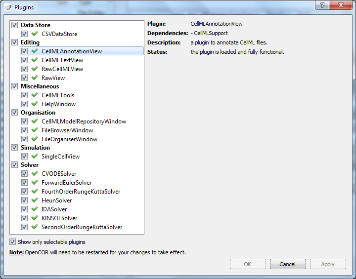
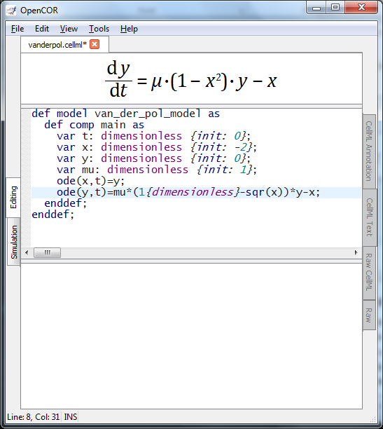
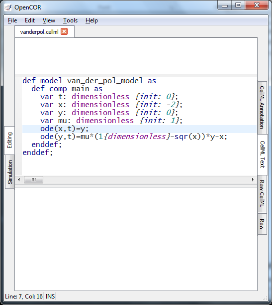
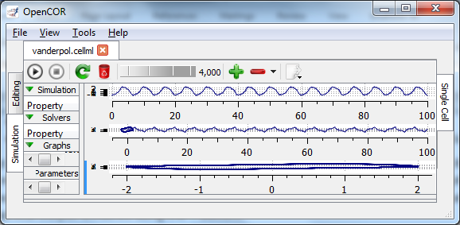

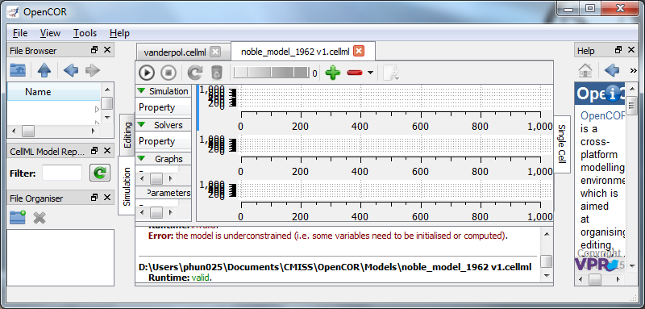
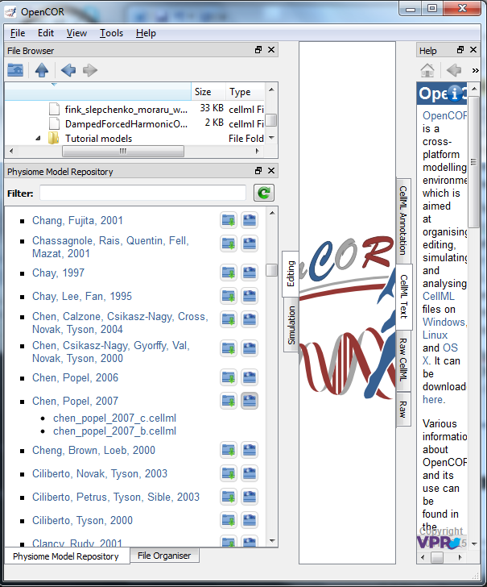
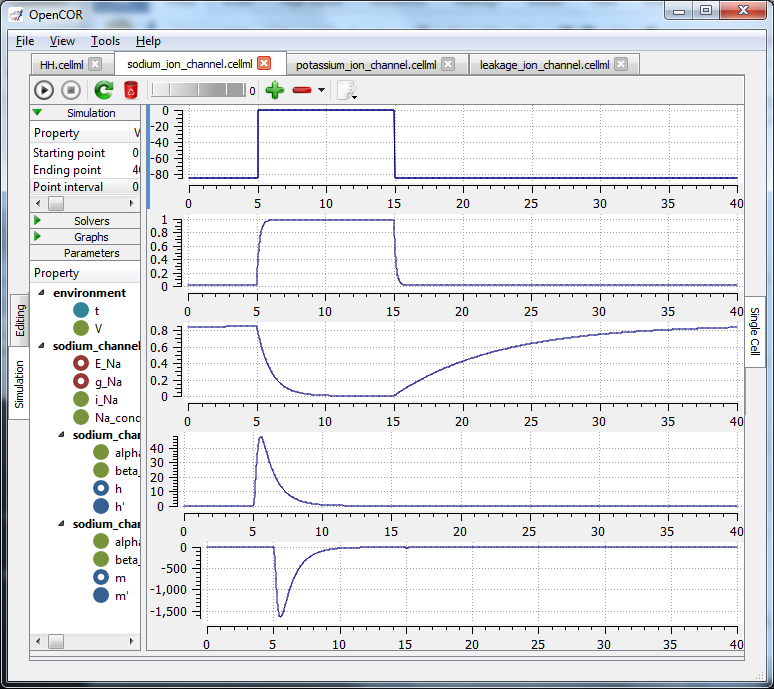
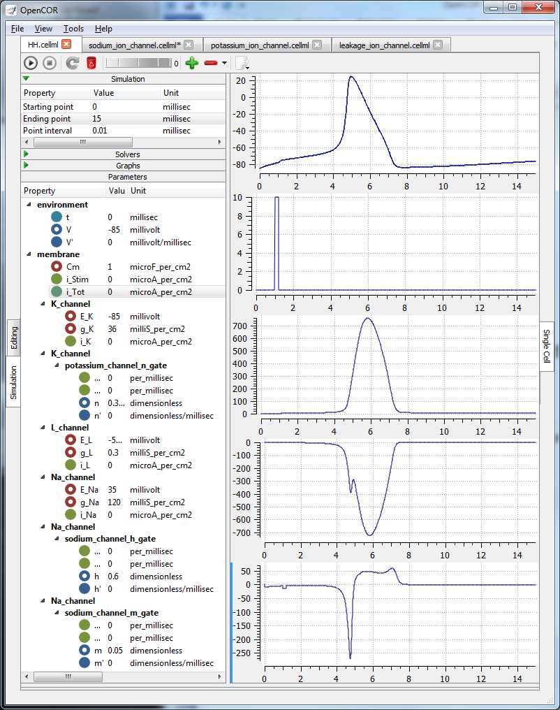

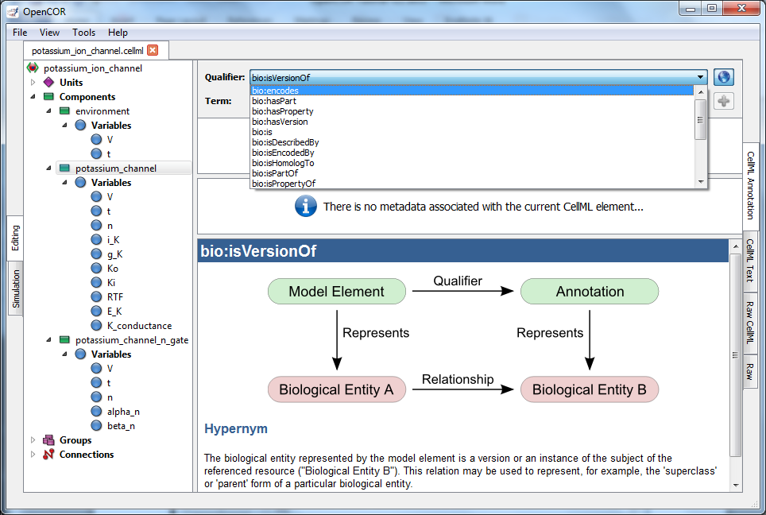
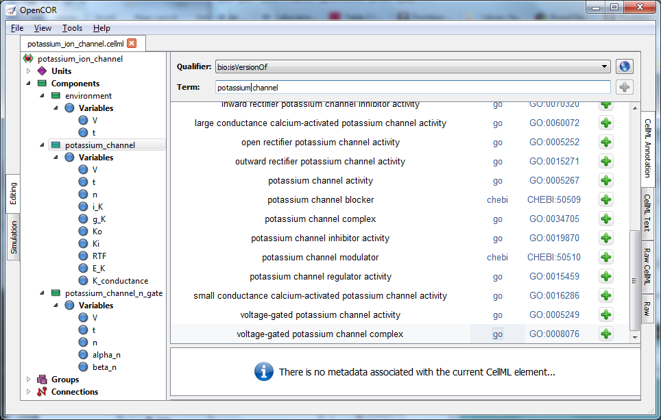

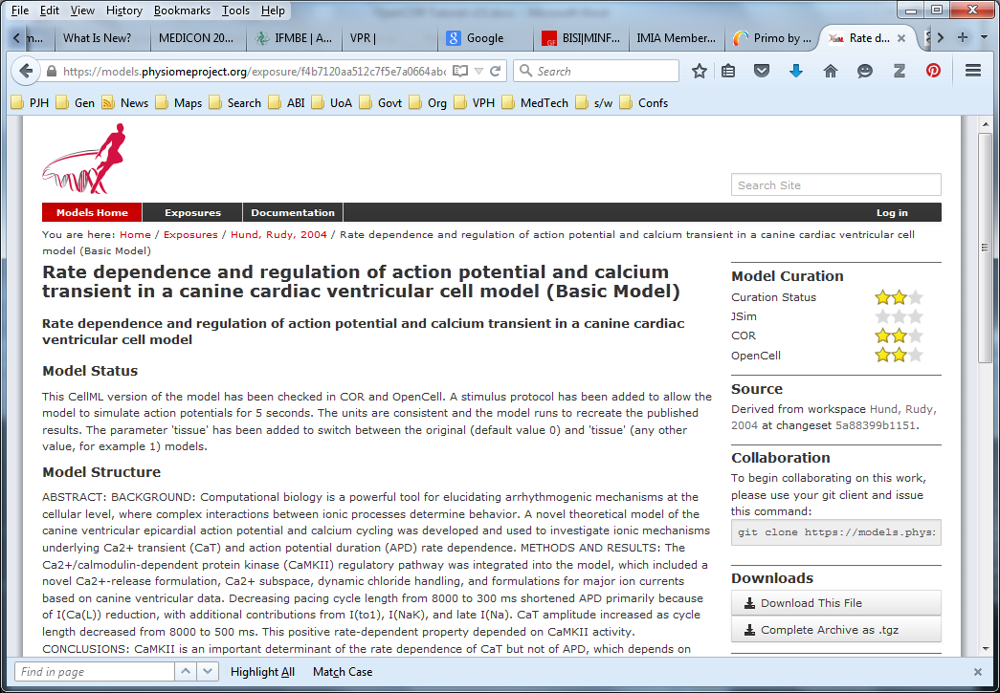
