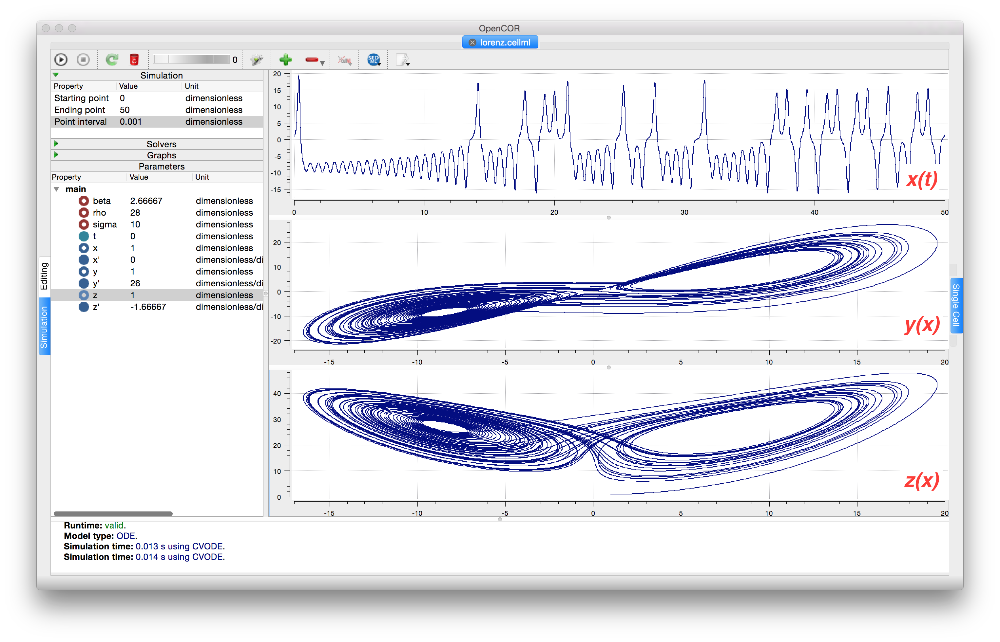

====================
The Lorenz attractor
====================

An example of a third order ODE system (i.e. three 1\ :sup:`st` order
equations) is the *Lorenz equations*\ [#]_.

   
   *CellML Text* code for the Lorenz equations.
   
This system has three equations:

.. math::

   \frac{\text{dx}}{\text{dt}} & =  \sigma\left( y - x \right) \\
   \frac{\text{dy}}{\text{dt}} & =  x\left( \rho - z \right) - y \\
   \frac{\text{dz}}{\text{dt}} & =  xy - \beta z

where :math:`\sigma,\ \rho` and :math:`\beta` are parameters.

The *CellML Text* code entered for these equations is shown in :numref:`ocr_tut_cellml_lorenz` with parameters

:math:`\sigma = 10`, :math:`\rho = 28`, :math:`\beta = 8/3` = 2.66667

and initial conditions

:math:`x\left( 0 \right) = y\left( 0 \right) = z\left( 0 \right) =`\ 1.

Solutions for :math:`x\left( t \right)`, :math:`y\left( x \right)` and
:math:`z\left( x \right)`, corresponding to the time integration
parameters shown on the LHS, are shown in :numref:`ocr_tut_soln_lorenz`. Note that this
system exhibits 'chaotic dynamics' with small changes in the initial
conditions leading to quite different solution paths.

This example illustrates the value of OpenCOR's ability to plot
variables as they are computed. Use the *Simulation Delay* wheel to slow
down the plotting by a factor of about 5-10,000 - in order to follow the
solution as it spirals in ever widening trajectories around the left
hand wing of the attractor before coming close to the origin that then
sends it off to the right hand wing of the attractor.

   
   Solutions of the Lorenz equations. Note that the
   parameters on the left have been reset to their initial values for this
   figure – normally they would be at their final solution values.

Solutions to the Lorenz equations are organised by the 2D 'Lorenz
manifold'. This surface has a very beautiful shape and has become an art
form - even rendered in crochet!\ [#]_ (See :numref:`ocr_tut_crotchet`).

   
   The crocheted Lorenz manifold made by Professors Hinke Osinga and Bernd Krauskopf of the Mathematics Department at the University of Auckland, New Zealand.
   
.. note::
   The simulation presented in :numref:`ocr_tut_soln_lorenz` can be loaded direction into OpenCOR using this `link <opencor://openFile/https://models.physiomeproject.org/workspace/25d/rawfile/f0e63e292ebb1d6798da08914b4217aec434af96/lorenz.sedml>`_.

Exercise for the reader
=======================

Another example of intriguing and unpredictable behaviour from a simple
deterministic ODE system is the 'blue sky catastrophe' model :cite:`9` defined
by the following equations:

.. math::

   \frac{\text{dx}}{\text{dt}} & = y \\
   \frac{\text{dy}}{\text{dt}} & = x - x^{3} - 0.25y + A\sin t

with parameter :math:`A = 0.2645` and initial conditions
:math:`x\left( 0 \right) = 0.9`, :math:`y\left( 0 \right) = 0.4`. Run to
:math:`t = 500` with :math:`\Delta t = 0.01` and plot
:math:`x\left( t \right)` and :math:`y\left( x \right)` (`OpenCOR link <opencor://openFile/https://models.physiomeproject.org/workspace/25d/rawfile/8b61448c7ea1b1aedc16931d97a3036fe298b0a3/BlueSkyCatastrophy.sedml>`_). Also try with
:math:`A = 0.265` to see how sensitive the solution is to small changes
in parameter values.

---------------------------

.. rubric:: Footnotes

.. [#] http://en.wikipedia.org/wiki/Lorenz_system

.. [#] http://www.math.auckland.ac.nz/~hinke/crochet/

