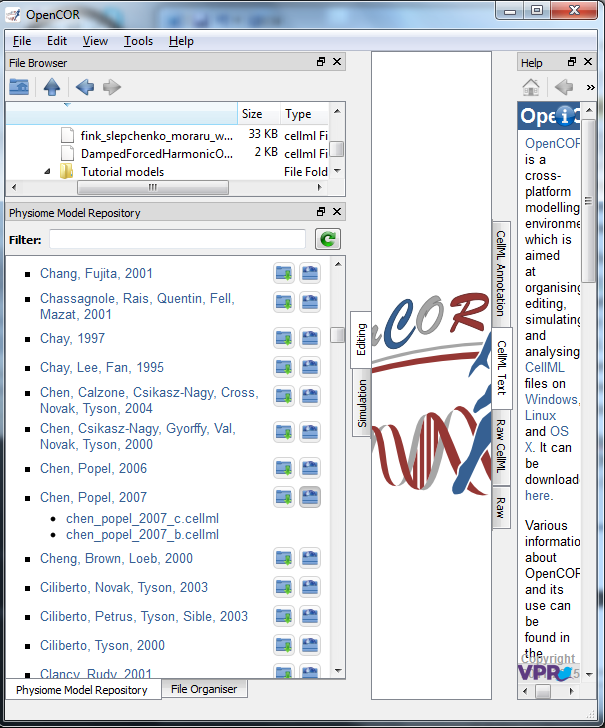

====================================================================================
Open an existing CellML file from a local directory or the Physiome Model Repository
====================================================================================

Go to the *File* menu and select *Open...* (:menuselection:`File --> Open`). Browse to the folder that
contains your existing models and select one. Note that this brings up a
new tabbed window and you can have any number of CellML models open at
the same time in order to quickly move between them. A model can be
removed from this list by clicking on |image_cross| next to the CellML model
name.

You can also access models from the left hand panel in :numref:`Fig. %s(a)<ocr_tut_main_win>`. If
this panel is not currently visible, use ‘CTRL-spacebar’ to make it
reappear. Models can then be accessed from any one of the three
subdivisions of this panel – *File Browser*, *Physiome Model Repository*
or *File Organiser*. For a file under *File Browser* or *File
Organiser*, either double-click it or ‘drag&drop’ it over the central
workspace to open that model. Clicking on a model in the *Physiome Model
Repository* (PMR) (e.g. Chen, Popel, 2007) opens a new browser window
with that model (PMR is covered in more detail in Section 13). You can
either load this model directly into OpenCOR or create an identical copy
(clone) of the model in your local directory. Note that PMR contains
*workspaces* and *exposures*. Workspaces are online environments for the
collaborative development of models (e.g. by geographically dispersed
groups) and can have password protected access. Exposures are workspaces
that are exposed for public view and mostly contain models from
peer-reviewed journal publications. There are about 600 exposures based
on journal papers and covering many areas of cell processes and other
ODE/algebraic models, but these are currently being supplemented with
reusable protein-based models – see discussion in a Section 13.

To load a model directly into OpenCOR, click on the right-most of the
two buttons in :numref:`ocr_tut_pmr_win` - this lists the CellML models in that exposure
- and then click on the model you want. Clicking on the left hand button
copies the PMR workspace to a local directory that you specify. This is
useful if you want to use that model as a template for a new one you are
creating.

   
   The Physiome Model Repository (PMR) window listing all PMR
   models. These can be opened from within OpenCOR using the two buttons to
   the right of a model, as explained below.

In the PMR window the buttons on the right-hand side [1] lists all the CellML files for this model.  Clicking on one of those uploads the model into OpenCOR.  The left-hand buttons [2] copies the PMR workspace to a local directory.

   
