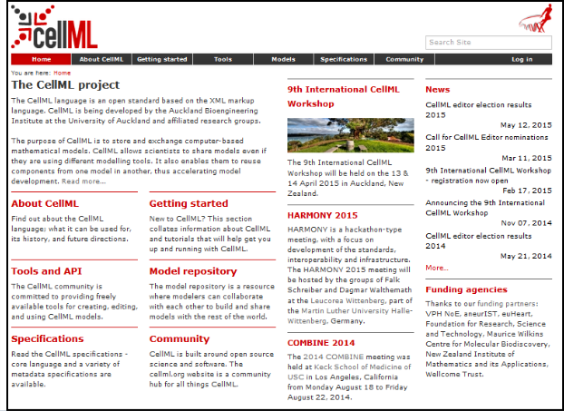
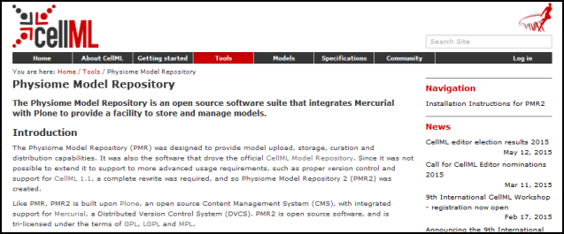
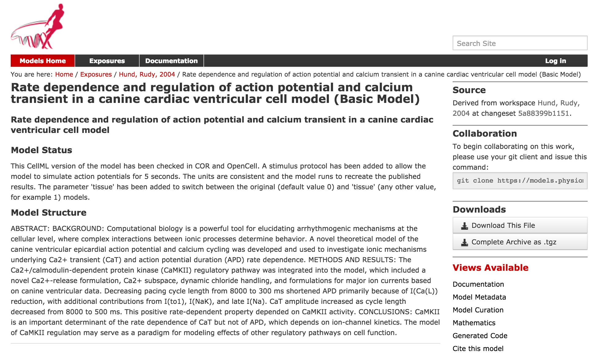
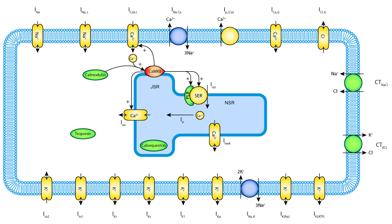
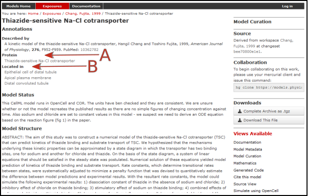

.. include:: resources/roles.txt

============================================================
The Physiome Model Repository and the link to bioinformatics
============================================================

The Physiome Model Repository (PMR) :cite:`13` is the main online repository
for the IUPS Physiome Project, providing version and access controlled
repositories, called *workspaces*, for users to store their data.
Currently there are approximately 640 public workspaces and another 200
private workspaces in the repository. PMR also provides a mechanism to
create persistent access to specific revisions of a workspace, termed
*exposures*. Exposure plugins are available for specific types of data
(e.g. CellML or FieldML documents) which enable customizable views of
the data when browsing the repository via a web browser, or an
application accessing the repository’s content via web services.

The CellML project website and the CellML Physiome Model Repository are
shown in :numref:`ocr_tut_cellml_web_main` and :numref:`ocr_tut_cellml_web_pmr`.

   
   The website for the CellML project at `www.cellml.org <http://www.cellml.org>`_.

   
   The website for the Physiome Model Repository project at `www.cellml.org/tools/pmr <http://www.cellml.org/tools/pmr>`_.

The CellML models on  `models.physiomeproject.org <https://models.physiomeproject.org>`_  are listed under 20 categories, shown below:
(numbers of exposures in each category are given besides the bar graph)

**Browse by category**

 -  Calcium Dynamics 140

 -  Cardiovascular Circulation 60

 -  Cell Cycle 38

 -  Cell Migration 2

 -  Circadian Rhythms 22

 -  Electrophysiology 230

 -  Endocrine 60

 -  Excitation-Contraction Coupling 22

 -  Gene Regulation 12

 -  Hepatology 29

 -  Immunology 55

 -  Ion transport 13

 -  Mechanical Constitutive Laws 19

 -  Metabolism 86

 -  Myofilament Mechanics 22

 -  Neurobiology 33

 -  pH regulation 2

 -  PKPD 11

 -  Signal Transduction 120

 -  Synthetic Biology 6

Note that searching of models can be done anywhere on the site using the
search box on the upper right hand corner. An important benefit of
ensuring that the models on the PMR are annotated is that models can
then be retrieved by a web-search using any of the annotated terms in
the models.

To illustrate the features of PMR, click on the Hund, Rudy 2004 (Basic)
model in the alphabetic listing of models under *Electrophysiology*.
This opens a web page (:numref:`ocr_tut_pmr_exp_hr`) using a 32 character string that has
been randomly generated as the ID for the exposure page for that model.

   
   The Physiome Model Repository exposure page for the basic Hund-Rudy 2004 model.

Note that the string is still unique even with only 5 characters:

e.g.
https://models.physiomeproject.org/exposure/f4b71/hund_rudy_2004_a.cellml/view

The section labelled ‘Model Structure’ contains the journal paper
abstract and often a diagram of the model [*]_. This is shown for the
Hund-Rudy 2004 model in :numref:`ocr_tut_hund_2004`. This model, with over 22 separate
protein model components, is also a good example of why it is important
to build models from modular components :cite:`14`, and in particular the
individual ion channels for electrophysiology models.

   
   A diagrammatic representation of the Hund-Rudy 2004 model.

There is a list of ‘Views Available’ for the CellMLmodel on the lower
right hand side of the exposure page. The function of each of these
views is as follows:

**Views Available**

**Documentation** - Takes you to the main exposure page.

**Model Metadata** - Lists metadata including authors, title, journal,
Pubmed ID and model annotations.

**Model Curation** - Provides the curation status of the model. Note:
this is soon to be updated.

**Mathematics** - Displays all the mathematical equations contained in
the model.

**Generated Code** - Creates code (C, C-IDA, F77, MATLAB or Python) for
the model.

**Cite this model** - Provides details on how to cite use of the CellML
model.

**Source view** - Gives a full listing of the XML code for the model.

**Simulate using OpenCell** - This will be OpenCOR once the SED-ML API
is included in OpenCOR.

Note that CellML models are available under a Creative Commons
Attribution 3.0 Unported License [*]_. This means that you are free to:

 -  Share — copy and redistribute the material in any medium or format

 -  Adapt — remix, transform, and build upon the material

for any purpose, including commercial use.

The next stage of content development for PMR is to provide a list of
the modular components of these models each with their own exposure. For
example, models for each of the individual ion channels used in the
publication-based electrophysiological models will be available as
standalone models that can then be imported as appropriate into a new
composite model. Similarly for enzymes in metabolic pathways and
signalling complexes in signalling pathways, etc. Some examples of these
protein modules are:

*Sodium/hydrogen exchanger 3* https://models.physiomeproject.org/e/236/

*Thiazide-sensitive Na-Cl cotransporter*
https://models.physiomeproject.org/e/231/

*Sodium/glucose cotransporter 1*
https://models.physiomeproject.org/e/232/

*Sodium/glucose cotransporter 2*
https://models.physiomeproject.org/e/233/

Note that in each case, as well as the CellML-encoded mathematical
model, links are provided (see :numref:`ocr_tut_pmr_wsp_thiazide`) to the UniProt Knowledgebase
for that protein, and to the Foundational Model of Anatomy (FMA)
ontology (via the EMBLE-EBI Ontology Lookup Service) for information
about tissue regions relevant to the expression of that protein (e.g.
*Proximal convoluted tubule*, *Apical plasma membrane*; *Epithelial cell
of proximal tubule*; *Proximal straight tubule*). Similar facilities are
available for SMBL-encoded biochemical reaction models through the
Biomodels database :cite:`15`.

   
   The PMR workspace for the Thiazide-sensitive Na-Cl
   cotransporter. Bioinformatic data for this model is accessed via the
   links under the headings highlight by the :red:`arrows` and include
   **Protein** (labelled :red:`A`) and the model **Location** (labelled
   :red:`B`). Other information is as already described for the Hund-Rudy 2004
   model.

---------------------------

.. rubric:: Footnotes

.. [*] These are currently hand drawn SVG diagrams but the plan is to automatically generate them from the model annotation and also (at some stage!) to animate them as the model is executed.

.. [*] `https://creativecommons.org/licenses/by/3.0/ <https://creativecommons.org/licenses/by/3.0/>`_
