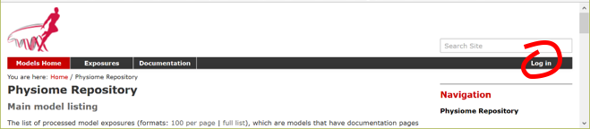
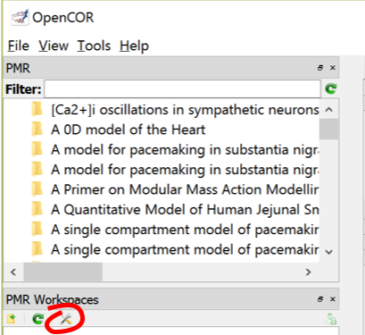
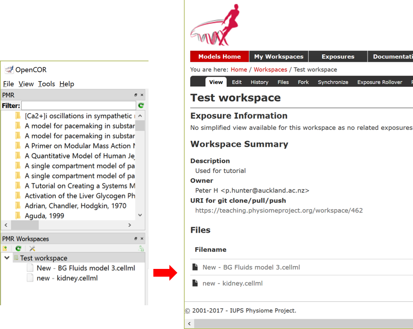

.. include:: resources/roles.txt

.. _cellml_opencor_pmr_tutorial__pmr_with_opencor:

======================
Using PMR with OpenCOR
======================

In addition to the :ref:`PMR <cellml_opencor_pmr_tutorial__pmr_intro>` window for browsing public exposures directly in OpenCOR (:ref:`PMR window <cellml_opencor_pmr_tutorial__open_existing>`) OpenCOR has the ability for users to directly create and access their workspaces in PMR.

.. note::

   It is a feature of PMR that all data is persistent and permanent. As such, any workspaces created on the main instance of PMR (https://models.physiomeproject.org/) can not be deleted. For the purposes of teaching, we have an alternate instance of PMR (https://teaching.physiomeproject.org/) which is periodically cleared out and synschronised from the main instance. Using the teaching instance allows you to play around without the worry of things being permanent.

1. Register for a user account on the teaching instance of PMR.

In order to make use of the teaching instance of PMR, you must first have an account for that instance of the repository. For teaching purposes it is best to register a new account. This can be done by first opening this link in your browser: https://teaching.physiomeproject.org. Then click the :guilabel:`Log in` button on (shown in :numref:`ocr_tut_pmr_teaching_login`) then the :guilabel:`registration form` link.

   The log in button for the teaching instance of PMR.

After filling in the names and email fields and clicking :guilabel:`Register` you will receive an email inviting you to confirm and set a password. Once that is completed you can then log in. Clicking on :guilabel:`My Workspaces` will take you to a listing of all your workspaces and provides access to the the :guilabel:`Workspace creation form`.

2. Create a new workspace, in this example the title ‘Test workspace’ has been used.

The PMR Workspaces window
-------------------------

A window labelled :guilabel:`PMR workspaces` is available in OpenCOR (see :numref:`ocr_tut_pmr_workspace_window`). If it is not currently visible it can be selected via :menuselection:`View --> Windows --> PMR workspaces` (or perhaps the :kbd:`Ctrl-space` shortcut).

   PMR workspace shown on the left hand panel in OpenCOR. The preferences button is highlighted.

3. Set preferences.

Clicking the preferences button (:numref:`ocr_tut_pmr_workspace_window`) presents a :guilabel:`Preferences` dialog box with three settings: PMR instance, Name and Email. For the current purpose choose :guilabel:`https://teaching.physiomeproject.org` for the first and enter your name and email. These are used to identify you as the author of changes you submit back to the repository (view `an example history <https://models.physiomeproject.org/workspace/43a/@@shortlog>`_).

4. Log into PMR from OpenCOR.

Before you can view private information or submit changes to PMR you must first log in to PMR from OpenCOR and grant OpenCOR permission to use your account. You accomplish this by clicking on the top right button in the :guilabel:`PMR Workspaces` window and then logging in with your new user name and password (created in step 1). Then grant access for OpenCOR to gain access to your PMR workspaces. The PMR workspaces window will then show all your workspaces, which should currently consist of the new workspace created in step 2. Note that using the same top right button you can log off - and when you next authenticate you will again be asked to grant access but this time without needing to login with your password.

Right clicking on the workspace name brings up a list of options for that workspace, the first being to view the workspace within PMR (in the web browser). Another option allows you to clone a workspace to your local disk - this will create a copy of the workspace on your local computer in which you are able to make changes.

5. Clone your *test workspace*

Using the :menuselection:`Clone...` option from the right-click menu on the workspace you created in step 2, clone the workspace to your PC. When doing this you will need to provide the folder in which you want to store the workspace contents - make sure you remember where this folder is!

6. Save a CellML model to your workspace.

A CellML file opened in OpenCOR (choose any model you have access to) can be saved (:menuselection:`File --> Save As...`) to the folder you created for the cloned workspace. Once you have saved a model you will see the file appear under the workspace's folder in the :guilabel:`PMR Workspaces` window. Note that the file appears under the workspace with a red patch on the logo indicating the the file is not yet flagged to upload. To upload the file to PMR, you need to :guilabel`Stage` the file by right-clicking the file and choosing :menuselection:`Stage` (the red patch then turns green) followed by :menuselection:`Commit` from the right-click menu on the workspace folder. This will ask you to provide a description of the change you would like to submit to PMR. When you now choose :menuselection:`Pull And Push` from the workspace menu, the staged changes will actually be submitted to PMR and you will see the file appear on the refreshed browser window. The file icon in the PMR Workspaces window will be shown without the red or green patch. :numref:`ocr_tut_pmr_workspace_window_commit` shows two CellML files that have been uploaded to PMR.

   Two CellML files (:file:`New – BG Fluids model 3.cellml` and :file:`new – kidney.cellml`) have been uploaded from OpenCOR to PMR and can be seen in the PMR workspace on the browser window on the right.
