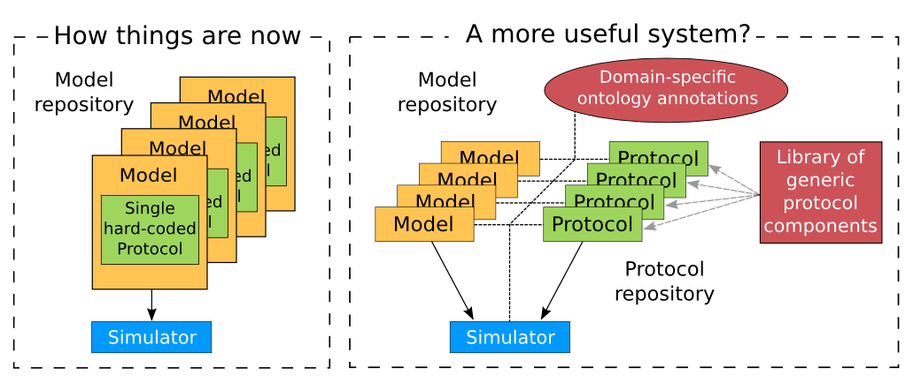

=======================================
SED-ML, functional curation and Web Lab
=======================================

In the same way that CellML models can be defined unambiguously, and shared easily, in a machine- readable format, there is a need to do the same thing with 'protocols' – i.e. to define what you have to do to replicate/simulate an experiment, and to analyse the results. An XML standard for this called SED-ML\ [#]_ is being developed by the CellML/SBML community and the API for SED-ML will implemented in the next full version release of OpenCOR in order to allow precise and reproducible control over the OpenCOR simulation and graphical output. This will also facilitate the curation of models according to their functional behaviour under a range of experimental scenarios.
The key idea behind functional curation is that, when mathematical and computational models are being developed, a primary goal should be the continuous comparison of those models against experimental data. When computational models are being re-used in new studies, it is similarly important to check that they behave appropriately in the new situation to which you're applying them. To achieve this goal, a pre-requisite is to be able to replicate in-silico precisely the same protocols used in an experiment of interest. A language for describing rich 'virtual experiment' protocols and software for running these on compatible models is being developed in the Computational Biology Group at Oxford University\ [#]_.
An online system called Web Lab\ [#]_ is also being developed that supports definition of experimental protocols for cardiac electrophysiology, and allows any CellML model to be tested under these protocols :cite:`16`. This enables comparison of the behaviours of cellular models under different experimental protocols: both to characterise a model’s behaviour, and comparing hypotheses by seeing how different models react under the same protocol (:numref:`ocr_tut_web_lab_fc_sch`).

   A schematic of the way we organise model and protocol descriptions. Web Lab provides an interface to a Model/Protocol Simulator, storing and displaying the results for cardiac electrophysiology models. (Adapted from :cite:`16`).

The Web Lab website provides tools for comparing how two different cardiac electrophysiology models behave under the same experimental protocols. Note that Web Lab demonstration for CellML models of cardiac electrophysiology is a prototype for a more general approach to defining simulation protocols for all CellML models.

---------------------------

.. rubric:: Footnotes

.. [#] The ‘Simulation Experiment Description Markup Language’: `sed-ml.org <http://sed-ml.org>`_

.. [#] `travis.cs.ox.ac.uk/FunctionalCuration/about.html <http://travis.cs.ox.ac.uk/FunctionalCuration/about.html>`_ This initiative is led by Jonathan Cooper and Gary Mirams.

.. [#] `travis.cs.ox.ac.uk/FunctionalCuration <http://travis.cs.ox.ac.uk/FunctionalCuration>`_.