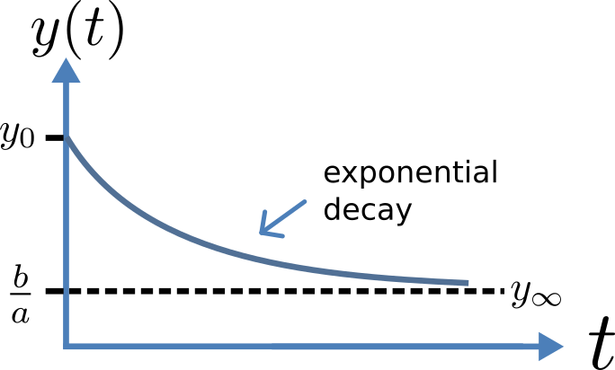

.. include:: resources/roles.txt

.. _ocr_tut_out_first_ode:

========================
A simple first order ODE
========================

   
   Solution of 1\ :sup:`st` order equation.
   
The simplest example of a first order ODE is

.. math::

   \frac{\text{dy}}{\text{dt}} = - ay + b

with the solution

.. math::

   y\left( t \right) = \frac{b}{a} + \left( y\left( 0 \right) - \frac{b}{a} \right).e^{- at},

where :math:`y\left( 0 \right)` or :math:`y_{0}`, the value of
:math:`y\left( t \right)` at :math:`t = 0`, is the *initial condition*.
The final steady state solution as :math:`t \rightarrow \infty` is
:math:`y\left( \left. \ t \right|_{\infty} \right) = y_{\infty} = \frac{b}{a}`
(see Figure 6). Note that :math:`t = \tau = \frac{1}{a}` is called the
*time constant* of the exponential decay, and that

.. math::

   y\left( \tau \right) = \frac{b}{a} + \left( y\left( 0 \right) - \frac{b}{a} \right).e^{- 1}.

At :math:`t = \tau` , :math:`y\left( t \right)` has therefore fallen to
:math:`\frac{1}{e}` (or about 37%) of the difference between the initial
(:math:`y\left( 0 \right)`) and final steady state (
:math:`y\left( \infty \right)`) values\ [#]_.

Choosing parameters :math:`a = \tau = 1;b = 2` and
:math:`y\left( 0 \right) = 5`, the *CellML Text* for this model is

.. code-block:: cell
   :emphasize-lines: 7

   def model first_order_model as
       def comp main as
           var t: dimensionless {init: 0};
           var y: dimensionless {init: 5};
           var a: dimensionless {init: 1};
           var b: dimensionless {init: 2};
           ode(y,t)=-a*y+b;
       enddef;
   enddef;

The :red:`solution` by OpenCOR is shown in :numref:`Fig. %s(a)<ocr_tut_out_first_ord>` for these parameters (a
decaying exponential) and in :numref:`Fig. %s(b)<ocr_tut_out_first_ord>` for parameters
:math:`a = 1;b = 5` and :math:`y\left( 0 \right) = 2` (an inverted
decaying exponential). Note the simulation panel with *Ending
point*\ =10, *Point interval*\ =0.1. Try putting :math:`a = - 1`.

.. figure:: _static/images/first_order_plots.png
   :name: ocr_tut_out_first_ord
   :alt: Output from simulation of first order ODEs
   :align: center

   OpenCOR output :math:`y\left( t \right)` for the simple
   ODE model with parameters (a) :math:`a = 1;b = 2` and
   :math:`y\left( 0 \right) = 5`, and (b) :math:`a = 1;b = 5` and
   :math:`y\left( 0 \right) = 2`. The :red:`red arrow` indicates the point
   at which the trace reaches the time constant :math:`\tau`
   (:math:`e^{- 1}` or :math:`\approx 37`% of the difference between the initial and final
   solution values). The black arrows indicate the initial and final
   (steady state) solutions. Note that the parameters on the left have been
   reset to their initial values for this figure - normally they would be
   at their final solution values.

These two solutions have the same exponential time constant
(:math:`\tau = \frac{1}{a} = 1`) but different initial and final (steady
state) values.

The exponential decay curve shown on the left in :numref:`ocr_tut_out_first_ord` is a common
feature of many models and in the case of radioactive decay (for
example) is a statement that the **rate of decay**
(:math:`- \frac{\text{dy}}{\text{dt}}`) is proportional to the
**current amount of substance** (:math:`y`). This is illustrated on
the NZ$100 note (should you be lucky enough to possess one), shown in
Figure 8.

   
   The **exponential curve** representing the naturally
   occurring radioactive decay explained by the New Zealand Noble laureate
   Sir Ernest Rutherford - best known for ‘splitting the atom’. This may be
   the only bank note depicting the mathematical solution of a first order
   ODE.

---------------------------

.. rubric:: Footnotes

.. [#] It is often convenient to write a first order equation as :math:`\tau\frac{\text{dy}}{\text{dt}} = - y + y_{\infty}`, so that its solution is expressed in terms of time constant :math:`\tau`, initial condition :math:`y_{0}` and steady state solution :math:`y_{\infty}` as: :math:`y\left( t \right) = y_{\infty} + \left( y_{0} - y_{\infty} \right).e^{- \frac{t}{\tau}}`.

